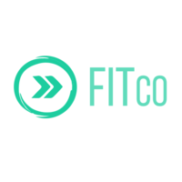
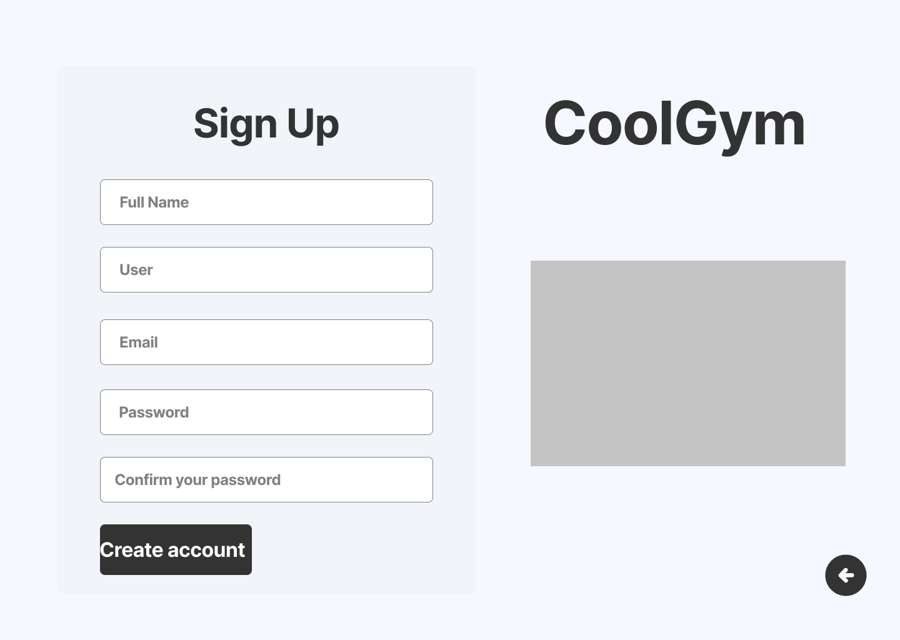
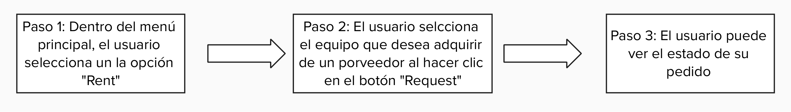

  
  
  <h1>Universidad: Universidad Peruana de Ciencias Aplicadas</h1>
  
<strong>Carrera:</strong> Ingeniería de Software

  
<strong>Ciclo:</strong> 2025-20

  
<strong>Código del Curso y Nombre del Curso:</strong> 1ASI0730 - Aplicaciones Web

  
<strong>Sección:</strong> 7426

  
<strong>Profesor:</strong> Naldo Reupo-Musayon Gastulo

  <h3>Informe de Trabajo Final</h3>

  
<strong>Startup:</strong> FitConnect 

  
<strong>Nombre del Producto:</strong> CoolGym 

<h3 align="center">Relación de Integrantes:</h3>

  <table>
    <tr>
      <th><strong>Código</strong></th>
      <th><strong>Apellidos y Nombres</strong></th>
    </tr>
    <tr>
      <td>U202320684</td>
      <td>Ponce Perales Alberto Alejandro</td>
    </tr>
    <tr>
      <td>U202319025</td>
      <td>Ventosilla Trujillo Anderson Ricardo</td>
    </tr>
    <tr>
      <td>U202222001</td>
      <td>Aliaga Urbina Wilder Gonzalo</td>
    </tr>
    <tr>
      <td>U202323562</td>
      <td>Villogas Medina Oliver Paul</td>
    </tr>
    <tr>
      <td>U20221F192</td>
      <td>Saldaña De Souza Juan David</td>
    </tr>
  </table>

<strong>Mes y Año:</strong> Setiembre 2025

# Registro de Versiones del Informe

| **Versión** | **Fecha**  | **Autores**                                                                                                                           | **Descripción de Modificación**                                                                                                                                                                                                                                                                                                                                                                                                    |
|-------------|------------|---------------------------------------------------------------------------------------------------------------------------------------|------------------------------------------------------------------------------------------------------------------------------------------------------------------------------------------------------------------------------------------------------------------------------------------------------------------------------------------------------------------------------------------------------------------------------------|
| 1.0         | 17/09/2025 | - Alberto Alejandro Ponce Perales   - Oliver Paul Villogas Medina    - Anderson Ventosilla   - Juan Saldaña   - Wilder Gonzalo Aliaga Urbina | Se incluyeron los siguientes capítulos:  • Estructura del informe  • Capítulo I: Introducción  • Capítulo II: Requirements Elicitation & Analysis  • Capítulo III: Requirements Specification  • Capítulo IV: Product Design  • Capítulo V: Product Implementation, Validation & Deployment  • Landing Page  • Configuración inicial del repositorio  • Aplicación de GitFlow y convenciones de commits |
| 2.0         | 08/10/2025 | - Alberto Alejandro Ponce Perales   - Oliver Paul Villogas Medina    - Anderson Ventosilla   - Juan Saldaña   - Wilder Gonzalo Aliaga Urbina | Actualizamos el reporte con los avances y trabajamos en el desarrollo de la aplicación frontend. Además, elaboramos el capítulo 5 y actualizamos nuevamente el reporte. |
| 3.0         | 12/11/2025 | - Alberto Alejandro Ponce Perales   - Oliver Paul Villogas Medina    - Anderson Ventosilla   - Juan Saldaña   - Wilder Gonzalo Aliaga Urbina | Actualizamos el reporte incluyendo los puntos 5.2.3. Sprint 3, 5.3. Validation Interviews, 5.4. Video About-the-Product y nos enfocamos en actualizar nuestro frontend y en avanzar la parte principal de nuestro backend. |
| 4.0         | 02/12/2025 | - Alberto Alejandro Ponce Perales   - Oliver Paul Villogas Medina    - Anderson Ventosilla    - Wilder Gonzalo Aliaga Urbina | Se levantaron todas las observaciones y se completo la documentación del reporte. |
---
# Project Report Collaboration Insights

**Link del repositorio del informe:**  
[https://github.com/1ASI0730-2520-7426-Grupo3/TB1/blob/main/README.md](https://github.com/1ASI0730-2520-7426-Grupo3/TB1/blob/main/README.md)

**Link de los repositorios de la organización:**  

Landing Page:
[https://github.com/1ASI0730-2520-7426-Grupo3/Landing-Page](https://github.com/1ASI0730-2520-7426-Grupo3/Landing-Page)

Frontend App:
[https://github.com/1ASI0730-2520-7426-Grupo3/Frontend](https://github.com/1ASI0730-2520-7426-Grupo3/Frontend)

Backend:

[https://github.com/1ASI0730-2520-7426-Grupo3/Backend](https://github.com/1ASI0730-2520-7426-Grupo3/Backend)

Este informe ha sido desarrollado de forma colaborativa mediante GitHub, aplicando GitFlow y Conventional Commits. Cada integrante del equipo ha contribuido mediante ramas independientes, commits individuales y revisiones de Pull Requests.

---

## Participación por miembro (commits realizados)

A continuación, se muestra un gráfico de barras con la cantidad de commits realizados por cada integrante del equipo:

Reporte:

Landing Page:

Frontend:

Backend:

# Contenido

- [Registro de Versiones del Informe](#registro-de-versiones-del-informe)
- [Project Report Collaboration Insights](#project-report-collaboration-insights)
- [Contenido](#contenido)
- [Student Outcome](#student-outcome)

## Capítulo I: Introducción
- [1.1 Startup Profile](#11-startup-profile)
  - [1.1.1 Descripción de la Startup](#111-descripción-de-la-startup)
  - [1.1.2 Perfiles de integrantes del equipo](#112-perfiles-de-integrantes-del-equipo)
- [1.2 Solution Profile](#12-solution-profile)
  - [1.2.1 Antecedentes y problemática](#121-antecedentes-y-problemática)
  - [1.2.2 Lean UX Process](#122-lean-ux-process)
    - [1.2.2.1 Lean UX Problem Statements](#1221-lean-ux-problem-statements)
    - [1.2.2.2 Lean UX Assumptions](#1222-lean-ux-assumptions)
    - [1.2.2.3 Lean UX Hypothesis Statements](#1223-lean-ux-hypothesis-statements)
    - [1.2.2.4 Lean UX Canvas](#1224-lean-ux-canvas)
- [1.3 Segmentos objetivo](#13-segmentos-objetivo)

## Capítulo II: Requirements Elicitation & Analysis
- [2.1 Competidores](#21-competidores)
  - [2.1.1 Análisis competitivo](#211-análisis-competitivo)
  - [2.1.2 Estrategias y tácticas frente a competidores](#212-estrategias-y-tácticas-frente-a-competidores)
- [2.2 Entrevistas](#22-entrevistas)
  - [2.2.1 Diseño de entrevistas](#221-diseño-de-entrevistas)
  - [2.2.2 Registro de entrevistas](#222-registro-de-entrevistas)
  - [2.2.3 Análisis de entrevistas](#223-análisis-de-entrevistas)
- [2.3 Needfinding](#23-needfinding)
  - [2.3.1 User Personas](#231-user-personas)
  - [2.3.2 User Task Matrix](#232-user-task-matrix)
  - [2.3.3 User Journey Mapping](#233-user-journey-mapping)
  - [2.3.4 Empathy Mapping](#234-empathy-mapping)
  - [2.3.5 As-Is Scenario Mapping](#235-as-is-scenario-mapping-)
- [2.4 Ubiquitous Language](#24-ubiquitous-language-)

## Capítulo III: Requirements Specification
- [3.1 To-Be Scenario Mapping](#31-to-be-scenario-mapping)
- [3.2 User Stories](#32-user-stories)
- [3.3 Impact Mapping](#33-impact-mapping)
- [3.4 Product Backlog](#34-product-backlog)

## Capítulo IV: Product Design
- [4.1 Style Guidelines](#41-style-guidelines)
  - [4.1.1 General Style Guidelines](#411-general-style-guidelines)
  - [4.1.2 Web Style Guidelines](#412-web-style-guidelines)
- [4.2 Information Architecture](#42-information-architecture)
  - [4.2.1 Organization Systems](#421-organization-systems)
  - [4.2.2 Labeling Systems](#422-labeling-systems)
  - [4.2.3 SEO Tags and Meta Tags](#423-seo-tags-and-meta-tags)
  - [4.2.4 Searching Systems](#424-searching-systems)
  - [4.2.5 Navigation Systems](#425-navigation-systems)
- [4.3 Landing Page UI Design](#43-landing-page-ui-design)
  - [4.3.1 Landing Page Wireframe](#431-landing-page-wireframe)
  - [4.3.2 Landing Page Mock-up](#432-landing-page-mockup)
- [4.4 Web Applications UX/UI Design](#44-web-applications-uxui-design)
  - [4.4.1 Web Applications Wireframes](#441-web-applications-wireframes)
  - [4.4.2 Web Applications Wireflow Diagrams](#442-web-applications-wireflow-diagrams)
  - [4.4.3 Web Applications Mock-ups](#443-web-applications-mock-ups)
  - [4.4.4 Web Applications User Flow Diagrams](#444-web-applications-user-flow-diagrams)
- [4.5 Web Applications Prototyping](#45-web-applications-prototyping)
- [4.6 Domain-Driven Software Architecture](#46-domain-driven-software-architecture)
  - [4.6.1 Software Architecture Context Diagram](#461-software-architecture-context-diagram)
  - [4.6.2 Software Architecture Container Diagrams](#462-software-architecture-container-diagrams)
  - [4.6.3 Software Architecture Components Diagrams](#463-software-architecture-components-diagrams)
- [4.7 Software Object-Oriented Design](#47-software-object-oriented-design-)
  - [4.7.1 Class Diagrams](#471-class-diagrams)
  - [4.7.2 Class Dictionary](#472-class-dictionary)
- [4.8 Database Design](#48-database-design)
  - [4.8.1 Database Diagram](#481-database-diagram)

## Capítulo V: Product Implementation, Validation & Deployment
- [5.1 Software Configuration Management](#51-software-configuration-managment-)
  - [5.1.1 Software Development Environment Configuration](#511-software-development-environment-configuration-)
  - [5.1.2 Source Code Management](#512-source-code-managment)
  - [5.1.3 Source Code Style Guide & Conventions](#513-source-code-style-guide--conventions-)
  - [5.1.4 Software Deployment Configuration](#514-software-deployment-configuration-)

- [5.2 Landing Page, Services & Applications Implementation](#52-landing-page-services--applications-implementation)
    - [5.2.1.1 Sprint Planning](#5211-sprint-planning-1)
    - [5.2.1.2 Aspect Leaders and Collaborators](#5212-aspect-leaders-and-collaborators)
    - [5.2.1.3 Sprint Backlog](#5213-sprint-backlog-1)
    - [5.2.1.4 Development Evidence for Sprint Review](#5214-development-evidence-for-sprint-review)
    - [5.2.1.5 Execution Evidence for Sprint Review](#5215-execution-evidence-for-sprint-review)
    - [5.2.1.6 Services Documentation Evidence](#5216-services-documentation-evidence-for-sprint-review)
    - [5.2.1.7 Software Deployment Evidence](#5217-software-deployment-evidence-for-sprint-review)
    - [5.2.1.8 Team Collaboration Insights](#5218-team-collaboration-insights-during-sprint)
  
    - [5.2.2.1 Sprint Planning](#5221-sprint-planning-2)
    - [5.2.2.2 Aspect Leaders and Collaborators](#5222-aspect-leaders-and-collaborators)
    - [5.2.2.3 Sprint Backlog](#5223-sprint-backlog-2)
    - [5.2.2.4 Development Evidence for Sprint Review](#5224-development-evidence-for-sprint-review)
    - [5.2.2.5 Execution Evidence for Sprint Review](#5225-execution-evidence-for-sprint-review)
    - [5.2.2.6 Services Documentation Evidence](#5226-services-documentation-evidence-for-sprint-review)
    - [5.2.2.7 Software Deployment Evidence](#5227-software-deployment-evidence-for-sprint-review)
    - [5.2.2.8 Team Collaboration Insights](#5228-team-collaboration-insights-during-sprint)

    - [5.2.3.1 Sprint Planning](#5231-sprint-planning-3)
    - [5.2.3.2 Aspect Leaders and Collaborators](#5232-aspect-leaders-and-collaborators)
    - [5.2.3.3 Sprint Backlog](#5233-sprint-backlog-3)
    - [5.2.3.4 Development Evidence for Sprint Review](#5234-development-evidence-for-sprint-review)
    - [5.2.3.5 Execution Evidence for Sprint Review](#5235-execution-evidence-for-sprint-review)
    - [5.2.3.6 Services Documentation Evidence](#5236-services-documentation-evidence-for-sprint-review)
    - [5.2.3.7 Software Deployment Evidence](#5237-software-deployment-evidence-for-sprint-review)
    - [5.2.3.8 Team Collaboration Insights](#5238-team-collaboration-insights-during-sprint)

    - [5.2.4.1 Sprint Planning](#5241-sprint-planning-4)
    - [5.2.4.2 Aspect Leaders and Collaborators](#5242-aspect-leaders-and-collaborators)
    - [5.2.4.3 Sprint Backlog](#5243-sprint-backlog-4)
    - [5.2.4.4 Development Evidence for Sprint Review](#5244-development-evidence-for-sprint-review)
    - [5.2.4.5 Execution Evidence for Sprint Review](#5245-execution-evidence-for-sprint-review)
    - [5.2.4.6 Services Documentation Evidence](#5246-services-documentation-evidence-for-sprint-review)
    - [5.2.4.7 Software Deployment Evidence](#5247-software-deployment-evidence-for-sprint-review)
    - [5.2.4.8 Team Collaboration Insights](#5248-team-collaboration-insights-during-sprint)

- [5.3 Validation Interviews](#53-validation-interviews)
  - [5.3.1 Diseño de entrevistas](#531-diseño-de-entrevistas)
  - [5.3.2 Registro de entrevistas](#532-registro-de-entrevistas)
  - [5.3.3 Evaluaciones según heurísticas](#533-evaluaciones-según-heurísticas)

- [5.4 Video About-the-Product](#54-video-about-the-product)

## Conclusiones
- [Conclusiones](#55-conclusiones)
- [Video About-the-Team](#56-video-about-the-team)

## Bibliografía
- [Bibliografía](#57-bibliografía-)

## Anexos
- [Anexos](#58-anexos)

# Student Outcome

*Cada participante del equipo debe colaborar a fin de que se redacte como grupo los sustentos y evidencias de las actividades realizadas en el trabajo final que han ayudado a desarrollar cómo las dimensiones del student outcome. Por ello en esta sección debe quedar descrito por escrito, la relación entre el outcome, sus dimensiones y el trabajo que han realizado.*

| **Criterio Específico** | **Acciones Realizadas** | **Conclusiones**  |
|---|---|---|
| **Trabaja en equipo para proporcionar liderazgo en forma conjunta** | **Alberto Ponce** TB1: asdasdasd.  **Oliver Villogas**   TB1: Participé de manera activa en todas las reuniones del equipo, asegurando la entrega de mi parte del trabajo dentro de los plazos establecidos. Fui proactivo en colaborar con mis compañeros, revisando la documentación y el código, y proporcioné retroalimentación constructiva para mejorar la calidad general de nuestros entregables.  TP: Participé de manera activa en todas las reuniones del equipo y mantuve un compromiso constante con el equipo, cumpliendo rigurosamente los plazos de entrega del desarrollo de las vistas clave del frontend.   TB2: Participé de manera activa en todas las reuniones del equipo y mantuve un compromiso constante con el equipo, cumpliendo rigurosamente los plazos de entrega del desarrollo de mi nueva page del frontend y de mi avance significativo del backend.  TF: Apoyé en el desarrollo de la complejidad del backend del context Equipments, en la internacionalización del backend y en la integración del frontend con el backend coordinando con el equipo para asegurar su correcta implementación.  **Anderson** TB1: Realizé el Diagrama de Clases y Diccionario de Clases, asegurando la correcta estructura del backend, además de contribuir al estilo del código y la configuración de despliegue, además colaborando con el equipo en la integración de estos artefactos. TP: Colaboré con el equipo en la implementación del contexto de seguridad (autenticación y autorización), coordinando la definición de endpoints y apoyando en la revisión de pull requests para mantener un código consistente y alineado con los lineamientos técnicos del proyecto. TB2: Lideré la integración del contexto Security con los demás bounded contexts, como Equipments, resolviendo conflictos de merge, apoyando en las pruebas end-to-end y verificando que las reglas de autorización funcionen de forma coherente en todo el sistema. TF: Asumí un rol de referencia en temas de backend y despliegue, coordinando con el equipo la configuración de los entornos de ejecución y el despliegue (Azure para el backend y Vercel para el frontend), apoyando en la resolución de incidencias durante las pruebas y facilitando la toma de decisiones técnicas para garantizar la estabilidad del sistema.  **Wilder Gonzalo** TB1: Elaboré la evidencia de desarrollo y ejecución de los Sprints, definí lineamientos de estilo, diseñé la landing page y realicé su despliegue.  TP: Apoyé al equipo documentando evidencias, corrigiendo la TB1 y desarrollando la Fake API y pantallas clave del Frontend.   TB2: Colaboré con el equipo de frontend implementando y ajustando la pantalla de inicio para los providers, asegurando su correcta comunicación con los microservicios y documentando los servicios de mi bundle context para facilitar el trabajo del equipo y las pruebas end-to-end.   TF:   Implementé la complejidad del backend en los bounded contexts Billing Invoices y Maintenance Requests, coordinando con el equipo para asegurar su integración correcta y documentando cada servicio para facilitar las pruebas y la colaboración entre contextos. | El equipo demostró un liderazgo compartido y colaborativo en el desarrollo del proyecto, asumiendo responsabilidades clave en diferentes áreas como la organización de tareas en GitHub, la integración de ramas, la elaboración de diagramas, la documentación, la definición de lineamientos técnicos y el despliegue de la landing page. Cada integrante aportó desde su rol, fomentando la coordinación, la retroalimentación constructiva y el cumplimiento de entregables, lo que fortaleció el trabajo en equipo y aseguró la calidad del producto final.|
| **Crea un entorno colaborativo e inclusivo, establece metas, planifica tareas y cumple objetivo** | **Alberto Ponce** TB1: asdasdasd  **Oliver Villogas** TB1: Asistí a todas las reuniones y brindé retroalimentación sobre los avances del proyecto. Según la planificación del proyecto, me encargué de la descripción de la Startup, el Solution Profile, el análisis de la problemática 5W y 2H, los Lean UX Problem Statements, el desarrollo de las User Personas, la creación de los Epics y User Stories, y el diseño del Diagrama de Base de Datos, entregando todo en los plazos establecidos.  TP: Colaboré activamente en la implementación del frontend para las vistas principales, cumpliendo rigurosamente los plazos. Mi contribución clave fue el desarrollo de la funcionalidad My Machines y Machine Controls.   TB2: Colaboré activamente con mis compañeros, cumplí con la realización de mi nueva page del frontend y realice un avance significativo del backend realizando el contexto shared, el contexto de equipments y las pruebas de integración del backend en el frontend.   TF: Colaboré activamente con mis compañeros, apoye en la internacionalización (i18n) del backend, en el correcto despliegue del backend y en la integración entre el backend y frontend.  **Anderson** TB1: Desarrolle la guía de estilo de código, configuró el deployment y elaboró el To-Be Scenario Mapping, asegurando consistencia y cumplimiento de los objetivos planteados para el proyecto asistiendo a las reuniones. TP: Participé en la planificación y distribución de tareas relacionadas con el contexto de seguridad y el soporte al frontend, registrando los avances en las herramientas digitales del equipo (como GitHub) y apoyando en la documentación técnica para que todos tuvieran claridad sobre los objetivos de cada sprint. TB2: Colaboré en la definición de metas de los sprints y en la priorización de historias vinculadas a autenticación, autorización e integración entre bounded contexts, identificando riesgos técnicos y proponiendo ajustes en la arquitectura y configuración de despliegue para cumplir los plazos y la calidad esperada. TF: Documenté los pasos de despliegue del backend y del frontend (incluyendo variables de entorno y URLs de los servicios), apoyé a mis compañeros en la resolución de problemas técnicos durante las integraciones y verifiqué que los entregables estuvieran alineados con las metas del sprint y los lineamientos definidos por el equipo.  **Wilder Gonzalo** TB1: Desarrollé los artefactos de diseño (style guidelines, arquitectura de información, wireframes, mockups, user flows y prototipos) asegurando consistencia y cumplimiento de objetivos. TP: Coordiné tareas de documentación y desarrollo, completando la Fake API y las vistas de Account Statement y Maintenance dentro del plazo.  TB2: Elaboré y mantuve la documentación de los microservicios de mi bounded context, detallando flujos, contratos y ejemplos de consumo, lo que facilitó la colaboración entre contextos y permitió alcanzar las metas de integración y despliegue dentro de los plazos establecidos.   TF:      Desarrollé la internacionalización (i18n) del backend y mantuve la documentación técnica de los nuevos servicios, apoyando al equipo en la planificación y cumplimiento de objetivos del sprint mediante entregas claras y alineadas a las metas del proyecto. | El equipo generó un entorno colaborativo e inclusivo, planificando tareas conherramientas digitales, estableciendo metas claras y cumpliendo los objetivos mediante la organización, la comunicación constante y la entrega oportuna de los artefactos del proyecto.|

---

# Capítulo I: Introducción

## 1.1 Startup Profile

### 1.1.1 Descripción de la Startup
FitConnect es una startup tecnológica que busca transformar el sector del fitness al resolver el problema clave de la dificultad que tienen los gimnasios para acceder a equipos de alta calidad debido a su elevado costo. Nuestro objetivo es reemplazar los métodos de adquisición tradicionales y la falta de datos precisos sobre el rendimiento de los equipos con una solución integral que ofrezca digitalización, flexibilidad y eficiencia en la gestión de equipos.
Para lograr esto, FitConnect ha desarrollado un marketplace especializado que centraliza y digitaliza las transacciones de compra, alquiler y leasing de equipos. Este modelo no solo facilita el acceso a tecnología de punta sin grandes inversiones iniciales, sino que también ofrece un sistema de monitoreo en tiempo real del estado y rendimiento de la maquinaria. De esta forma, la plataforma permite a los gimnasios realizar mantenimiento predictivo, optimizar el uso de sus recursos y garantizar una experiencia superior para sus usuarios. 
 <strong>Misión:</strong> Digitalizar y optimizar la adquisición y el mantenimiento de equipos de fitness, brindando a gimnasios y entrenadores las herramientas necesarias para una gestión eficiente.
 <strong>Visión:</strong> Liderar la transformación digital de la industria del fitness en Latinoamérica, convirtiéndonos en el principal referente para la adquisición y gestión de equipos inteligentes.

---
### 1.1.2 Perfiles de integrantes del equipo

| Foto                                                                      | Nombre completo                      | Código     | Carrera                | Descripción                                                                                                                                                                                                                                                                                                                                                                                                                                                                                                                                                                                                                                                                                                                          |
|---------------------------------------------------------------------------|--------------------------------------|------------|------------------------|--------------------------------------------------------------------------------------------------------------------------------------------------------------------------------------------------------------------------------------------------------------------------------------------------------------------------------------------------------------------------------------------------------------------------------------------------------------------------------------------------------------------------------------------------------------------------------------------------------------------------------------------------------------------------------------------------------------------------------------|
|                                               | Alberto Alejandro Ponce Perales      | u202320684 | Ingeniería de Software | sadfasdfsadf                                                                                                                                                                                                                                                                                                                                                                                                                                                                                                                                                                                                                                                                                                                         |
|     | Oliver Paul Villogas Medina                     | U202323562 | Ingeniería de Software | Tengo conocimientos en C + +, Python, HTML, CSS y SQL Server. Me apasiona la tecnología y me caracterizo por ser una persona ordenada, responsable y puntual en el desarrollo de mis proyectos. Estoy comprometido a aportar lo mejor de mí en este proyecto y a contribuir activamente en la solución de los desafíos que puedan surgir durante su desarrollo. |                                                                                                                                                                                                                                                                                                                                                                                                                                                                                                                                                                                                                                                                                                                         
|  | Anderson Ricardo Ventosilla Trujillo | u202319025 | Ingenieria de Software | Desarrollo Backend, Bases de Datos, Frontend                                                                                                                                                                                                                                                                                                                                                                                                                                                                                                                                                                                                                                                                                         |
|                                               | Juan David Saldaña De Souza                                 | u20221f192 | Ingenieria de Software | Soy estudiante de Ingeniería de Software y me apasiona la innovación tecnológica, la programación y la automatización de procesos mediante inteligencia artificial. Me considero una persona comprometida y responsable que prioriza sus responsabilidades y se esfuerza por cumplir con los plazos.                                                                                                                                                                                                                                                                                                                                                                                                                                                                                                                                                                                                                                                                                                                       |
|                                                       | Wilder Gonzalo Aliaga Urbina         | u202222001 | Ingeniería de Software | Como estudiante universitario de 20 años y cursando la carrera de Ingeniería de Software, tengo una sólida base en programación en C++, Python, HTML y CSS, además de habilidades en creatividad y organización grupal. Mi enfoque está en fomentar un ambiente de aprendizaje eficiente y participativo en equipo. Me apasiona encontrar soluciones innovadoras y siempre estoy dispuesto a aprender nuevas tecnologías que potencien mis proyectos. He trabajado en proyectos colaborativos donde la comunicación y la planificación fueron claves para lograr buenos resultados. Mi objetivo es seguir creciendo profesionalmente mientras contribuyo activamente al desarrollo de iniciativas tecnológicas con impacto positivo. |

---

## 1.2 Solution Profile
CoolGym es una aplicación que funciona como un marketplace bidireccional, diseñada para transformar la forma en que los gimnasios, entrenadores y proveedores de máquinas de fitness acceden y gestionan sus equipos de fitness. La plataforma aborda la problemática de la alta inversión inicial y la falta de información en tiempo real sobre el uso de la maquinaria, creando un ecosistema de mutuo beneficio para proveedores de equipos y clientes.
El núcleo de la solución es la capacidad de CoolGym para conectar a los usuarios con un catálogo de equipos fitness inteligentes que pueden ser adquiridos a través de un modelo de compra, alquiler o leasing flexible. A través de la aplicación, los gimnasios pueden explorar diferentes opciones, comparar especificaciones y seleccionar la maquinaria que mejor se adapte a sus necesidades y presupuesto.
 La propuesta de valor diferencial de CoolGym reside en su sistema de monitoreo en tiempo real. Los equipos están conectados a la plataforma y envían métricas clave sobre su estado, rendimiento, uso y posibles fallas. Esta funcionalidad brinda a los clientes la capacidad de tomar decisiones basadas en datos para optimizar sus operaciones, gestionar el mantenimiento de los equipos y mejorar la experiencia de sus usuarios. A su vez, los proveedores de equipos pueden dar un seguimiento preciso al uso de su inventario, lo que les permite ofrecer mantenimiento preventivo y servicios de soporte proactivo, asegurando el rendimiento de sus productos y facilitando la renovación de contratos.

### 1.2.1 Antecedentes y problemática
**What?  ¿Cuál es el problema?**
 La gestión ineficiente de equipos dentro del sector fitness. Específicamente, la dificultad que tienen los gimnasios y entrenadores independientes para acceder a equipos de alta calidad debido a su elevado costo de adquisición inicial. Adicionalmente, los equipos existentes en el mercado carecen de sistemas de monitoreo en tiempo real, lo que impide un control efectivo de su rendimiento, uso y estado general. Esta falta de datos genera una gestión ineficiente del ciclo de vida de la maquinaria, afectando la rentabilidad y la calidad del servicio ofrecido. 

**When? ¿Cuándo sucede el problema?**
 El problema es una constante que se presenta a lo largo de todo el ciclo de vida de un gimnasio. Se inicia con la barrera de entrada para la adquisición de equipos de alta gama y continúa durante la fase de operación, donde la falta de información en tiempo real se traduce en ineficiencias, fallas inesperadas y costos de mantenimiento elevados. El problema se agrava con el tiempo, a medida que los equipos envejecen y la incertidumbre sobre su estado aumenta, generando una constante presión sobre la rentabilidad del negocio. 

**Where? ¿Dónde sucede el problema?**
 Se presenta en gimnasios y centros de entrenamiento de pequeña y mediana escala. Si bien es un desafío en el sector, la falta de soluciones flexibles para la adquisición y monitoreo de equipos es particularmente notable en mercados donde el acceso a capital para inversiones de alto costo es limitado. La problemática se evidencia en el proceso de adquisición de equipos y durante su uso diario, afectando directamente la operación interna del gimnasio y, por ende, la experiencia de sus usuarios. 

**Why? ¿Por qué sucede el problema?**
 Debido a la ausencia de herramientas digitales para la gestión y adquisición de equipos en el sector fitness. Los gimnasios no cuentan con soluciones integradas que les permitan acceder a maquinaria de alta calidad de forma flexible ni controlar su ciclo de vida, desde su compra hasta su mantenimiento. Esta falta de trazabilidad y visibilidad en tiempo real no solo genera fallas inesperadas, sino que también crea una barrera de entrada para negocios más pequeños, que no pueden afrontar los altos costos de la inversión inicial. 

**Who? ¿Quién está involucrado?**
 El problema afecta a dos actores principales en la cadena de valor del fitness: los gimnasios y entrenadores independientes y los proveedores de equipos de fitness. Los primeros, al ser los solicitantes, enfrentan barreras para acceder a tecnología de punta y carecen de control sobre el rendimiento de sus máquinas una vez instaladas. Por su parte, los proveedores se ven perjudicados por la ausencia de canales de venta eficientes y la falta de información en tiempo real sobre cómo sus productos se utilizan en el mercado, lo que dificulta el soporte post-venta y la toma de decisiones estratégicas. 

**How? ¿Cómo se va a llevar a cabo?**
 CoolGym digitaliza y automatiza todo el flujo de gestión: desde la selección y adquisición de equipos, hasta la centralización del monitoreo en tiempo real de su rendimiento. La aplicación unifica toda la información, lo que permite a los clientes gestionar sus recursos de manera proactiva y a los proveedores ofrecer un soporte técnico eficiente. A través de una interfaz intuitiva y con trazabilidad de datos, la plataforma mejora la comunicación, reduce errores y optimiza la toma de decisiones para todos los actores involucrados. 

**How much? ¿Cuánto costará o qué recursos se necesitarán?**
 Se requerirán recursos técnicos como un equipo de desarrollo de software, servidores en la nube y sistemas de seguridad e integración para la plataforma. A nivel de recursos humanos, se necesitará personal para soporte, ventas y atención al cliente. También se considerarán inversiones en marketing, relaciones comerciales con proveedores y gimnasios, y análisis constante del sector fitness para adaptar la solución a las necesidades del mercado y asegurar un crecimiento sostenido. 

---

### 1.2.2 Lean UX Process

#### 1.2.2.1 Lean UX Problem Statements

**Gimnasios y Entrenadores Independientes**
 Los gimnasios y entrenadores independientes enfrentan dificultades significativas al adquirir y gestionar equipos de alta calidad, debido a la falta de un canal de adquisición formal y a la ausencia de datos en tiempo real sobre el rendimiento de sus máquinas.
Esta falta de formalidad genera inversiones no optimizadas, costos de mantenimiento elevados y una notable ausencia de trazabilidad, lo que provoca fallas inesperadas en los equipos y posibles interrupciones en la operación del negocio.
Nuestra solución, CoolGym, propone un marketplace bidireccional que permite a estas empresas digitalizar la adquisición y el monitoreo de sus equipos, asegurando transparencia y eficiencia en todo el proceso.
Sin embargo, la adopción de un modelo digital que involucra transacciones de alto valor (como el leasing y el alquiler) puede ser un desafío si la plataforma no genera la confianza necesaria para manejar contratos y acuerdos comerciales complejos. 

**¿Cómo podemos diseñar una experiencia de usuario que simplifique la complejidad de las transacciones de alto valor y genere la confianza necesaria para asegurar una adopción masiva en el sector fitness?**

**Proveedores de Equipos de Fitness**
 Los distribuidores y fabricantes de equipos de fitness enfrentan dificultades significativas al gestionar sus inventarios y al ofrecer soporte post-venta, debido a la falta de un canal formal y centralizado que les brinde visibilidad sobre el rendimiento de sus productos.
Esta falta de visibilidad genera una gestión reactiva de los activos, dificultades para planificar el mantenimiento preventivo y una notable ausencia de datos sobre la utilización de su maquinaria. Esto, a su vez, afecta la retención de clientes y la rentabilidad de sus contratos de alquiler o leasing.
Nuestra solución, CoolGym, propone un marketplace bidireccional que permite a los proveedores digitalizar sus procesos de venta y tener acceso a métricas en tiempo real sobre el uso de sus equipos. Esto asegura la trazabilidad y la eficiencia en su operación.
No obstante, la implementación de un nuevo sistema puede encontrar resistencia si los beneficios no son evidentes y medibles. Esto podría dificultar la adopción por parte de los proveedores que tienen métodos de trabajo ya establecidos. 

**¿Cómo podemos demostrar de manera efectiva a los proveedores que el acceso a datos en tiempo real les permitirá optimizar el mantenimiento preventivo y aumentar la rentabilidad de sus activos?**

**Visión Estratégica y del Producto**
 El mercado latinoamericano de equipos de fitness carece actualmente de una solución SaaS especializada que ofrezca una gestión integral y trazabilidad completa de los activos entre proveedores y clientes.
Esta ausencia crea una brecha significativa entre las prácticas operativas actuales, caracterizadas por su informalidad, y la necesidad creciente de procesos más modernos, eficientes y transparentes.
CoolGym aspira a cerrar esta brecha proporcionando una plataforma escalable y adaptable que se convierta en el estándar digital para la gestión de equipos de fitness en la región.
Sin embargo, dada la complejidad del ecosistema y la diversidad de actores involucrados (gimnasios de distinto tamaño, tipos de proveedores), es esencial una estrategia de introducción al mercado cuidadosamente planificada. 

**¿Cómo podemos identificar y abordar un segmento inicial que nos permita validar nuestra propuesta de valor, generar aceptación en el mercado y establecer una base sólida para una expansión escalable?**

#### 1.2.2.2 Lean UX Assumptions

**Features**

1. Creemos que al ofrecer un dashboard centralizado con métricas de uso en tiempo real, los gimnasios podrán prevenir fallas y mejorar la experiencia del cliente.

2. Creemos que al permitir el monitoreo remoto de los equipos por parte de los proveedores, se reducirá el tiempo de respuesta ante problemas técnicos.

3. Creemos que los entrenadores y administradores valorarán un sistema que ofrezca alertas automáticas por desgaste o consumo energético alto, ayudándoles a tomar decisiones proactivas.

4. Creemos que al ofrecer modelos de adquisición flexibles (leasing, alquiler o compra directa), aumentaremos el acceso a tecnología avanzada en gimnasios de todos los tamaños.

5. Creemos que al digitalizar la relación entre proveedores y gimnasios (incluyendo contratos, mantenimiento y reportes), mejoraremos la eficiencia y generaremos fidelización.

6. Creemos que al visualizar datos sobre uso y rendimiento por máquina, el sistema ayudará a optimizar la rotación de equipos y reducir el desgaste desigual.

**Business Outcomes**

* Lograremos establecer una base sólida de gimnasios y entrenadores que busquen modernizar su operación accediendo a equipos fitness de alta calidad sin grandes inversiones iniciales, reduciendo así sus barreras de entrada al uso de tecnología avanzada.

* Al ofrecer una plataforma intuitiva que conecta a proveedores con clientes y permite el seguimiento en tiempo real del estado de los equipos, ayudaremos a reducir las fallas operativas, mejorar la experiencia de los usuarios finales y optimizar la inversión en mantenimiento preventivo.

* Nos diferenciaremos de las opciones tradicionales del mercado al centralizar todo el proceso de adquisición, monitoreo y mantenimiento de equipos en un solo sistema, eliminando la informalidad y aumentando el control sobre los activos físicos de los gimnasios.

* Aumentaremos nuestra presencia en el mercado fitness al posicionarnos como una solución tecnológica confiable, capaz de digitalizar y profesionalizar un sector que aún depende de procesos fragmentados y poco eficientes.

* Generaremos relaciones a largo plazo con proveedores de equipos, ofreciendo no solo visibilidad comercial, sino también herramientas de fidelización como contratos automatizados, métricas de desgaste y alertas de mantenimiento.

**Business Assumptions**

1. Los gimnasios y entrenadores personales están abiertos a modelos flexibles de adquisición de equipos (alquiler, leasing o compra) si eso les permite acceder a tecnología de punta sin grandes inversiones iniciales.

2. Los proveedores de equipos fitness buscan canales digitales que les permitan expandir sus ventas, obtener ingresos recurrentes y dar mantenimiento remoto o programado a los equipos que colocan.

3. Los negocios fitness están preocupados por reducir fallas en sus equipos porque afectan directamente la experiencia del cliente final, lo que puede provocar bajas en membresías o mala reputación.

4. La falta de trazabilidad en el uso y desgaste de los equipos genera costos ocultos y pérdidas operativas, por lo que los gimnasios valorarán la información en tiempo real para tomar decisiones más inteligentes.

5. Los proveedores estarán dispuestos a integrarse a la plataforma si ésta les brinda visibilidad comercial, herramientas de seguimiento y control sobre sus equipos instalados (uso, fallas, mantenimientos, métricas de desgaste).

6. El mercado fitness está en crecimiento, pero aún presenta una baja digitalización, por lo que existe una gran oportunidad para una solución como CoolGym que centralice la operación y el monitoreo de equipos inteligentes.

**User Assumptions**

¿Quién es el usuario?

* Los usuarios principales son:

* Dueños y administradores de gimnasios (pequeños, medianos o grandes).

* Entrenadores independientes que operan sus propios espacios.

* Técnicos o personal de mantenimiento que necesitan gestionar reparaciones.

* Proveedores de equipos fitness inteligentes, que desean monitorear sus productos postventa.

¿Dónde encaja nuestro producto en su trabajo o vida?

CoolGym se integra en la operación diaria del gimnasio como herramienta clave de gestión de activos. Reemplaza las hojas de cálculo, sistemas separados o el seguimiento manual, permitiendo monitorear uso, desgaste y necesidades de mantenimiento desde una sola plataforma. Para los proveedores, sirve como canal de venta, gestión y postventa inteligente.

¿Qué problemas tiene nuestro producto que resolver?

* Dificultad de acceso a equipos de alta gama sin grandes inversiones.

* Fallas recurrentes por falta de mantenimiento preventivo.

* Pérdida de ingresos por equipos inactivos o defectuosos.

* Falta de control sobre el consumo energético y costos operativos.

* Ausencia de visibilidad sobre el rendimiento y desgaste real de los equipos.

¿Cuándo y cómo es nuestro producto usado?

* Es utilizado a diario por los gimnasios para monitorear en tiempo real el estado de los equipos.

* Los proveedores lo usan para dar seguimiento a los productos colocados, generar alertas de mantenimiento y gestionar contratos.

* Entrenadores personales pueden usarlo para planificar el uso de sus equipos, optimizando su funcionamiento.

¿Qué características son importantes?

* Conexión en tiempo real con equipos inteligentes.

* Alertas automáticas por desgaste, fallas o consumo excesivo.

* Dashboard centralizado para visualización de estadísticas.

* Gestión de contratos, renovaciones y mantenimiento programado.

* Acceso multiusuario con roles diferenciados (admin, técnico, proveedor).

¿Cómo debe verse y comportarse el producto?

* CoolGym debe ofrecer una interfaz limpia, moderna y profesional, alineada con marcas tecnológicas del sector fitness. Debe ser:

* Fácil de navegar, incluso para usuarios no técnicos.

* Altamente visual, con gráficos, alertas y reportes.

* Eficiente en la carga de información, sin demoras ni confusión.

* Confiable, ya que la gestión de equipos costosos y el seguimiento preventivo dependen de su funcionamiento fluido.

#### 1.2.2.3 Lean UX Hypothesis Statements

Hipótesis 01: Trazabilidad y monitoreo en tiempo real de equipos fitness

Creemos que los gimnasios y entrenadores personales necesitan monitorear en tiempo real el estado y uso de sus equipos para optimizar su operación y evitar interrupciones.
Esto logrará reducir los tiempos de inactividad y mejorar la continuidad de las rutinas de entrenamiento.
Lo habremos demostrado cuando al menos el 60% de los gimnasios registrados utilicen el panel de monitoreo diariamente y se registre una reducción del 40% en el tiempo de inactividad de los equipos durante los primeros 3 meses.

Hipótesis 02: Mejora en la gestión de mantenimiento preventivo

Creemos que los proveedores de equipos valorarán poder hacer seguimiento al estado de sus máquinas de forma remota y ofrecer mantenimientos preventivos sin depender de reportes manuales.
Esto logrará agilizar la atención de fallas y mejorar la eficiencia del servicio técnico.
Lo habremos demostrado cuando al menos el 70% de los proveedores activos activen las alertas automáticas de mantenimiento y el tiempo promedio de respuesta ante una alerta de desgaste disminuya en al menos 50% en los primeros 4 meses.

Hipótesis 03: Reducción de costos energéticos

Creemos que registrar y visualizar el consumo energético de los equipos permitirá a los gimnasios tomar decisiones más informadas para reducir sus gastos operativos.
Esto logrará optimizar el uso de los equipos y disminuir el consumo eléctrico mensual.
Lo habremos demostrado cuando al menos el 50% de los gimnasios revisen las métricas de consumo semanalmente y se observe una reducción del 20% en el consumo eléctrico promedio mensual dentro de los primeros 6 meses.

Hipótesis 04: Adopción de modelos flexibles de adquisición

Creemos que ofrecer opciones de alquiler y leasing facilitará la adquisición de equipos fitness por parte de gimnasios y entrenadores independientes, especialmente aquellos con menor capital inicial.
Esto logrará incrementar la accesibilidad a la tecnología fitness y fomentar el crecimiento de la plataforma.
Lo habremos demostrado cuando al menos el 60% de las transacciones se realicen bajo modalidad de alquiler o leasing y el número de transacciones mensuales crezca un 30% en los primeros 6 meses respecto al período inicial.

#### 1.2.2.4 Lean UX Canvas

## 1.3 Segmentos objetivo

### Segmento 1: Proveedores de Equipos Fitness Inteligentes  
Este segmento está compuesto por empresas fabricantes y distribuidores de equipos fitness con tecnología integrada, como máquinas de entrenamiento con sensores IoT, wearables de monitoreo y accesorios inteligentes. Estos proveedores buscan alianzas estratégicas que les permitan aumentar la adopción de sus productos en gimnasios y centros de alto rendimiento, integrarlos en plataformas digitales y diferenciarse en un mercado cada vez más competitivo mediante la recolección, análisis y visualización de datos.

---

### Segmento 2: Clientes (Gimnasios y Entrenadores)  
Este segmento lo conforman gimnasios, centros de entrenamiento y entrenadores personales que desean ofrecer experiencias más personalizadas a sus usuarios. Su interés principal está en optimizar el rendimiento y la satisfacción de sus clientes a través de datos precisos, rutinas adaptadas y un monitoreo constante de la evolución física. De esta forma, buscan innovar en sus servicios, mejorar la retención de clientes y generar un valor agregado frente a la competencia mediante herramientas digitales que potencien su labor.

# Capítulo II: Requirements Elicitation & Analysis 
## 2.1. Competidores.
En el ecosistema de soluciones para la industria fitness en Latinoamérica, existen diversas plataformas que ofrecen funcionalidades similares a las de **CoolGym**, aunque con enfoques parciales. A continuación, se presentan algunos de los competidores más relevantes, junto con un análisis de sus propuestas y la ventaja diferencial de nuestra startup.

**Fitco**  
Startup peruana con presencia en México, Chile y Colombia, enfocada en la gestión integral de gimnasios. Su software permite administrar membresías, clases, pagos y reservas, lo que contribuye a la digitalización de operaciones internas de los centros fitness.  
🔹 *Ventaja de CoolGym*: Además de la gestión digital, ofrecemos un marketplace que conecta a gimnasios con proveedores de equipos inteligentes mediante compra, alquiler o leasing, junto con un sistema de monitoreo en tiempo real que reduce costos y mejora la experiencia de los clientes.

**SportManager Latinoamérica**  
Plataforma argentina que ofrece un sistema de control para gimnasios, con herramientas orientadas a reservas, estadísticas financieras y planes de entrenamiento personalizados. Está diseñada principalmente para facilitar la operación diaria de los gimnasios.  
🔹 *Ventaja de CoolGym*: Vamos más allá de la gestión interna, facilitando que los gimnasios accedan a equipos inteligentes con contratos flexibles y reciban reportes de desgaste y consumo energético, lo que optimiza su inversión y previene fallas costosas.

**Fit Home Pro**  
Startup con presencia en Colombia y México que se centra en la renta de equipos fitness para uso doméstico. Su propuesta permite a los usuarios acceder a máquinas modernas en casa mediante un esquema flexible de alquiler.  
🔹 *Ventaja de CoolGym*: A diferencia de este enfoque B2C, nuestra propuesta está orientada al segmento profesional, integrando a proveedores y clientes en un ecosistema único con contratos formales, dashboard estadístico y mantenimiento predictivo de los equipos.

### 2.1.1. Análisis competitivo.
<table border="1">
  <tr>
    <th colspan="6" style="text-align:left">Competitive Analysis Landscape</th>
  </tr>
  <tr>
    <td><strong>¿Por qué llevar a cabo este análisis?</strong></td>
    <td colspan="5">
      Para identificar las ventajas, debilidades y propuestas de valor de nuestros principales competidores en el mercado de gestión fitness y soluciones digitales, lo que permitirá a CoolGym diferenciarse con una oferta más innovadora.
    </td>
  </tr>
  <tr>
    <td colspan="2"><strong>(En la cabecera colocar por cada competidor nombre y logo)</strong></td>
    <td><strong>CoolGym</strong> </td>
    <td><strong>Fitco</strong> </td>
    <td><strong>SportManager</strong> </td>
    <td><strong>Fit Home Pro</strong> </td>
  </tr>

  <!-- Perfil -->
  <tr>
    <th rowspan="3">Perfil</th>
    <td><strong>Overview</strong></td>
    <td>Plataforma integral de gestión para gimnasios, con marketplace y monitoreo en tiempo real.</td>
    <td>Software de gestión de gimnasios con reservas, pagos y reportes.</td>
    <td>Enfocado en clubes deportivos y gestión administrativa.</td>
    <td>Aplicación para entrenamiento en casa y gestión de rutinas virtuales.</td>
  </tr>
  <tr>
    <td><strong>Ventaja competitiva</strong></td>
    <td>Marketplace + leasing de equipos inteligentes + monitoreo en tiempo real.</td>
    <td>Amplia red en Latinoamérica, experiencia consolidada.</td>
    <td>Especialización en clubes y deportes en equipo.</td>
    <td>Enfoque en la experiencia del usuario final en casa.</td>
  </tr>
  <tr>
    <td><strong>¿Qué valor ofrece al cliente?</strong></td>
    <td>Reducción de costos y mejor experiencia con tecnología integrada.</td>
    <td>Eficiencia operativa en gimnasios.</td>
    <td>Control administrativo y organizacional.</td>
    <td>Accesibilidad al fitness desde casa.</td>
  </tr>

  <!-- Perfil de Marketing -->
  <tr>
    <th rowspan="2">Perfil de Marketing</th>
    <td><strong>Mercado objetivo</strong></td>
    <td>Gimnasios, centros deportivos y usuarios interesados en equipos inteligentes.</td>
    <td>Gimnasios medianos y grandes en LATAM.</td>
    <td>Clubes deportivos, asociaciones y ligas.</td>
    <td>Usuarios individuales y familias que entrenan en casa.</td>
  </tr>
  <tr>
    <td><strong>Estrategias de marketing</strong></td>
    <td>Innovación tecnológica + convenios con proveedores de equipos.</td>
    <td>Alianzas con cadenas de gimnasios.</td>
    <td>Marketing B2B orientado a asociaciones deportivas.</td>
    <td>Publicidad digital y apps stores.</td>
  </tr>

  <!-- Perfil de Producto -->
  <tr>
    <th rowspan="3">Perfil de Producto</th>
    <td><strong>Productos & Servicios</strong></td>
    <td>Gestión digital, marketplace, leasing de equipos, monitoreo IoT.</td>
    <td>Gestión administrativa, reservas, pagos, CRM.</td>
    <td>Control de socios, eventos deportivos, reportes.</td>
    <td>App con rutinas, planes de entrenamiento y seguimiento.</td>
  </tr>
  <tr>
    <td><strong>Precios & Costos</strong></td>
    <td>Modelo SaaS flexible + leasing de equipos.</td>
    <td>Suscripción mensual.</td>
    <td>Licencias por institución.</td>
    <td>Suscripción mensual / anual.</td>
  </tr>
  <tr>
    <td><strong>Canales de distribución</strong></td>
    <td>Web, app móvil, convenios con proveedores.</td>
    <td>Web y contacto directo con gimnasios.</td>
    <td>Distribución directa B2B.</td>
    <td>App Stores y plataformas digitales.</td>
  </tr>

  <!-- SWOT -->
  <tr>
    <th rowspan="4">Análisis SWOT</th>
    <td><strong>Fortalezas</strong></td>
    <td>Marketplace único en la región.</td>
    <td>Posicionamiento en el mercado.</td>
    <td>Experiencia en deportes colectivos.</td>
    <td>Accesibilidad y simplicidad.</td>
  </tr>
  <tr>
    <td><strong>Debilidades</strong></td>
    <td>Requiere inversión en IoT y convenios.</td>
    <td>Poca diferenciación tecnológica.</td>
    <td>Mercado limitado a clubes.</td>
    <td>Baja personalización de planes.</td>
  </tr>
  <tr>
    <td><strong>Oportunidades</strong></td>
    <td>Expansión de IoT en fitness.</td>
    <td>Crecimiento del sector fitness en LATAM.</td>
    <td>Alianzas con federaciones deportivas.</td>
    <td>Incremento del fitness digital post-pandemia.</td>
  </tr>
  <tr>
    <td><strong>Amenazas</strong></td>
    <td>Competencia internacional con más capital.</td>
    <td>Nuevos entrantes con innovación.</td>
    <td>Digitalización lenta en clubes.</td>
    <td>Alta competencia en apps fitness.</td>
  </tr>
</table>

### 2.1.2. Estrategias y tácticas frente a competidores.

Hemos identificado diversas estrategias y tácticas para diferenciarse y competir eficazmente con los actores del mercado del fitness. A continuación, se detallan las principales:

#### 1. Estrategias de Diferenciación

   •	Monitoreo y Mantenimiento Preventivo en Tiempo Real: A diferencia de los proveedores de equipos fitness tradicionales, FitConnect se enfoca en ofrecer una solución integral. Los equipos inteligentes conectados a nuestra plataforma permiten un monitoreo en tiempo real del uso, el desgaste y el estado, lo que facilita el mantenimiento preventivo y evita fallas inesperadas. Esto permite a los gimnasios operar de manera más eficiente y reducir costos, a diferencia de un simple modelo de compra-venta de equipos.

   •	Gestión Centralizada y Datos de Uso: Nuestra plataforma CoolGym ofrece un dashboard que centraliza estadísticas vitales sobre el rendimiento de los equipos, algo que la mayoría de los competidores no ofrece de forma especializada para el sector fitness. Esto le da a los gimnasios un control total sobre sus activos y les ayuda a optimizar el uso de sus equipos y el consumo de energía, mejorando la rentabilidad.

   •	Modelo de Adquisición Flexible: A diferencia de la compra directa, que requiere una gran inversión inicial, FitConnect permite a los gimnasios acceder a equipos modernos a través de opciones de alquiler y leasing. Esta flexibilidad es un diferenciador clave frente a competidores que solo se centran en la venta, facilitando la adopción de tecnología de punta a negocios de cualquier tamaño.
#### 2. Tácticas de Marketing

   •	Marketing de Contenido y Demostraciones: Enfocaremos nuestras campañas en plataformas digitales como redes sociales y blogs, mostrando demostraciones en vivo de cómo el dashboard de CoolGym ayuda a los gimnasios a tomar mejores decisiones. Destacaremos historias de éxito que muestren cómo la plataforma ha ayudado a reducir costos y mejorar la experiencia del cliente.

   •	Alianzas Estratégicas con Proveedores: Colaboraremos estrechamente con proveedores de equipos fitness inteligentes para promover sus productos a través de nuestra plataforma. Esto no solo nos diferencia, sino que también nos posiciona como un socio clave para la industria, al ofrecerles un canal de distribución y gestión de activos más eficiente.
#### 3. Estrategias de Precios

   •	Comisión por Transacción: Nuestro modelo de negocio se basa en una comisión por cada venta, alquiler o leasing realizado a través de la plataforma. Esta estrategia es transparente y se alinea con el éxito de nuestros proveedores, a diferencia de modelos que exigen costos fijos más altos desde el inicio.

   •	Suscripción al Dashboard: Ofrecemos planes de suscripción para que los gimnasios accedan al dashboard de estadísticas y mantenimiento. Este modelo de negocio recurrente nos permite generar ingresos estables y ofrece un valor continuo a los clientes más allá de la simple adquisición del equipo.
#### 4. Expansión y Adaptabilidad

   •	Enfoque Regional y Expansión Gradual: A diferencia de competidores que operan a nivel global, FitConnect comenzará en un mercado regional específico. Esto nos permitirá adaptarnos mejor a las necesidades de los gimnasios y entrenadores locales antes de expandirnos a nivel nacional.

   •	Integración Abierta con Dispositivos: Diseñaremos nuestra plataforma para que sea compatible con equipos de diferentes marcas, lo que nos diferenciará de competidores que puedan estar limitados a una sola línea de productos. Esto nos permitirá ofrecer un catálogo más amplio y atractivo para los clientes.

## 2.2. Entrevistas.

### 2.2.1. Diseño de entrevistas.

Preguntas Genéricas
1. Datos Demográficos y de Contacto:

* Nombre y Apellido
* Edad
* Distrito de Residencia
* Estado Civil
* Ocupación
* Familia (Ej. "Número de miembros en la familia", "Con quién vive")

2. Antecedentes (Background):

* Biografia o Background (Ej. "Cuéntanos un poco sobre tu historia, tu educación y tu experiencia laboral.")

3. Tecnología y Preferencias Digitales:

* Dispositivos de preferencia (Ej. "Qué tipo de dispositivos tecnológicos usas con más frecuencia: smartphone, laptop, tablet, etc.")
* Canales digitales de interacción (Ej. "Cuáles redes sociales o plataformas digitales
  sueles usar para comunicarte o informarte?")
* Marcas e Influencias (Ej. "Qué marcas o figuras públicas te inspiran o sigues regularmente?")

Preguntas dependiendo de cada segmento

Segmento 1: Proveedores de Equipos Fitness Inteligentes

* ¿Cuáles son sus principales desafíos al momento de vender o arrendar equipos a gimnasios y entrenadores?
* ¿Le gustaría tener una forma de ofrecer a sus clientes opciones de pago más flexibles, como el alquiler o el leasing?
* ¿Qué valor tendría para su negocio poder monitorear el rendimiento y el uso de sus equipos una vez que han sido vendidos o arrendados?
* ¿Estaría interesado en una plataforma que le brinde un canal de ventas adicional y le proporcione información sobre el mercado y la demanda de sus productos?
* ¿Consideraría pagar una comisión por cada transacción (venta, alquiler, leasing) que se genere a través de nuestra plataforma?

Segmento 2: Clientes (Gimnasios y Entrenadores)

* ¿Cuáles son sus principales desafíos al momento de adquirir equipos nuevos para su negocio?
* ¿Cómo manejan actualmente el mantenimiento de las máquinas de ejercicio? ¿Les preocupa el tiempo de inactividad de las máquinas?
* ¿Qué tan importante es para usted tener acceso a datos sobre el uso de sus equipos?
* ¿Consideraría el alquiler o el leasing de equipos si le permitiera acceder a tecnología más moderna sin una inversión inicial grande?
* ¿Qué valor tendría para usted una plataforma que le avise de posibles fallas en las máquinas antes de que ocurran y le permita gestionar mejor sus recursos?

### 2.2.2. Registro de entrevistas

Entrevista 1

Nombres: Lewis Alexis

Apellidos: Rengifo Pizango

Edad: 25

Distrito: Miraflores

Captura de la entrevista:

Inicio / Fin: 00:00 - 06:00

Duración: 6 minutos

URL de Entrevista: (https://upcedupe-my.sharepoint.com/:v:/g/personal/u202320684_upc_edu_pe/EW94wtAG3VtIlqkCZ2-P13kBRghtqge8-UubYvV2q48aug?e=FGOdV1&nav=eyJyZWZlcnJhbEluZm8iOnsicmVmZXJyYWxBcHAiOiJTdHJlYW1XZWJBcHAiLCJyZWZlcnJhbFZpZXciOiJTaGFyZURpYWxvZy1MaW5rIiwicmVmZXJyYWxBcHBQbGF0Zm9ybSI6IldlYiIsInJlZmVycmFsTW9kZSI6InZpZXcifX0%3D)

Resumen:

Lewis, de 25 años, es analista comercial y estudió Ingeniería Industrial. Inició su carrera en el rubro de la mecánica, lo cual despertó su interés en el desarrollo de soluciones más eficientes, llevándolo al sector de equipos fitness inteligentes. Su visión es consolidar su marca en el segmento premium, ofreciendo equipos de gimnasio conectados, con análisis de datos y personalización del entrenamiento.
Entre sus principales desafíos destacan los ciclos de ventas prolongados, la alta inversión inicial del sector premium, la capacitación constante del personal de ventas y mantenimiento, y la instalación de maquinaria en ubicaciones remotas. Lewis considera el leasing como una herramienta clave para reducir barreras de entrada y facilitar la adquisición de equipos por parte de nuevos clientes.
Asimismo, reconoce el valor de una plataforma que optimice el mantenimiento, permita investigación y desarrollo, y recolecte datos para servicios de valor añadido. También ve con gran potencial un canal de ventas adicional, siempre que ofrezca herramientas de análisis de mercado, datos de competencia y análisis de precios, lo que facilitaría la toma de decisiones basadas en información confiable y eficaz.

Entrevista 2

Nombres: Mathias Sebastian

Apellidos: Villavicencio Viacava

Edad: 23

Distrito: San Juan de Lurigancho

Captura de la entrevista:

Inicio / Fin: 00:00 - 03:24

Duración: 03:24 minutos

URL de Entrevista: (https://upcedupe-my.sharepoint.com/personal/u202320684_upc_edu_pe/_layouts/15/stream.aspx?id=%2Fpersonal%2Fu202320684%5Fupc%5Fedu%5Fpe%2FDocuments%2FAnderson02%2Emp4&ga=1&referrer=StreamWebApp%2EWeb&referrerScenario=AddressBarCopied%2Eview%2E34473130%2D39bf%2D4df6%2Db23b%2D7ef1def516ae)

Resumen:

Mathias, de 23 años, es entrenador personal y busca hacer crecer su negocio con un gimnasio propio. Uno de sus principales desafíos es el alto costo inicial de los equipos, sumado a la rápida obsolescencia tecnológica y la dificultad para elegir maquinaria duradera y eficiente. Actualmente realiza mantenimiento solo cuando una máquina falla, lo que genera tiempos de inactividad que afectan sus ingresos. Considera muy valioso contar con datos de uso para tomar decisiones estratégicas y prevenir fallas. Le interesa el alquiler o leasing de equipos por su menor impacto financiero y valora la idea de una plataforma que anticipe fallos para optimizar la operatividad del gimnasio.

Segmento 2:
Entrevista 2
Nombres: Enrique Arturo

Apellidos: Gutiérrez Vela

Edad: 24

Distrito: Surco

Captura de la entrevista:

Inicio / Fin: 00:00 - 05:40

Duración: 5 minutos y 40 segundos.

URL de Entrevista: (https://upcedupe-my.sharepoint.com/:v:/g/personal/u202320684_upc_edu_pe/EUCdcanMW8pHjefRFHiuz7oBSbTvZGESwO3CUbPgbUXkCg?e=EF3TDO&nav=eyJyZWZlcnJhbEluZm8iOnsicmVmZXJyYWxBcHAiOiJTdHJlYW1XZWJBcHAiLCJyZWZlcnJhbFZpZXciOiJTaGFyZURpYWxvZy1MaW5rIiwicmVmZXJyYWxBcHBQbGF0Zm9ybSI6IldlYiIsInJlZmVycmFsTW9kZSI6InZpZXcifX0%3D)

Resumen:

Enrique, de 24 años, es biólogo de profesión y actualmente se encuentra emprendiendo con la apertura de un gimnasio la próxima semana. Utiliza principalmente su celular como dispositivo preferido.
Entre los desafíos que ha enfrentado para adquirir equipos, destaca la relación calidad-precio de la maquinaria, la falta de información confiable sobre su calidad y los altos costos y demoras asociados a la importación. Actualmente, realiza mantenimientos preventivos, pero señala que aun así las máquinas se dañan, lo que genera molestias y pérdidas económicas al quedar inactivas.
Considera fundamental contar con información sobre el uso y estado de cada máquina, ya que esto permite tomar decisiones tanto a corto como a largo plazo. Ve como un aspecto atractivo la posibilidad de adquirir equipos sin necesidad de una gran inversión inicial, y valora especialmente poder anticiparse a fallas para tomar medidas correctivas de forma oportuna.

Entrevista 2
Nombres: Thiago Imanol

Apellidos: Paucar Aranda

Edad: 22

Distrito: San Juan de lurigancho

Captura de la entrevista:

Inicio / Fin: 00:00 - 01:36

Duración: 01 minuto y 36 segundos.

URL de Entrevista: (https://upcedupe-my.sharepoint.com/:v:/g/personal/u202320684_upc_edu_pe/EZqwF9uW2AJBpOeGFsJSXJMBHV6_r764nF-us6Fe2I7T3A?e=kvRPMk)

Resumen:

Thiago Paucar, de 22 años y residente en San Juan de Lurigancho, está iniciando su camino como entrenador independiente y planea montar su propio gimnasio. Entre los principales retos que enfrenta está el elevado costo de los equipos, lo que dificulta invertir sin comprometer su capital. Además, le preocupa que la tecnología de las máquinas quede rápidamente obsoleta y que la variedad del mercado complique elegir equipos duraderos. Su enfoque actual de mantenimiento es correctivo, esperando a que los equipos fallen para repararlos, lo que genera pérdidas por el tiempo que quedan inactivos. Thiago ve como una gran ventaja contar con datos sobre el uso de las máquinas para optimizar su distribución y prevenir fallos. También le interesa el leasing, ya que le permitiría acceder a equipos modernos sin una gran inversión inicial, y considera clave una plataforma que le alerte sobre posibles fallas para mantener operativa su infraestructura.

**Segmento objetivo #1: Proveedores de Equipos Fitness Inteligentes**

**Entrevista 1:**

**Nombre: Luis David Hidalgo Chong**

**Edad: 25 años**

**Ocupación: Médico**

**Vive solo en San Isidro**

**Estado civil: Soltero**

**Se describe como un proveedor del rubro fitness interesado en nuevas tecnologías y plataformas para expandir su negocio.**

**Resumen: Luis David es un médico de 25 años que reside solo en el distrito de San Isidro. En su faceta como proveedor de equipos de fitness, utiliza su smartphone y redes como Instagram y WhatsApp para comunicarse. Sigue a marcas influyentes en el mundo del fitness como Dragon Pharma y Gymshark. El principal desafío que enfrenta en su negocio es la dificultad para encontrar clientes y concretar ventas a través de los canales actuales. Se muestra muy receptivo a la idea de una plataforma que le ofrezca un canal de ventas adicional y datos sobre el mercado. Además, está de acuerdo con ofrecer a sus clientes opciones de pago más flexibles, como el alquiler, y consideraría pagar una comisión por cada transacción exitosa generada a través de una nueva plataforma, reconociendo el valor del servicio.**

**Link del video: https://youtu.be/_V-_i0k1XH4**

**Segmento objetivo #2: Clientes (Gimnasios y Entrenadores)**

**Entrevista 1:**

**Nombre: Juan Pedro Manosalva Pérez**

**Edad: 22 años**

**Ocupación: Estudiante y Administrador de gimnasio**

**Vive con sus padres y hermano en Santa Anita**

**Estado civil: Soltero**

**Se describe como un joven emprendedor que busca hacer crecer su gimnasio de manera eficiente y rentable.**

**Resumen: Juan Pedro es un estudiante de 22 años que administra un pequeño gimnasio en Santa Anita, donde vive con su familia. Utiliza activamente su laptop y teléfono, informándose a través de TikTok y YouTube, y sigue marcas relacionadas con un estilo de vida saludable. Su principal desafío como nuevo empresario es el alto costo inicial que implica adquirir equipos de calidad y duraderos. Considera que el acceso a datos sobre el uso de sus máquinas es fundamental para optimizar el mantenimiento y la distribución en su local. Se muestra muy interesado en el alquiler de equipos como un modelo económico flexible que le permitiría acceder a tecnología moderna sin una gran inversión. Finalmente, asigna un "valor altísimo" a una plataforma que pueda predecir fallas en las máquinas, ya que le permitiría programar mantenimientos preventivos, reducir costos y evitar la inactividad de los equipos.**

**Link del video: https://youtu.be/t-2CzNTSFxI**

### 2.2.3. Análisis de entrevistas

## 2.3. Needfinding.

### 2.3.1. User Personas.
Para comprender a nuestros usuarios principales, hemos diseñado dos perfiles de User Persona que representan a nuestros segmentos clave: los dueños o entrenadores de gimnasios y los proveedores de equipos fitness. Estos perfiles nos ayudan a identificar sus motivaciones, frustraciones y necesidades, permitiéndonos desarrollar una plataforma que resuelva sus problemas reales y mejore significativamente su proceso de compra y venta de equipos. 

**User Persona 1: Dueños o entrenadores de gimnasios**
   

**User Persona 2: Proveedores de equipos de fitness**
   

### 2.3.2. User Task Matrix.
mi parte

### 2.3.3. User Journey Mapping.

Segmento 1: Proveedores de Equipos Fitness Inteligentes

Este User Journey Map representa el recorrido actual de Kevin Castillo. El mapa ilustra su experiencia completa desde que maneja continuamente los datos registrados de la empresa hasta su seguimiento luego de la realización de la venta o servicio. Esta sección refleja la situación actual sin la intervención de una solución tecnológica, mostrando los puntos de contacto, tareas clave, emociones y posibles fricciones que enfrenta en su día a día. Este recorrido permite entender los desafíos que enfrenta Kevin para gestionar y optimizar la operación de su negocio.

Segmento 2: Clientes (Gimnasios y Entrenadores)

Este User Journey Map representa el recorrido actual de David Torres. El mapa ilustra su experiencia completa desde que considera adquirir un equipo de fitness hasta el seguimiento post-compra o alquiler. Esta sección refleja la situación actual sin la intervención de una solución tecnológica, mostrando los puntos de contacto, tareas clave, emociones y posibles fricciones que enfrenta en su día a día. Este recorrido permite entender los desafíos que enfrenta David para adquirir y mantener equipos en su negocio.

### 2.3.4. Empathy Mapping.

Segmento 1: Proveedores de Equipos Fitness Inteligentes

Segmento 2: Clientes (Gimnasios y Entrenadores)

### 2.3.5. As-is Scenario Mapping. 

## As-Is Scenario Mapping – Mantenimiento en equipos
**Preparación de la actividad**  
Se preparó el cuadro y se dividió en fases: *Steps, Doing, Thinking y Feeling*.  

**Brainstorming**  
Se obtuvo el siguiente resultado en el proceso de la lluvia de ideas: 

**Resultado** 

---

## As-Is Scenario Mapping – Gestión de reportes y datos
**Preparación de la actividad**  
Se preparó el cuadro y se dividió en fases: *Steps, Doing, Thinking y Feeling*.  

**Brainstorming**  
Se obtuvo el siguiente resultado en el proceso de la lluvia de ideas:  

**Resultado**  

## 2.4. Ubiquitous Language. 
|Término (Inglés)    |Término (Español) |Definición     |
|-----------------------------------------------|-----------------|------------|
|     User      | Usuario  |Persona que interactúa con la plataforma. Puede ser un Cliente o un Proveedor.| 
|     Client      | Cliente   | Gimnasio o entrenador que adquiere o gestiona equipos de fitness. |
|       Provider    | Proveedor | Empresa o distribuidor que ofrece equipos de fitness en la plataforma.|
|   Support Ticket        | Ticket de Soporte   | Registro de una solicitud de ayuda o un problema reportado por un usuario. |
|     Notification      | Notificación   | Mensaje o alerta automática enviada a un usuario para informarle sobre un evento relevante. |
|      Order     | Pedido   | Registro de la adquisición de un equipo, que puede ser una compra, alquiler o leasing. |
|       Order Status    | Estado del Pedido  | Condición actual de un Pedido. |
|      Invoice     | Factura   | Documento contable que detalla los productos y servicios de un Pedido. |
|      Maintenance     | Mantenimiento   | Servicio de reparación o prevención de fallas de un equipo. |
|        Payment   | Pago  | Registro de una transacción monetaria realizada por un cliente para saldar un Pedido. |
|       Equipment    | Equipo  | Un activo físico (por ejemplo, una caminadora) que se gestiona en la plataforma. |
|      Category     | Categoría   | Tipo de Equipo de fitness (por ejemplo: cardio, fuerza, bicicleta estática). |
|      Equipment Status     | Estado del Equipo   | La condición operativa actual de un Equipo.|
|      Equipment Monitoring     | Monitoreo del Equipo   | El proceso de recolección y registro de datos en tiempo real de un Equipo. |
|       Monitoring Data    | Dato de Monitoreo   | El valor específico y la información que un Equipo inteligente envía a la plataforma (por ejemplo: horas de uso, rendimiento). |
|       Traceability    |Trazabilidad   | La capacidad de rastrear y monitorear el historial completo de un Equipo. |
|      Monitoring Dashboard     | Dashboard de Monitoreo   | La interfaz de usuario que visualiza de forma gráfica y en tiempo real el Monitoreo del Equipo. |

# Capítulo III: Requirements Specification

## 3.1. To-Be Scenario Mapping

**Segmento 1: Proveedores de Equipos Fitness Inteligentes**  

&nbsp; 

**Segmento 2: Clientes (Gimnasios y Entrenadores)**  

&nbsp; 

## 3.2. User Stories
**Epics:**

| Epic ID | Título                           | Descripción                                                                                                                                      |
|--------|-----------------------------------|--------------------------------------------------------------------------------------------------------------------------------------------------|
| EP01   | Gestión de equipos                | Conectar, registrar y visualizar el estado de las máquinas en el gimnasio.                                                                       |
| EP02   | Gestión de mantenimiento          | Programar mantenimientos, recibir alertas y consultar el historial de incidencias.                                                               |
| EP03   | Gestión de reportes y analíticas  | Generar reportes y dashboards en tiempo real para apoyar la toma de decisiones.                                                                  |
| EP04   | Ventas y retención de clientes    | Facilitar pruebas gratuitas, planes de precios, soporte técnico y contacto con clientes/proveedores.                                             |
| EP05   | Gestión de suscripciones y pagos  | Automatizar y simplificar la gestión de pagos y suscripciones para proveedores y dueños de gimnasios.                                             |
| EP06   | Autenticación y perfiles          | Registro, inicio de sesión, recuperación de contraseña y gestión de perfil.                                                                      |
| EP07   | Gestión de compras y alquileres   | Búsqueda, selección, carrito y envío de solicitudes de compra o alquiler de equipos.                                                             |
| EP08   | Gestión de pedidos y envíos       | Recepción de solicitudes, aceptación/rechazo, logística, seguimiento y confirmación de entrega.                                                  |
| EP09   | Sistema de notificaciones         | Configuración y recepción de alertas sobre fallas, pedidos, pagos, etc.                                                                         |
| EP10   | Versión multilenguaje             | Interfaz disponible en español e inglés según preferencia del usuario.                                                                           |

**User Stories:**

| User Story ID | Título                          | Descripción                                                                                                                  | Criterios de Aceptación                                                                                                                                                                                                                                                                                                                                 | Epic ID |
|---------------|----------------------------------|------------------------------------------------------------------------------------------------------------------------------|----------------------------------------------------------------------------------------------------------------------------------------------------------------------------------------------------------------------------------------------------------------------------------------------------------------------------------------------------------|---------|
| US01 | Conectar máquinas al sistema | Como administrador de gimnasio, quiero conectar mis máquinas al sistema, para tener un control centralizado de su estado y uso. | Escenario 1: Registro exitoso de máquina  Dado que un administrador accede al panel de conexión, cuando ingresa los datos de una máquina (marca, modelo, ID), entonces la máquina queda registrada en el sistema.  Escenario 2: Visualización en dashboard  Dado que la máquina está conectada, cuando el administrador abre el panel de control, entonces la máquina aparece listada con su estado actual. | EP01 |
| US02 | Visualizar estado de equipos | Como administrador, quiero ver el estado actual de los equipos, para monitorear su uso y detectar problemas. | Escenario 1: Estados visibles en dashboard  Dado que el administrador abre el panel de control, cuando se muestran los equipos, entonces cada uno debe indicar si está Activo, En Mantenimiento o Fuera de Servicio. Escenario 2: Actualización en tiempo real  Dado que el estado de una máquina cambia, cuando ocurre el cambio, entonces el panel de control se actualiza automáticamente sin recargar la página. | EP01 |
| US03 | Programar mantenimientos preventivos | Como administrador, quiero programar mantenimientos preventivos, para aumentar la vida útil de los equipos. | Escenario 1: Creación de mantenimiento  Dado que el administrador define una fecha, cuando guarda el mantenimiento, entonces este aparece en el calendario del sistema.  Escenario 2: Notificación de recordatorio  Dado que se acerca la fecha, cuando faltan 24 horas, entonces el sistema envía un recordatorio. | EP02 |
| US04 | Consultar historial de incidencias | Como administrador del gimnasio, quiero acceder al historial de incidencias de cada máquina, para mejorar la gestión y los servicios de mantenimiento. | Escenario 1: Visualizar historial  Dado que un administrador abre la página de una máquina, cuando accede a Historial, entonces el sistema muestra una lista de incidencias con fecha, tipo y solución.  Escenario 2: Exportar historial  Dado que el historial está disponible, cuando el administrador exporta, entonces se genera un PDF o Excel. | EP02 |
| US05 | Generar reportes de rendimiento | Como gerente de gimnasio, quiero visualizar reportes de rendimiento para tomar decisiones basadas en datos. | Escenario 1: Generación de reporte  Dado que el gerente elige un rango, cuando solicita el reporte, entonces se generan métricas de uso.  Escenario 2: Exportación en PDF  Dado que el reporte fue generado, cuando exporta, entonces se descarga un PDF. | EP03 |
| US06 | Ver dashboards en tiempo real | Como administrador, quiero ver dashboards con gráficas en tiempo real. | Escenario 1: Gráficas actualizadas  Dado que el administrador abre el panel, cuando los equipos reportan datos, entonces las gráficas se actualizan en tiempo real.  Escenario 2: KPIs visibles  Dado que el panel carga, entonces aparecen KPIs como horas de uso, fallas y disponibilidad. | EP03 |
| US07 | Reportes de uso en tiempo real | Como usuario, quiero consultar reportes de uso en tiempo real. | Escenario 1: Consulta de uso  Dado que selecciona una máquina, cuando accede al reporte, entonces se muestra uso y desgaste.  Escenario 2: Actualización automática  Dado que la máquina está en uso, cuando el usuario mantiene abierto el reporte, entonces se refresca en tiempo real. | EP03 |
| US08 | Probar demo gratuita | Como cliente interesado, quiero probar una demo gratuita. | Escenario 1: Registro en demo  Dado que un cliente se registra, obtiene acceso inmediato.  Escenario 2: Límite de tiempo  Dado que usa la demo 14 días, cuando termina el periodo, se desactiva. | EP04 |
| US09 | Elegir plan de precios | Como administrador, quiero elegir un plan flexible. | Escenario 1: Visualizar planes  Dado que abre precios, aparecen Básico, Estándar y Premium.  Escenario 2: Cambio de plan  Dado que cambia de plan, el sistema actualiza su suscripción. | EP04 |
| US10 | Acceder a soporte técnico | Como administrador, quiero soporte en caso de incidencias críticas. | Escenario 1: Creación de ticket  Dado que tiene un problema, cuando abre un ticket, el sistema lo registra.  Escenario 2: Confirmación  Dado que se creó el ticket, recibe confirmación por correo. | EP04 |
| US11 | Eliminar equipo del sistema | Como administrador de gimnasio, quiero poder eliminar una máquina de mi inventario, para mantener la lista de equipos operativos actualizada. | Escenario 1: Eliminación exitosa  Dado que el administrador ha seleccionado una máquina, cuando confirma la eliminación, entonces la máquina desaparece del dashboard.  Escenario 2: Confirmación de eliminación  Dado que inició el proceso, cuando el sistema muestra un mensaje de confirmación, el administrador debe aceptarlo para completar la acción. | EP01 |
| US12 | Gestionar órdenes de trabajo | Como proveedor, quiero crear y asignar órdenes de trabajo a mis técnicos. | Escenario 1: Creación y asignación  Dado que el proveedor recibe una solicitud, cuando crea una orden con detalles y técnico asignado, entonces se registra y se notifica al técnico.  Escenario 2: Visualización de carga  Dado que tiene órdenes creadas, cuando accede a la sección de órdenes, entonces ve la lista con estados (asignada, en progreso, completada). | EP02 |
| US13 | Analizar patrones de uso | Como gerente de gimnasio, quiero analizar gráficos de uso por hora y semana para identificar afluencia. | Escenario 1: Horas pico  Dado que accede al dashboard, cuando ve el gráfico de las últimas 24 horas, identifica horas de mayor actividad.  Escenario 2: Tendencias semanales  Dado que visualiza el gráfico semanal, identifica días de mayor uso. | EP03 |
| US14 | Acceder a preguntas frecuentes | Como usuario, quiero acceder a FAQs y tutoriales para resolver dudas sin soporte. | Escenario 1: Navegar a FAQs  Dado que tiene una duda, cuando hace clic en Preguntas frecuentes, entonces ve las respuestas comunes.  Escenario 2: Acceso a tutoriales  Dado que necesita una guía, cuando hace clic en Tutoriales, accede a instructivos o guías visuales. | EP04 |
| US15 | Cambiar el idioma de la interfaz | Como usuario, quiero cambiar el idioma de la interfaz. | Escenario 1: Cambio exitoso  Dado que está en español, cuando selecciona English, entonces todo el contenido cambia al inglés.  Escenario 2: Preferencia guardada  Dado que seleccionó un idioma previamente, cuando inicia sesión otra vez, la plataforma carga en ese idioma. | EP10 |
| US16 | Seleccionar y suscribirse a un plan | Como usuario, quiero seleccionar un plan de suscripción. | Escenario 1: Suscripción exitosa  Dado que el usuario elige un plan y paga, cuando confirma, entonces recibe acceso inmediato.  Escenario 2: Pago fallido  Dado que intenta pagar con tarjeta inválida, cuando procesa el pago, entonces muestra error. | EP05 |
| US17 | Consultar el estado de cuenta | Como usuario, quiero consultar mi estado de cuenta. | Escenario 1: Administrador ve egresos  Dado que inició sesión, cuando abre Estado de Cuenta, ve egresos con fecha, descripción y monto.  Escenario 2: Proveedor ve ingresos  Dado que inició sesión como proveedor, cuando abre Estado de Cuenta, ve ingresos con fecha, descripción y monto. | EP05 |
| US18 | Gestionar métodos de pago | Como usuario, quiero añadir, editar o eliminar mis métodos de pago. | Escenario 1: Añadir método  Dado que ingresa datos válidos de tarjeta y guarda, entonces se añade correctamente.  Escenario 2: Eliminar método  Dado que tiene un método guardado, cuando lo elimina y confirma, entonces desaparece de la cuenta. | EP05 |
| US19 | Recibir facturas y recibos | Como usuario, quiero recibir facturas y recibos de mis pagos. | Escenario 1: Recibo automático  Dado que completa un pago, cuando la transacción es aprobada, entonces recibe un correo con el recibo.  Escenario 2: Acceder a factura oficial  Dado que necesita un comprobante anterior, cuando abre historial y selecciona una transacción, puede descargar un PDF. | EP05 |
| US20 | Recibir recordatorios de pago | Como usuario, quiero recibir notificaciones sobre pagos próximos. | Escenario 1: Recordatorio próximo  Dado que tiene un pago programado, cuando la fecha se acerca, recibe una notificación.  Escenario 2: Pago atrasado  Dado que la fecha pasó, cuando el sistema detecta pago pendiente, entonces recibe alerta de atraso. | EP05 |
| US21 | Cambiar de plan de suscripción | Como usuario, quiero cambiar mi plan de suscripción actual. | Escenario 1: Cambio a plan superior  Dado que tiene un plan activo, cuando selecciona un plan superior y confirma, entonces la suscripción se actualiza.  Escenario 2: Cambio a plan inferior  Dado que elige un plan más económico, cuando confirma, entonces el sistema actualiza la suscripción. | EP05 |
| US22 | Registro de nuevo usuario | Como usuario nuevo, quiero registrarme en la plataforma. | Escenario 1: Registro exitoso  Dado que ingresa datos válidos, cuando hace clic en Crear Cuenta, entonces el sistema crea la cuenta.  Escenario 2: Datos inválidos  Dado que deja campos vacíos o correo inválido, cuando continúa, entonces muestra mensajes de error. | EP06 |
| US23 | Inicio de sesión | Como usuario, quiero iniciar sesión de forma segura. | Escenario 1: Inicio exitoso  Dado que ingresa credenciales correctas, cuando continúa, accede al panel.  Escenario 2: Inicio fallido  Dado que ingresa datos incorrectos, entonces se muestra mensaje de error. | EP06 |
| US24 | Recuperación de contraseña | Como usuario, quiero recuperar mi contraseña. | Escenario 1: Solicitud de recuperación  Dado que hizo clic en Olvidé mi contraseña e ingresa su correo, entonces se envía un enlace.  Escenario 2: Restablecimiento exitoso  Dado que abre el enlace y establece nueva contraseña, entonces puede iniciar sesión. | EP06 |
| US25 | Gestión del perfil | Como usuario, quiero editar mi información personal. | Escenario 1: Actualización exitosa  Dado que edita nombre o correo y guarda, entonces se muestra confirmación.  Escenario 2: Datos inválidos  Dado que ingresa un correo inválido, cuando guarda, muestra error. | EP06 |
| US26 | Gestión de la contraseña | Como usuario, quiero cambiar mi contraseña. | Escenario 1: Cambio exitoso  Dado que ingresa contraseña actual y nueva válida, entonces el sistema actualiza.  Escenario 2: Cambio fallido  Dado que la contraseña actual es incorrecta o la nueva no cumple requisitos, entonces muestra error. | EP06 |
| US27 | Buscar equipos de proveedores | Como dueño de gimnasio, quiero buscar equipos específicos de los proveedores. | Escenario 1: Búsqueda por tipo  Dado que busca un tipo de máquina, cuando ingresa el término, entonces se muestran resultados.  Escenario 2: Filtrar resultados  Dado que aplica filtros, cuando selecciona uno, los resultados se actualizan. | EP07 |
| US28 | Ver detalles de un equipo | Como dueño de gimnasio, quiero ver información detallada de un equipo. | Escenario 1: Ver detalles  Dado que hace clic en un equipo, entonces ve especificaciones, fotos, precio y proveedor.  Escenario 2: Equipo no disponible  Dado que hace clic en un equipo no disponible, entonces se muestra mensaje y alternativas. | EP07 |
| US29 | Gestionar mi lista de solicitud | Como dueño de gimnasio, quiero añadir, eliminar o ajustar equipos en mi solicitud. | Escenario 1: Añadir a solicitud  Dado que encuentra un equipo, cuando hace clic en Añadir, entonces se agrega a la lista.  Escenario 2: Editar o eliminar  Dado que revisa su lista, cuando cambia cantidad o elimina un equipo, se actualiza la solicitud. | EP07 |
| US30 | Enviar una solicitud de compra o alquiler | Como dueño de gimnasio, quiero enviar una solicitud al proveedor. | Escenario 1: Envío exitoso  Dado que revisó su lista y envía, entonces la solicitud se envía y muestra confirmación.  Escenario 2: Envío con información incompleta  Dado que intenta enviar sin completar un campo obligatorio, entonces se muestra error. | EP07 |
| US31 | Ver el estado de mi solicitud | Como dueño de gimnasio, quiero ver el estado de mi solicitud. | Escenario 1: Estado pendiente  Dado que envió una solicitud, cuando revisa Mis Solicitudes, ve estado Pendiente.  Escenario 2: Estado aceptado o rechazado  Dado que el proveedor ya la revisó, el estado aparece como Aceptado o Rechazado. | EP07 |
| US32 | Recibir y ver nuevas solicitudes | Como proveedor, quiero recibir notificaciones y ver nuevas solicitudes. | Escenario 1: Notificación nueva  Dado que un dueño envía una solicitud, cuando es recibida, el proveedor obtiene notificación.  Escenario 2: Ver solicitudes pendientes  Dado que inició sesión, cuando abre Mis Solicitudes, ve la lista ordenada. | EP08 |
| US33 | Aceptar o rechazar una solicitud | Como proveedor, quiero aceptar o rechazar solicitudes. | Escenario 1: Aceptación  Dado que revisa una solicitud, cuando hace clic en Aceptar, cambia a Aceptada y notifica al cliente.  Escenario 2: Rechazo  Dado que revisa una solicitud, cuando hace clic en Rechazar y agrega motivo opcional, se notifica al cliente. | EP08 |
| US34 | Gestionar el estado del pedido | Como proveedor, quiero actualizar el estado del pedido. | Escenario 1: En preparación  Dado que tiene un pedido aceptado, cuando marca En preparación, se actualiza y notifica al cliente.  Escenario 2: En camino  Dado que está en preparación, cuando marca En camino, se notifica al cliente.  Escenario 3: Entregado  Dado que el cliente confirmó recepción, cuando marca Entregado, se finaliza el ciclo. | EP08 |
| US35 | Ver datos de contacto de un cliente | Como proveedor, quiero ver datos de contacto del cliente. | Escenario 1: Ver contacto  Dado que recibió una solicitud, cuando abre detalles, ve datos de contacto.  Escenario 2: Contactar antes de aceptar  Dado que necesita información, cuando abre detalles, puede ver el contacto antes de decidir. | EP08 |
| US36 | Recibir alertas de fallas de equipos | Como dueño de gimnasio, quiero recibir alertas de fallas. | Escenario 1: Falla crítica  Dado que un equipo reporta falla crítica, entonces recibe alerta de alta prioridad.  Escenario 2: Problema menor  Dado que reporta problema menor, recibe notificación de baja prioridad. | EP09 |
| US37 | Recibir alertas de solicitudes de mantenimiento | Como proveedor, quiero recibir notificaciones de mantenimiento. | Escenario 1: Nueva solicitud  Dado que el dueño reporta una falla y envía solicitud, el proveedor recibe notificación.  Escenario 2: Ver detalles  Dado que recibe solicitud, cuando abre detalles, ve equipo, problema y contacto. | EP09 |
| US38 | Configurar los tipos de notificaciones | Como usuario, quiero elegir qué notificaciones recibir. | Escenario 1: Desactivar notificación  Dado que está en configuración, cuando desactiva un tipo, deja de recibirlo.  Escenario 2: Reactivar notificación  Dado que estaba desactivada, cuando la activa, vuelve a recibirla. | EP09 |
| US39 | Recibir notificaciones por correo | Como usuario, quiero recibir notificaciones por correo. | Escenario 1: Configurar recepción  Dado que activa la opción, se guarda su preferencia.  Escenario 2: Envío de correo  Dado que ocurre un evento importante, recibe un correo con detalles. | EP09 |
| US40 | Ver notificaciones dentro de la app | Como usuario, quiero ver todas mis notificaciones dentro de la app. | Escenario 1: Ver bandeja  Dado que tiene notificaciones, cuando hace clic en el ícono, ve lista con no leídas destacadas.  Escenario 2: Desactivar notificaciones de app  Dado que desactiva la opción, deja de recibirlas dentro de la app. | EP09 |

## 3.3. Impact Mapping

El siguiente Impact Mapping fue desarrollado en UXPressia de manera colaborativa por el equipo de CoolGym para alinear los objetivos de negocio con los requerimientos funcionales de la plataforma.

## 3.4. Product Backlog

A continuación, presentaremos el Product Backlog, el cual contiene todas las funcionalidades y características necesarias para el desarrollo de la plataforma. Este listado incluye tanto las historias de usuario como las tareas técnicas que facilitarán el progreso del proyecto. Para priorizar las tareas, se ha utilizado la escala Fibonacci (1, 2, 3,
5, 8, 13, 21), la cual ayuda a estimar el esfuerzo relativo requerido para completar cada tarea. Además, hemos asignado cada item a un sprint, de acuerdo con su
relevancia y dependencias.

Escala de Story Points (Fibonacci):

1: Tareas pequeñas que se pueden completar rápidamente.

2: Tareas de tamaño moderado.

3: Tareas que requieren más tiempo y esfuerzo.

5: Tareas complejas o con dependencia de otras tareas.

8: Tareas muy complejas o que afectan a múltiples áreas.

| Orden | User Story ID | Título    | Descripción           | Story Points       |
|-------------|---------------|------------|------------------------|---------------------------------------------|
|1| 	US-01        |	Registro de nuevo usuario|	Como usuario nuevo, quiero registrarme en la plataforma, para poder acceder a los servicios.|	5|
|2| 	US-02        |	Inicio de sesión|	Como usuario, quiero poder iniciar sesión en mi cuenta de forma segura, para acceder a mis datos y a las funcionalidades de la plataforma.|	3|
|3| 	US-03        |	Recuperación de contraseña|	Como usuario, quiero poder recuperar mi contraseña en caso de olvidarla, para poder volver a acceder a mi cuenta.	|3
|4| 	US-04        |	Gestión del perfil|	Como usuario, quiero poder editar mi información personal (nombre, correo, etc.), para mantener mi perfil actualizado.	|2                                                                                                          
|5| 	US-05        |	Gestión de la contraseña|	Como usuario, quiero poder cambiar mi contraseña, para mantener mi cuenta segura.	|2                                                                                                                                         
|6| 	US-06        |	Cambiar el idioma|	Como usuario, quiero poder cambiar el idioma de la interfaz, para usar la plataforma en mi idioma preferido.|	1                                                                                                                     
|7| 	US-07        |	Conectar máquinas al sistema|	Como administrador de gimnasio, quiero conectar mis máquinas al sistema, para tener un control centralizado de su estado y uso.|	5                                                                                       
|8| US-08         |	Visualizar estado de equipos|	Como administrador, quiero ver el estado actual de los equipos, para monitorear su uso y detectar problemas.|	5                                                                                                          
|9| 	US-09        |	Eliminar equipo del sistema	|Como administrador de gimnasio, quiero poder eliminar una máquina de mi inventario, para mantener la lista de equipos operativos actualizada.	|3                                                                          
|10| 	US-10        |	Ver dashboards en tiempo real|	Como administrador, quiero ver dashboards con gráficas de rendimiento, para tener una visión clara del estado general de mis equipos.|	5                                                                                
|11| US-11	        |Reportes de uso en tiempo real	|Como usuario, quiero consultar reportes de uso en tiempo real, para conocer la frecuencia y desgaste de cada equipo.|	5                                                                                                 
|12| US-12	        |Generar reportes de rendimiento|	Como gerente de gimnasio, quiero visualizar reportes de rendimiento de los equipos, para tomar decisiones basadas en datos.|	8                                                                                         
|13| US-13	        |Analizar patrones de uso|	Como gerente de gimnasio, quiero analizar los gráficos de uso por hora y semana, para identificar los momentos de mayor afluencia y mejorar las decisiones operativas.|	8                                                     
|14| US-14	        |Seleccionar y suscribirse a un plan|	Como usuario, quiero poder seleccionar un plan de suscripción, para acceder a los servicios de la plataforma.|	5                                                                                                   
|15| 	US-15        |	Consultar el estado de cuenta|	Como usuario, quiero consultar mi estado de cuenta, para llevar un registro claro de todas mis transacciones.|	3                                                                                                        
|16| 	US-16        |	Gestionar métodos de pago|	Como usuario, quiero poder añadir, editar o eliminar mis métodos de pago, para que el proceso de pago sea más rápido y seguro.|	5                                                                                           
|17| 	US-17        |	Recibir facturas y recibos|	Como usuario, quiero recibir facturas y recibos de mis pagos, para tener un registro oficial de mis transacciones.	|3                                                                                                      
|18| 	US-18        |	Recibir recordatorios de pago|	Como usuario, quiero recibir notificaciones sobre la fecha de mi próximo pago, para evitar interrupciones en mi servicio.	|3                                                                                            
|19| 	US-19        |	Cambiar de plan de suscripción|	Como usuario, quiero poder cambiar mi plan de suscripción actual, para ajustar los servicios que recibo a mis necesidades.	|5                                                                                          
|20| 	US-20        |	Programar mantenimientos preventivos|	Como administrador, quiero programar mantenimientos preventivos, para aumentar la vida útil de los equipos.	|5                                                                                                   
|21| 	US-21        |	Consultar historial de incidencias|	Como administrador del gimnasio, quiero acceder al historial de incidencias de cada máquina, para mejorar la gestión y los servicios de mantenimiento.|	3                                                          
|22| 	US-22        |	Gestionar órdenes de trabajo|	Como proveedor, quiero crear y asignar órdenes de trabajo a mis técnicos, para gestionar de forma organizada las solicitudes de mantenimiento.|	5                                                                        
|23| 	US-23        |	Acceder a soporte técnico|	Como administrador, quiero contar con soporte en caso de incidencias críticas, para resolver problemas sin afectar a mis clientes.	|3                                                                                       
|24| 	US-24        |	Acceder a preguntas frecuentes y tutoriales|	Como usuario, quiero acceder a una sección de preguntas frecuentes y tutoriales, para resolver mis dudas de forma autónoma sin tener que contactar al equipo de soporte.|	2                               
|25| 	US-25        |	Recibir alertas de fallas de equipos|	Como dueño de gimnasio, quiero recibir una alerta inmediata si uno de mis equipos reporta una falla, para poder tomar acción de inmediato y no afectar el servicio.|	8                                           
|26| 	US-26        |	Recibir alertas de solicitudes de mantenimiento|	Como proveedor, quiero recibir notificaciones sobre las solicitudes de mantenimiento de equipos de clientes, para programar el servicio técnico y asegurar el buen funcionamiento de las máquinas.|	5 
|27| 	US-27        |	Configurar los tipos de notificaciones|	Como usuario, quiero poder elegir qué tipo de notificaciones deseo recibir, para controlar qué información me envía la plataforma.	|5                                                                          
|28| 	US-28        |	Recibir notificaciones por correo electrónico|	Como usuario, quiero recibir notificaciones por correo electrónico sobre eventos importantes, para mantenerme informado de forma asíncrona.|	3                                                          
|29| 	US-29        |	Ver notificaciones dentro de la app|	Como usuario, quiero ver todas mis notificaciones en un solo lugar dentro de la aplicación, para no perderme ninguna alerta importante y poder consultarlas en cualquier momento.	|3                              
|30| 	US-30        |	Buscar equipos de proveedores|	Como dueño de gimnasio, quiero buscar equipos específicos de los proveedores, para encontrar las máquinas que necesito.|	3                                                                                              
|31| 	US-31        |	Ver detalles de un equipo|	Como dueño de gimnasio, quiero ver la información detallada de un equipo, para evaluar si cumple con mis requisitos antes de seleccionarlo.|	3                                                                              
|32| 	US-32        |	Gestionar mi lista de solicitud|	Como dueño de gimnasio, quiero poder añadir, eliminar o ajustar la cantidad de equipos en mi lista de solicitud, para organizar mi pedido antes de enviarlo.|	5                                                       
|33| 	US-33        |	Enviar una solicitud de compra o alquiler|	Como dueño de gimnasio, quiero enviar una solicitud de compra o alquiler al proveedor, para iniciar el proceso de adquisición de equipos.|	5                                                                
|34| 	US-34        |	Ver el estado de mi solicitud|	Como dueño de gimnasio, quiero ver el estado de mi solicitud (pendiente, aceptada, rechazada), para saber en qué punto se encuentra mi pedido.|	3                                                                       
|35| 	US-35        |	Recibir y ver nuevas solicitudes|	Como proveedor, quiero ser notificado y poder ver las nuevas solicitudes de equipos, para responder a tiempo a los clientes.|	5                                                                                      
|36| 	US-36        |	Aceptar o rechazar una solicitud|	Como proveedor, quiero poder aceptar o rechazar una solicitud de un dueño de gimnasio, para confirmar si puedo o no cumplir con el pedido.|	5                                                                        
|37| 	US-37        |	Gestionar el estado del pedido|	Como proveedor, quiero poder actualizar el estado de un pedido y confirmar la entrega, para asegurar un seguimiento preciso y transparente.	|5                                                                         
|38| 	US-38        |	Ver los datos de contacto de un cliente|	Como proveedor, quiero ver los datos de contacto de mi cliente, para poder comunicarme directamente con él y coordinar la logística del pedido.	|2                                                            
|39| US-39	        |Probar demo gratuita|	Como cliente interesado, quiero probar una demo gratuita, para entender cómo funciona el sistema antes de comprarlo.	|5                                                                                                           
|40| 	US-40        |	Elegir plan de precios|	Como administrador, quiero contar con un plan de precios flexible, para elegir el que mejor se adapte a mis necesidades.	|3                                                                                                    

# Capítulo IV: Product Design

## 4.1. Style Guidelines

### 4.1.1. General Style Guidelines

El tono de CoolGym es profesional y accesible, con lenguaje claro, directo y empático para atraer y retener gimnasios y proveedores.

- **Personalidad de marca:** tecnológica, confiable, enérgica y cercana.
- **Paleta:** fría-dinámica (azules/teales) con acentos energéticos (verde lima) que evocan tecnología + rendimiento.
- **Tipografía:** moderna y de alta legibilidad en pantallas.

**Branding**

La identidad visual de **CoolGym** busca transmitir **confianza, innovación y performance** dentro del sector fitness inteligente.

- **Logo:** Representa una **bicicleta estática** con un estilo minimalista y un efecto de **neón azul**, evocando **tecnología, energía y modernidad**.  
  Este recurso visual conecta directamente con el mundo del entrenamiento indoor y el monitoreo digital en tiempo real.  
  El logo está disponible en versiones para **fondos claros y oscuros**, así como en formatos **monocromáticos** y en **ícono de aplicación** para su uso en dispositivos móviles y web.

**Typography**

Se emplearán **Inter** (primaria) y **Roboto** (secundaria) por su legibilidad, métricas consistentes y soporte amplio en web y móviles.

*Figura 1: Tipografía Inter (Primaria).*

*Figura 2: Tipografía Roboto (Secundaria).*

**Colors**

La paleta de colores de **CoolGym** fue diseñada para reflejar un entorno **tecnológico, moderno y enérgico**, transmitiendo **confianza, dinamismo y rendimiento**.

El color principal elegido es el **azul eléctrico**, ya que simboliza innovación, frescura y tecnología, valores que se alinean con la propuesta de la plataforma. Se complementa con tonos neutros (negro, blanco y gris) que sirven como base para textos y fondos. Finalmente, se incluyen colores secundarios vibrantes (verde, rojo y amarillo) que se utilizan para representar **estados del sistema**, **alertas** y **acciones clave** dentro de la aplicación.

- **Primario**
  - Azul eléctrico: `#0884C4`

- **Neutros**
  - Gris medio: `#808080`
  - Negro: `#000000`
  - Blanco: `#FFFFFF`

- **Secundarios**
  - Blanco azul mar: `#F4FCFC` → fondos alternativos y secciones claras
  - Verde medio primavera: `#00CC66` → notificaciones positivas, éxito
  - Rojo claro: `#FF4B4B` → errores, fallas críticas
  - Amarillo mandarina: `#FFCC00` → advertencias, calificaciones, avisos

Esta paleta asegura que la plataforma **CoolGym** proyecte una experiencia visual coherente, clara y alineada con la identidad fitness tecnológica de la marca.

*Figura 3: Paleta de colores — CoolGym.*

**Spacing**

- **Escala base:** 8 px (8, 16, 24, 32, 40, 48…)
- **Margen mínimo:** 16 px
- **Grid:** 12 columnas (web), 4 columnas (móvil). Gutters de 16–24 px.

### 4.1.2. Web Style Guidelines

En esta sección definimos los estándares visuales e interacción para la versión web de **CoolGym**, asegurando una experiencia de usuario coherente, profesional y accesible en todos los dispositivos.  
Es fundamental que las interfaces web sean **responsivas**, ya que esto ofrece ventajas tanto para el usuario (accesibilidad en cualquier dispositivo) como para el equipo desarrollador (eficiencia en costos, tiempos y satisfacción del cliente).

Adoptando un enfoque **mobile-first**, utilizamos un sistema de **grid de 12 columnas** para que la interfaz se adapte a cualquier dispositivo.

**Tipografía**  
De acuerdo con la guía de estilos, se emplea la tipografía **Inter** como principal por su **claridad, modernidad y legibilidad digital**, acompañada de **Roboto** como secundaria en textos complementarios.  
El tamaño de fuente se ajusta automáticamente para adaptarse al dispositivo, asegurando siempre una lectura clara y jerárquica.

**Colores**  
De acuerdo al rubro fitness tecnológico al que está orientado **CoolGym**, los colores reflejan **tecnología, energía y confianza**. La elección de colores es la siguiente:

- **Azul eléctrico (#0A84FF):** Se usará para headers, botones principales y CTAs destacados.
- **Blanco (#FFFFFF):** Fondos neutros y áreas de descanso visual.
- **Negro carbón (#000000):** Botones secundarios, bordes y textos destacados.
- **Gris medio (#808080):** Líneas, bordes, separadores y estados deshabilitados.
- **Gris claro (#F3F5F7):** Fondos alternativos y secciones de apoyo.
- **Teal tecnológico (#17B1A3):** Notificaciones positivas, métricas destacadas y estados de éxito.
- **Rojo claro (#FF4B4B):** Alertas, errores y fallas críticas.
- **Amarillo mandarina (#FFCC00):** Advertencias, calificaciones y recordatorios importantes.

Sin embargo, debido a la variación de botones y fondos que tendrá la plataforma, no siempre se usará una única tonalidad. Por ello, se definió una **paleta ampliada de azules** para mantener consistencia visual en distintas vistas.

**Paleta extendida de azules para CoolGym:**

- `#0A84FF`
- `#5C9BD0`
- `#8AB3DC`
- `#B3CCE8`
- `#D9E5F3`

*Figura 1: Guías de Estilo Web — CoolGym, color Sky Blue y paleta extendida.*

*Figura 5: Esquema de alertas críticas — Error/Down.*

## 4.2. Information Architecture

### 4.2.1. Organization Systems

En **CoolGym**, hemos implementado diferentes sistemas de organización basados en los grupos de información más relevantes para gimnasios y proveedores. La disposición visual del contenido se ha realizado de las siguientes maneras:

- **Jerárquica (visual hierarchy):**  
  Para resaltar los elementos más importantes, como el estado de los equipos fitness, la utilización diaria y las alertas críticas. Esto facilita que los usuarios accedan de manera rápida e intuitiva a la información clave.

- **Organización secuencial (step-by-step):**  
  Utilizada en procesos que requieren una guía clara, como la adquisición o leasing de equipos inteligentes y la instalación de sensores IoT. Esto asegura un flujo lógico y fácil de seguir para el usuario.

- **Organización matricial:**  
  Aplicada en áreas donde se necesita comparar o analizar datos relacionados, como métricas de rendimiento de equipos, consumo energético y planes de leasing vs compra. Este enfoque proporciona al usuario una visión clara y estructurada de las opciones disponibles.

### 4.2.2. Labeling Systems

En **CoolGym**, aplicamos los siguientes sistemas de organización visual:

- **Jerarquía Visual:**  
  Destacamos información clave como el nivel de uso de cada equipo, las métricas de salud (estado operativo) y las alertas críticas para su rápida identificación por parte de administradores y proveedores.

- **Organización Secuencial:**  
  El proceso de **agendar mantenimiento**, instalar equipos inteligentes o activar contratos de leasing se organiza paso a paso para guiar al usuario de forma clara.

- **Organización Matricial:**  
  Usamos **tablas comparativas** para mostrar diferencias entre modelos de equipos fitness (bicicletas, caminadoras, elípticas), así como entre planes de leasing y compra, facilitando la decisión de los gimnasios y la oferta de los proveedores.

### 4.2.3. SEO Tags and Meta Tags

**Landing Page**
- **Title:** CoolGym - Leasing y Monitoreo Inteligente de Equipos Fitness
- **Meta Description:** CoolGym conecta gimnasios con proveedores de equipos fitness inteligentes, permitiendo alquilar o comprar máquinas modernas con monitoreo en tiempo real. Optimiza el rendimiento de tus equipos, reduce fallas y mantén tu gimnasio siempre operativo con mantenimiento predictivo.
- **Meta Keywords:** leasing equipos gimnasio, monitoreo fitness IoT, mantenimiento preventivo, CoolGym, bicicletas estáticas, caminadoras inteligentes, consumo energético
- **Meta Author:** CoolGym

**Aplicación Web**
- **Title:** CoolGym - Plataforma de Gestión y Telemetría de Equipos Fitness
- **Meta Description:** CoolGym facilita la gestión integral de tus equipos fitness: telemetría en tiempo real, mantenimiento preventivo y análisis de uso. Supervisa la salud de cada máquina, recibe alertas críticas y optimiza costos con planes de leasing o compra flexibles.
- **Meta Keywords:** gestión equipos gimnasio, telemetría fitness, mantenimiento predictivo, CoolGym, alertas de fallas, eficiencia energética, leasing gimnasios
- **Meta Author:** CoolGym

### 4.2.4. Searching Systems

Estas decisiones están orientadas a facilitar la navegación eficiente dentro de CoolGym, evitando que los usuarios se sientan abrumados por grandes volúmenes de datos y asegurando que encuentren rápidamente lo que necesitan, ya sea para reservar máquinas, contratar servicios o conocer el estado de los equipos.

**Opciones de Búsqueda**  
**Barra de Búsqueda**  
La barra de búsqueda permite a los usuarios ingresar términos específicos, como el nombre de una máquina, tipo de plan o estado de disponibilidad, para encontrar rápidamente información relevante. Los resultados se muestran de manera instantánea conforme se escriben los términos.

**Categorías**  
Los usuarios pueden seleccionar entre diferentes categorías de servicios y equipos, como "Máquinas de Cardio", "Máquinas de Fuerza", "Planes de Membresía", "Entrenadores Personales" y "Clases Grupales", para limitar los resultados a un grupo específico.

**Etiquetas Populares**  
Las etiquetas populares, como "Disponible Ahora", "Top Rated" o "Mantenimiento Programado", permiten a los usuarios localizar servicios o equipos relacionados con términos comunes, facilitando el acceso a opciones más demandadas o especializadas.

**Filtros Disponibles**  
**Filtros por Tipo de Máquina**
- Cardio (Caminadoras, Elípticas, Bicicletas)
- Fuerza (Pesas, Prensas, Máquinas Guiadas)
- Funcional (Cuerdas, Kettlebells, TRX)

**Filtros por Estado de Disponibilidad**
- Disponible
- En Uso
- En Mantenimiento

**Filtro por Horario**  
Los usuarios pueden ajustar el filtro para ver disponibilidad de equipos o clases en periodos específicos, como "Mañana", "Tarde" o "Noche".

### 4.2.5. Navigation Systems

La estructura de navegación y las opciones disponibles en CoolGym están diseñadas para ofrecer una experiencia de usuario fluida, moderna y enfocada en la gestión de equipos y servicios fitness. A continuación, se resumen las secciones y elementos clave:

1. **Páginas Principales**
  - **Inicio**: Página principal del sitio web.
  - **Funcionalidades**: Detalles sobre las herramientas y servicios que ofrece CoolGym.
  - **Planes y Membresías**: Información sobre las suscripciones y beneficios disponibles.
  - **Nosotros**: Información sobre la misión y visión de CoolGym.
  - **Contacto**: Información de contacto y formulario para soporte o consultas.

2. **Opciones de Usuario**
  - **Login**: Acceso a cuentas de usuario.
  - **Sign-up**: Registro de nuevos usuarios.
  - **Perfil de Usuario**: Acceso a historial de reservas, progreso y configuraciones personales.

3. **Búsqueda y Navegación**
  - **Búsqueda**: Barra de búsqueda para encontrar equipos.
  - **Categorías**: Filtros por tipo de máquina.
  - **Explorar**: Opciones para navegar por secciones como "Equipos Disponibles".

4. **Branding y Identidad**
  - **CoolGym**: Logo y nombre de la marca, presentes en todas las secciones para mantener la identidad visual y reforzar la confianza de los usuarios.

## 4.3. Landing Page UI Design
### 4.3.1. Landing Page Wireframe

El wireframe de la página de inicio de CoolGym organiza los elementos clave para ofrecer una navegación intuitiva. Incluye un encabezado con el logo y un menú de navegación, seguido de una propuesta de valor clara con botones de acción destacados como "Solicitar Demo" y "¿Cómo Funciona?". La página cuenta con secciones para describir a los usuarios objetivo, las funcionalidades clave del sistema, y los beneficios que ofrece CoolGym. Al final, se encuentra un formulario de contacto para que los usuarios soliciten una demo, junto con enlaces legales en el pie de página.

<figure style="page-break-inside: avoid; text-align: center;">
  
  <figcaption style="font-size: 0.9em; color: #555;">
    <strong>Figura 1:</strong> Wireframe de la Landing Page.
  </figcaption>
</figure>

### 4.3.2. Landing Page Mockup

El Landing Page Mock-up de CoolGym muestra un diseño limpio y organizado, con una estructura intuitiva que guía a los usuarios a través de la plataforma. Incluye una propuesta de valor destacada en la parte superior, seguida de secciones clave como las funcionalidades del sistema, los beneficios para empresas y proveedores, y una explicación clara de cómo funciona el servicio. También cuenta con testimonios de clientes, detalles sobre la empresa y un formulario para solicitar una demo, todo con un enfoque en facilitar la conversión de visitantes a usuarios activos.

<figure style="page-break-inside: avoid; text-align: center;">
  
  <figcaption style="font-size: 0.9em; color: #555;">
    <strong>Figura 1:</strong> Mockup Landing Page.
  </figcaption>
</figure>

## 4.4. Web Applications UX/UI Design

### 4.4.1. Web Applications Wireframes

Los wireframes de las aplicaciones web de CoolGym delinean la estructura y organización de las pantallas principales, especificando la ubicación de los elementos de la interfaz de usuario y la navegación. Estos esquemas visuales sirven como una guía precisa para el diseño final, asegurando una experiencia de usuario fluida e intuitiva. Los wireframes están enfocados en la funcionalidad y facilidad de uso, permitiendo que diseñadores y desarrolladores visualicen cómo los usuarios interactúan con la aplicación, optimizando la disposición de los elementos para crear una experiencia eficiente y atractiva.

### 4.4.2. Web Applications Wireflow Diagrams
En esta sección se presentan los Wireflows para cada objetivo del usuario, teniendo en cuenta los User Personas relevantes. Cada diagrama ilustra el flujo de interacción del usuario y cómo las acciones realizadas afectan las pantallas dentro de la aplicación.

### **User Goal 1**:
Como dueño de un gimnasio que adquiere máquinas de ejercicio quiero estar pendiente del estado de cada equipo registrado.

**Task Flow**
<figure style="page-break-inside: avoid; text-align: center;">
  
  <figcaption style="font-size: 0.9em; color: #555;">
    <strong>Figura 1:</strong> Taskflow 1.
  </figcaption>
</figure>

**Wireflow**
<figure style="page-break-inside: avoid; text-align: center;">
  
  <figcaption style="font-size: 0.9em; color: #555;">
    <strong>Figura 2:</strong> Wireflow 1.
  </figcaption>
</figure>

### **User Goal 2**:
Como dueño de un gimnasio que adquiere máquinas de ejercicio quiero lograr administrar los nuevos equipos que registre.

**Task Flow**
<figure style="page-break-inside: avoid; text-align: center;">
  
  <figcaption style="font-size: 0.9em; color: #555;">
    <strong>Figura 3:</strong> Taskflow 2.
  </figcaption>
</figure>

**Wireflow**
<figure style="page-break-inside: avoid; text-align: center;">
  
  <figcaption style="font-size: 0.9em; color: #555;">
    <strong>Figura 4:</strong> Wireflow 2.
  </figcaption>
</figure>

### **User Goal 3**:
Como dueño de un gimnasio que adquiere máquinas de ejercicio quiero revisar las estadísticas completas de mis equipos.

**Task Flow**
<figure style="page-break-inside: avoid; text-align: center;">
  
  <figcaption style="font-size: 0.9em; color: #555;">
    <strong>Figura 5:</strong> Taskflow 3.
  </figcaption>
</figure>

**Wireflow**
<figure style="page-break-inside: avoid; text-align: center;">
  
  <figcaption style="font-size: 0.9em; color: #555;">
    <strong>Figura 6:</strong> Wireflow 3.
  </figcaption>
</figure>

### **User Goal 4**:
Como dueño de un gimnasio que adquiere máquinas de ejercicio quiero pedir nuevos equipos a un proveedor de manera sencilla.

**Task Flow**
<figure style="page-break-inside: avoid; text-align: center;">
  
  <figcaption style="font-size: 0.9em; color: #555;">
    <strong>Figura 7:</strong> Taskflow 4.
  </figcaption>
</figure>

**Wireflow**
<figure style="page-break-inside: avoid; text-align: center;">
  
  <figcaption style="font-size: 0.9em; color: #555;">
    <strong>Figura 8:</strong> Wireflow 4.
  </figcaption>
</figure>

### **User Goal 5**:
Como proveedor de máquinas de gimnasio quiero estar pendiente de los órdenes de pedidos de mis clientes.

**Task Flow**
<figure style="page-break-inside: avoid; text-align: center;">
  
  <figcaption style="font-size: 0.9em; color: #555;">
    <strong>Figura 9:</strong> Taskflow 5.
  </figcaption>
</figure>

**Wireflow**
<figure style="page-break-inside: avoid; text-align: center;">
  
  <figcaption style="font-size: 0.9em; color: #555;">
    <strong>Figura 10:</strong> Wireflow 5.
  </figcaption>
</figure>

### 4.4.3. Web Applications Mock-ups
En esta sección se presentan y detallan los mock-ups de las aplicaciones de CoolGym. Se resalta la aplicación de los principios de diseño, la arquitectura de la información, el diseño inclusivo y el Design System implementado en los productos digitales. Cada mock-up muestra cómo estos conceptos se integran en la interfaz de usuario. A continuación, se mostrarán las maquetas de la aplicación web, que representan visualmente cómo se verá y funcionará la plataforma CoolGym. Estas maquetas son fundamentales para comunicar el diseño a los desarrolladores y clientes, asegurando que la experiencia del usuario se alinee con la visión del proyecto.

- **Mockups Gimnasio o entrenador:**

- **Mockups Proveedor:**

Link de los mockups: https://www.figma.com/design/Ys9J5pptHtokr8eKylv5PK/CoolGym--TB1-?node-id=2313-3&t=amLUNup4SstukKS7-1

### 4.4.4. Web Applications User Flow Diagrams
### User Goal 1:
- Como dueño de un gimnasio que adquiere máquinas de ejercicio quiero estar pendiente del estado de cada equipo registrado.

### User Goal 2:
- Como dueño de un gimnasio que adquiere máquinas de ejercicio quiero revisar las estadísticas completas de mis equipos.

### User Goal 3:
- Como dueño de un gimnasio que adquiere máquinas de ejercicio quiero lograr administrar los nuevos equipos que registre.

## 4.5. Web Applications Prototyping
A continuación se presenta el prototipo de la aplicación web de CoolGym, el cual permite a los usuarios interactuar con la interfaz y explorar las diversas secciones de la plataforma. Este prototipo incluye las funcionalidades clave y características de la aplicación, proporcionando una vista preliminar de la experiencia del usuario. Además, facilita la evaluación y prueba de la interfaz antes de su implementación final, asegurando que el diseño sea intuitivo y eficiente.
Link del prototipo: https://www.figma.com/proto/Ys9J5pptHtokr8eKylv5PK/CoolGym--TB1-?node-id=4328-1170&p=f&t=l1t8VlkaLtyNTjZq-1&scaling=min-zoom&content-scaling=fixed&page-id=2313%3A3&starting-point-node-id=4328%3A1170

## 4.6. Domain-Driven Software Architecture.

### 4.6.1. Software Architecture Context Diagram.
   
### 4.6.2. Software Architecture Container Diagrams.
   
### 4.6.3. Software Architecture Components Diagrams.
   

## 4.7 Software Object-Oriented Design 

### 4.7.1 Class Diagrams

En esta sección planteamos nuestro **diagrama de clases**, el cual nos permitirá modelar la estructura de nuestro sistema y facilitar el desarrollo del backend.  
Cada clase incluye sus atributos principales y los métodos que encapsulan la lógica del negocio, sirviendo como base para la implementación.  

# 4.7.2. Class Dictionary

## **Usuario**
**Descripción:** Clase base que representa a un usuario del sistema de gestión de equipos de gimnasio, conteniendo información común de autenticación y datos personales.

**Atributos:**
- `idUsuario: int` - Identificador único del usuario
- `nombreUsuario: String` - Nombre de usuario único en el sistema
- `nombreCompleto: String` - Nombre completo del usuario
- `correo: String` - Dirección de correo electrónico
- `contraseña: String` - Contraseña encriptada para autenticación
- `rol: String` - Rol del usuario en el sistema

**Métodos:**
- `iniciarSesion(): boolean` - Autentica las credenciales del usuario
- `registrar(): void` - Registra un nuevo usuario en el sistema
- `actualizarPerfil(): void` - Actualiza la información del perfil
- `validarCredenciales(): boolean` - Valida las credenciales proporcionadas
- `cambiarContraseña(): boolean` - Permite cambiar la contraseña actual

---

## **Cliente**
**Descripción:** Clase que extiende Usuario, representando a los propietarios de gimnasios que alquilan equipos, siendo uno de los segmentos objetivo del negocio.

**Atributos:**
- `idCliente: int` - Identificador único del cliente
- `nombreGimnasio: String` - Nombre del gimnasio del cliente
- `telefono: String` - Número de teléfono de contacto
- `direccion: String` - Dirección física del gimnasio

**Métodos:**
- `registrarCliente(): void` - Registra un nuevo cliente en el sistema
- `verEquiposAlquilados(): List<Equipo>` - Obtiene equipos actualmente alquilados
- `solicitarMantenimiento(): void` - Solicita servicio de mantenimiento
- `consultarHistorialPedidos(): List<Pedido>` - Consulta historial de pedidos

---

## **Proveedor**
**Descripción:** Clase que extiende Usuario, representando a las empresas que suministran equipos de gimnasio, siendo el segundo segmento objetivo del negocio.

**Atributos:**
- `idProveedor: int` - Identificador único del proveedor
- `nombreEmpresa: String` - Razón social de la empresa proveedora
- `ruc: String` - Registro Único de Contribuyente
- `telefono: String` - Número de teléfono empresarial
- `direccion: String` - Dirección de la empresa

**Métodos:**
- `registrarProveedor(): void` - Registra un nuevo proveedor
- `ofrecerEquipo(): void` - Publica nuevos equipos en el catálogo
- `generarFactura(): Factura` - Genera facturas por ventas/alquileres
- `consultarVentas(): List<Pedido>` - Consulta historial de ventas

---

## **Equipo**
**Descripción:** Clase que representa un equipo de gimnasio disponible en el sistema, siendo el producto principal del inventario de la aplicación.

**Atributos:**
- `idEquipo: int` - Identificador único del equipo
- `modelo: String` - Modelo específico del equipo
- `descripcion: String` - Descripción detallada de características
- `precio: double` - Precio de alquiler o venta del equipo
- `estadoEquipo: EstadoEquipo` - Estado actual del equipo

**Métodos:**
- `asignarMantenimiento(): void` - Asigna servicio de mantenimiento
- `cambiarEstado(EstadoEquipo): void` - Actualiza el estado del equipo
- `calcularPrecioAlquiler(int): double` - Calcula precio por días de alquiler
- `verificarDisponibilidad(): boolean` - Verifica si está disponible
- `obtenerHistorialMantenimiento(): List<Mantenimiento>` - Obtiene historial de servicios

---

## **Categoria**
**Descripción:** Clase que representa las categorías de clasificación de equipos de gimnasio, facilitando la organización y búsqueda en el inventario.

**Atributos:**
- `idCategoria: int` - Identificador único de la categoría
- `nombre: String` - Nombre descriptivo de la categoría

**Métodos:**
- `crearCategoria(): void` - Crea una nueva categoría
- `actualizarCategoria(): void` - Actualiza información de la categoría
- `eliminarCategoria(): boolean` - Elimina categoría si no tiene equipos asociados
- `listarEquiposPorCategoria(): List<Equipo>` - Lista equipos de esta categoría

---

## **Pedido**
**Descripción:** Clase que representa una orden de alquiler o compra de equipos, gestionando las transacciones comerciales entre clientes y proveedores.

**Atributos:**
- `idPedido: int` - Identificador único del pedido
- `fechaCreacion: Date` - Fecha de creación del pedido
- `montoTotal: double` - Monto total de la transacción
- `estadoPedido: EstadoPedido` - Estado actual del pedido

**Métodos:**
- `agregarItem(ItemPedido): void` - Añade un item al pedido
- `eliminarItem(int): void` - Remueve un item del pedido
- `calcularTotal(): double` - Calcula el monto total del pedido
- `actualizarEstado(EstadoPedido): void` - Actualiza el estado
- `confirmarPedido(): boolean` - Confirma y procesa el pedido
- `cancelarPedido(): boolean` - Cancela el pedido si es posible

---

## **ItemPedido**
**Descripción:** Clase que representa un elemento individual dentro de un pedido, detallando cantidad y precios específicos de cada equipo solicitado.

**Atributos:**
- `idItem: int` - Identificador único del item
- `cantidad: int` - Cantidad de equipos solicitados
- `precioUnitario: double` - Precio unitario del equipo

**Métodos:**
- `calcularSubtotal(): double` - Calcula subtotal del item
- `actualizarCantidad(int): void` - Modifica la cantidad solicitada
- `validarDisponibilidad(): boolean` - Verifica disponibilidad del stock

---

## **Factura**
**Descripción:** Clase que representa un documento fiscal generado por las transacciones, manejando la información financiera y tributaria del sistema.

**Atributos:**
- `idFactura: int` - Identificador único de la factura
- `numeroFactura: String` - Número correlativo oficial
- `fechaEmision: Date` - Fecha de emisión del documento
- `montoTotal: double` - Monto total facturado
- `estadoFactura: EstadoFactura` - Estado de pago de la factura

**Métodos:**
- `generarPDF(): File` - Genera documento PDF de la factura
- `cambiarEstado(EstadoFactura): void` - Actualiza estado de pago
- `calcularImpuestos(): double` - Calcula impuestos aplicables
- `enviarPorCorreo(): boolean` - Envía factura por email
- `anularFactura(): boolean` - Anula la factura si es permitido

---

## **Pago**
**Descripción:** Clase que representa un pago realizado hacia una factura, gestionando los métodos de pago y confirmaciones financieras.

**Atributos:**
- `idPago: int` - Identificador único del pago
- `monto: double` - Monto pagado
- `fechaPago: Date` - Fecha en que se realizó el pago
- `metodo: String` - Método utilizado para el pago

**Métodos:**
- `procesarPago(): boolean` - Procesa el pago a través del método seleccionado
- `validarPago(): boolean` - Valida la información del pago
- `generarComprobante(): String` - Genera comprobante de pago
- `revertirPago(): boolean` - Revierte el pago si es necesario

---

## **Mantenimiento**
**Descripción:** Clase que representa un servicio de mantenimiento aplicado a equipos, similar a las vacunas que mantienen la salud, mantiene el funcionamiento óptimo de los equipos.

**Atributos:**
- `idMantenimiento: int` - Identificador único del servicio
- `descripcionProblema: String` - Descripción del problema o mantenimiento
- `fechaSolicitud: Date` - Fecha de solicitud del servicio
- `estadoMantenimiento: EstadoMantenimiento` - Estado del servicio

**Métodos:**
- `registrarSolicitud(): void` - Registra nueva solicitud de mantenimiento
- `actualizarEstado(EstadoMantenimiento): void` - Actualiza estado del servicio
- `asignarTecnico(String): void` - Asigna técnico responsable
- `completarMantenimiento(): void` - Marca el servicio como completado
- `calcularCosto(): double` - Calcula costo del mantenimiento

---

## **Notificacion**
**Descripción:** Clase que representa una notificación del sistema hacia los usuarios, gestionando la comunicación de eventos importantes de la aplicación.

**Atributos:**
- `idNotificacion: int` - Identificador único de la notificación
- `mensaje: String` - Contenido del mensaje a enviar
- `tipo: String` - Tipo de notificación (INFO, ALERTA, ERROR)
- `canal: String` - Canal de envío (EMAIL, SMS, PUSH)
- `fecha: Date` - Fecha de creación de la notificación
- `leida: boolean` - Indica si fue leída por el destinatario

**Métodos:**
- `enviar(): boolean` - Envía la notificación al destinatario
- `marcarComoLeida(): void` - Marca la notificación como leída
- `programarEnvio(Date): void` - Programa envío para fecha específica
- `reenviar(): boolean` - Reenvía la notificación si es necesario

---

## **TicketSoporte**
**Descripción:** Clase que representa un ticket de soporte técnico generado por usuarios, gestionando las solicitudes de ayuda y resolución de problemas en la aplicación.

**Atributos:**
- `idTicket: int` - Identificador único del ticket
- `asunto: String` - Asunto o título del problema reportado
- `mensaje: String` - Descripción detallada del problema
- `fechaCreacion: Date` - Fecha de creación del ticket
- `estado: String` - Estado actual del ticket (ABIERTO, EN_PROCESO, CERRADO)
- `fechaCierre: Date` - Fecha de resolución del ticket

**Métodos:**
- `abrirTicket(): void` - Crea y abre un nuevo ticket de soporte
- `cerrarTicket(): void` - Cierra el ticket marcándolo como resuelto
- `responder(String): void` - Añade respuesta al hilo del ticket
- `asignarAgente(String): void` - Asigna agente de soporte responsable
- `escalarTicket(): void` - Escala el ticket a nivel superior

## 4.8. Database Design.

### 4.8.1. Database Diagram.
El siguiente diagrama entidad‑relación (ER) muestra las tablas principales con claves primarias (PK), claves foráneas (FK), atributos  y relaciones establecidas:
  

# Capítulo V: Product Implementation, Validation & Deployment

## 5.1 Software Configuration Managment 

### 5.1.1 Software Development Environment Configuration 

### 5.1.2 Source Code Managment

### 5.1.3 Source Code Style Guide & Conventions 

## HTML
- Todas las etiquetas deben cerrarse correctamente.  
- Comentarios cortos en línea.  
- Uso obligatorio de atributos `alt`, `width`, `height` en imágenes.  
- Nombres de clases en inglés, en *lower-case* con guiones (kebab-case).  
- **Referencia:** [HTML5 Syntax - W3Schools](https://www.w3schools.com/html/html5_syntax.asp)

---

## CSS
- Indentación de **2 espacios**.  
- Código en minúscula y limpio.  
- Comentarios explicativos por bloque.  
- Nombres de clase descriptivos y semánticos.  
- **Referencia:** [Google HTML/CSS Style Guide](https://google.github.io/styleguide/htmlcssguide.html)

---

## JavaScript
- Variables con nombres representativos.  
- Uso coherente de comillas (simples o dobles).  
- Funciones modulares y reutilizables.  
- Comentarios en secciones complejas.  
- Evitar variables globales.  
- **Referencia:** [MDN JavaScript](https://developer.mozilla.org/es/docs/Web/JavaScript)

---

## Vue.js (para sprints futuros)
- Carpetas organizadas por módulos:  
  - `components/`  
  - `views/`  
  - `store/`  
- Reutilización de componentes.  
- Separación clara entre lógica y vista.  
- Documentación interna con `props`, eventos y métodos.  
- **Referencia:** [Vue.js Guide](https://vuejs.org/guide/introduction)

### 5.1.4 Software Deployment COnfiguration 

A continuación, se describe el procedimiento para desplegar el proyecto **CoolGym** en **GitHub Pages**.

---

## 1. Ubicar el repositorio del proyecto
Se accede al repositorio público alojado en GitHub que contiene el código fuente del sitio.  

---

## 2. Ir a la sección de configuración (Settings)
En la barra superior del repositorio, se hace clic en la pestaña **Settings**.  

---

## 3. Configurar GitHub Pages desde una rama
En la sección **Pages**, dentro de *Build and deployment*, se selecciona la opción **Deploy from a branch**.  
Luego, se elige la rama **main** y la carpeta raíz `/ (root)` como origen del contenido.  

---

## Resultado
Tras guardar la configuración, GitHub Pages generará automáticamente el despliegue del sitio.  
Se mostrará un enlace con la URL pública donde se podrá visualizar **CoolGym**.  

## 5.2. Landing Page, Services & Applications Implementation
### 5.2.1. Sprint 1
En este primer sprint se desarrolló el landing page. 
#### 5.2.1.1. Sprint Planning 1
|Sprint #    | Sprint 1|
|-----------------------------------------------|-----------------|
| Sprint Planning Background | 
|     Date     | 01/09/2025  |
|    Time     | 3:30 PM   |
|     Location     | Google Meet   |
|     Prepared By    | Ponce Perales, Alberto Alejandro   |
|Attendees (to planning meeting)| Ponce Perales, Alberto Alejandro  Villogas Medina, Oliver Paul  Aliaga Urbina, Wilder Gonzalo  Saldaña De Souza, Juan David  Ventosilla Trujillo, Anderson Ricardo|
|     Sprint 1 Review Summary     | Durante este sprint, el equipo se enfocó en sentar las bases estratégicas del proyecto. Se completaron entregables clave de UX como User Personas, Journey Maps y la arquitectura de información del sitio, que guiaron el diseño de la plataforma. Con esta base, se desarrolló, diseñó y desplegó la primera versión funcional de la landing page. Esta página incluye componentes clave como la descripción del servicio, los planes de suscripción, una sección que destaca los beneficios tanto para los clientes como para los proveedores y la funcionalidad de cambio de idioma entre español e inglés, asegurando que un público más amplio pueda entender la propuesta de valor del proyecto CoolGym.|
|   Sprint 1 Retrospective Summary     | Los miembros del equipo coincidieron en que la colaboración fue muy productiva y fluida. Se destacó la sinergia en el uso de herramientas como UXPressia y Figma, lo que permitió una ejecución eficiente del diseño y el desarrollo de la página web. Para el siguiente sprint, se identificó la oportunidad de mejorar la estimación de las tareas y la capacidad para elegir adecuadamente las funcionalidades a desarrollar en base a las prioridades del proyecto.|
|     Sprint Goal & User Stories  |
|     Sprint 1 Goal     | Nos enfocamos en entregar una primera versión de la landing page y toda la documentación del informe del proyecto. Creemos que esto entrega una propuesta de valor validada y una presencia web inicial que atrae a nuestros segmentos objetivo y potenciales usuarios. Esto se confirmará cuando la landing page esté desplegada y la documentación del informe esté finalizada.|
|     Sprint 1 Velocity     | 20  |
|     Sum of Story Points     | 20   |

#### 5.2.1.2. Aspect Leaders and Collaborators
| Team Member                                         | GitHub Username | Landing Page     | Diseño UI/UX                |Documentación                  |
|-----------------------------------------------|-----------------|------------|------------------------|---------------------------------------------|
| Ponce Perales, Alberto Alejandro | aponceperales   | C | C | L|
| Villogas Medina, Oliver Paul | OliverVillogas   | C | C | C|
| Aliaga Urbina, Wilder Gonzalo| gonzalo1905   | L | L | C|
| Saldaña De Souza, Juan David | jndesouza  | C | C | C|
| Ventosilla Trujillo, Anderson Ricardo |  aNd12326 | C | C | C|

### 5.2.1.3. Sprint Backlog 1

| User Story Id | User Story Title                   | Work Item/Task Id | Work Item/Task Title               | Description                                                                 | Estimation | Assigned To          | Status |
|---------------|------------------------------------|--------------------|-----------------------------------|-----------------------------------------------------------------------------|------------|----------------------|--------|
| US-LP01       | Landing Page – Estructura inicial  | T01                | Maquetado HTML base               | Construcción de la estructura inicial: header, secciones y footer.          | 8h         | Wilder Aliaga        | Done   |
| US-LP02       | Landing Page – Diseño visual       | T02                | Aplicación de estilos CSS         | Implementación de estilos según Style Guidelines.                           | 10h        | Oliver Villogas      | Done   |
| US-LP03       | Implementar multilenguaje          | T03                | Selector de idioma + carga dinámica | Implementación del sistema i18n (ES/EN) con JSON + script.js.              | 6h         | Anderson Ventosilla  | Done   |
| US-LP04       | Contenido estratégico UX           | T04                | User Personas & Journey Maps      | Creación de User Personas, Customer Journey Maps y Problem Statements.      | 6h         | Alberto Ponce        | Done   |
| US-LP05       | Arquitectura de información         | T05                | Definición IA, flujos y estructura | Diseño de arquitectura de información y organización del contenido.         | 5h         | Wilder Aliaga        | Done   |
| US-LP06       | Despliegue en GitHub Pages         | T06                | Configuración del repositorio     | Publicación del sitio, configuración de ramas y hosting.                    | 4h         | Juan David Saldaña   | Done   |
| US-INF01      | Documentación del informe          | T07                | Redacción del Capítulo I y II     | Startup Profile, UX Research y estructura inicial del informe.              | 8h         | Equipo Completo      | Done   |

#### 5.2.1.4. Development Evidence for Sprint Review

En este primer Sprint hemos realizado la implementación de nuestra Landing Page, donde todo el equipo ha aportado en varias tareas. En la siguiente tabla se muestran los commits realizados.

<table>
    <tr>
        <th colspan="2">Repository</th>
        <th colspan="2">Branch</th>
        <th colspan="2">Commit Id</th>
        <th colspan="2">Commit Message</th>
        <th colspan="2">Commit Message Body</th>
        <th colspan="2">Commited on (Date)</th>
    </tr>
    <tr>
        <td colspan="2">1ASI0730-2520-7426-Grupo3/Landing-Page</td>
        <td colspan="2">main</td>
        <td colspan="2">15ad028</td>
        <td colspan="2">Initial commit</td>
        <td colspan="2">Initial commit</td>
        <td colspan="2">16/09/2025</td>
    </tr>
    <tr>
        <td colspan="2">1ASI0730-2520-7426-Grupo3/Landing-Page</td>
        <td colspan="2">main</td>
        <td colspan="2">33ad2a9</td>
        <td colspan="2">Actualización de index.html e imágenes de beneficios</td>
        <td colspan="2">Actualización de index.html e imágenes de beneficios</td>
        <td colspan="2">16/09/2025</td>
    </tr>
    <tr>
        <td colspan="2">1ASI0730-2520-7426-Grupo3/Landing-Page</td>
        <td colspan="2">main</td>
        <td colspan="2">3694000</td>
        <td colspan="2">Actualización en script.js (carga de idioma y configuración de video)</td>
        <td colspan="2">Actualización en script.js (carga de idioma y configuración de video)</td>
        <td colspan="2">16/09/2025</td>
    </tr>
</table>

#### 5.2.1.5. Execution Evidence for Sprint Review

Como equipo, lo que logramos en este primer Sprint fue la exitosa implementación de nuestra Landing Page y su posterior despliegue gracias a la herramienta GitHub Pages. A continuación, presentaremos lo logrado a través de imágenes mostrando las principales vistas.

- Esta es la sección inicial, donde está el header y nuestra propuesta de valor.
  

- Aquí se puede observar la sección donde se presenta a los usuarios a los que está orientado nuestra plataforma.
  

- Esta sección describe las funcionalidades claves principales de nuestra plataforma CoolGym.
  

- Tenemos en esta sección la visualización de los beneficios que obtendrá cada uno de nuestros usuarios de cada segmento.
  
  

- También se encuentra la sección de nuestra misión y visión.
  

- Por último, está la sección donde podemos solicitar una demo.
  

- Para más detalles, visualizar el video: [Video demostrativo de la landing page](https://upcedupe-my.sharepoint.com/:v:/g/personal/u202222001_upc_edu_pe/ER_C-hIOG3FKjtRkPjBaiwwBf-UwMA4usXIgbvV8pMkVBA?nav=eyJyZWZlcnJhbEluZm8iOnsicmVmZXJyYWxBcHAiOiJPbmVEcml2ZUZvckJ1c2luZXNzIiwicmVmZXJyYWxBcHBQbGF0Zm9ybSI6IldlYiIsInJlZmVycmFsTW9kZSI6InZpZXciLCJyZWZlcnJhbFZpZXciOiJNeUZpbGVzTGlua0NvcHkifX0&e=ZeUoBs)

#### 5.2.1.6. Services Documentation Evidence for Sprint Review

Durante este Sprint, el equipo se concentró en la creación de la Landing Page. Al ser una fase inicial, no se trabajaron funcionalidades de backend, por lo tanto, no se generó nueva documentación de APIs en formato OpenAPI. La siguiente etapa del proyecto se enfocará en las funcionalidades principales de la plataforma.

#### 5.2.1.7. Software Deployment Evidence for Sprint Review

Durante este Sprint, el equipo completó el despliegue de la Landing Page de la plataforma CoolGym. Para la publicación, se utilizó GitHub Pages como servicio de hosting. Esta actividad marca el primer paso en el proceso de lanzamiento, haciendo que el producto sea visible y accesible para los usuarios.

### Pasos realizados

1. Iniciamos sesión en GitHub. En caso de no tener cuenta o querer trabajar con una nueva, nos registramos.

2. Luego de iniciar sesión o registrarnos, seleccionamos a nuestro perfil de usuario y luego elegimos "Your organizations".

3. En la nueva pestaña seleccionamos "New organization", luego seleccionamos el plan gratuito y finalmente rellenamos los datos para crear la organización

4. Dentro de la organización seleccionamos "People" para invitar a los miembros del equipo.

5. Luego de tener al equipo completo en la organización, creamos un nuevo repositorio. En nuestro caso tenemos solo dos repositorios por el momento, uno para
   el informe y el otro para el Landing Page. Nos dirigimos a este último.

6. Al estar en el repositorio "Landing Page", nos dirigimos a settings y seleccionamos "pages" (1). Luego seleccionamos la rama y ruta en la que está el código que
   deseamos desplegar (2). Guardamos (3) y finalmente tendremos que esperar unos minutos para que el enlace esté disponible (4).

7. Podemos visualizar el resultado.

#### 5.2.1.8. Team Collaboration Insights during Sprint

**Landing Page**

### 5.2.2. Sprint 2
##### 5.2.2.1. Sprint Planning 2

| Sprint #                        | Sprint 2                                                                                                                                                                                                                                                                                                                                                                                                                                                                                                                                                                                                                                                                                                                                                                                                                                                    |
|---------------------------------|-------------------------------------------------------------------------------------------------------------------------------------------------------------------------------------------------------------------------------------------------------------------------------------------------------------------------------------------------------------------------------------------------------------------------------------------------------------------------------------------------------------------------------------------------------------------------------------------------------------------------------------------------------------------------------------------------------------------------------------------------------------------------------------------------------------------------------------------------------------|
| Sprint Planning Background      |
| Date                            | 02/10/2025                                                                                                                                                                                                                                                                                                                                                                                                                                                                                                                                                                                                                                                                                                                                                                                                                                                  |
| Time                            | 5:21 PM                                                                                                                                                                                                                                                                                                                                                                                                                                                                                                                                                                                                                                                                                                                                                                                                                                                     |
| Location                        | Google Meet                                                                                                                                                                                                                                                                                                                                                                                                                                                                                                                                                                                                                                                                                                                                                                                                                                                 |
| Prepared By                     | Ponce Perales, Alberto Alejandro                                                                                                                                                                                                                                                                                                                                                                                                                                                                                                                                                                                                                                                                                                                                                                                                                            |
| Attendees (to planning meeting) | Ponce Perales, Alberto Alejandro  Villogas Medina, Oliver Paul  Aliaga Urbina, Wilder Gonzalo  Saldaña De Souza, Juan David  Ventosilla Trujillo, Anderson Ricardo                                                                                                                                                                                                                                                                                                                                                                                                                                                                                                                                                                                                                                                                              |
| Sprint 2 Review Summary         | Durante este sprint, el equipo se enfocó en desarrollar las funcionalidades principales de gestión de usuarios y el dashboard inicial. Se completó el desarrollo del módulo de registro y autenticación (login). Además, se maquetó y desarrolló la estructura del dashboard principal para dos tipos de usuarios: clientes y proveedores. Esto permite a los usuarios registrados acceder a una vista personalizada donde podrán navegar a las futuras secciones de la plataforma, sentando las bases para la interacción con los servicios principales de CoolGym.                                                                                                                                                                                                                                                                                        |
| Sprint 2 Retrospective Summary  | El equipo concluyó que la definición detallada de los criterios de aceptación en las historias de usuario fue clave para el éxito del sprint, evitando ambigüedades. La sinergia entre el equipo de desarrollo y UX/UI mejoró notablemente, permitiendo ajustes rápidos en el flujo de usuario. Para el próximo sprint, se identificó la necesidad de establecer un entorno de pruebas más robusto para agilizar la validación de las nuevas funcionalidades y asegurar la calidad del software desplegado.                                                                                                                                                                                                                                                                                                                                                 |
| Sprint Goal & User Stories      |
| Sprint 2 Goal                   | Desarrollar e implementar las vistas principales del frontend para el flujo de usuario, incluyendo la página de inicio, el listado y detalle de máquinas, y las páginas de contacto y renta. User Stories: 1. Como usuario, quiero una página de Home donde pueda ver las máquinas destacadas y navegar a otras secciones. (5 Story Points) 2. Como proveedor, quiero una pantalla de "Mis Máquinas" para ver un listado de los equipos que he publicado. (5 Story Points) 3. Como usuario, quiero poder ver la página de detalle de una máquina con toda su información, fotos y precio. (8 Story Points) 4. Como usuario interesado, quiero una pantalla de Renta para iniciar el proceso de alquiler de una máquina. (3 Story Points) 5. Como usuario, quiero una página de Contacto para poder enviar consultas al equipo de soporte. (2 Story Points). |
| Sprint 2 Velocity               | 23                                                                                                                                                                                                                                                                                                                                                                                                                                                                                                                                                                                                                                                                                                                                                                                                                                                          |
| Sum of Story Points             | 23                                                                                                                                                                                                                                                                                                                                                                                                                                                                                                                                                                                                                                                                                                                                                                                                                                                          |

##### 5.2.2.2. Aspect Leaders and Collaborators

| Team Member                                         | GitHub Username | Landing Page     | Frontend                |Documentación                  |
|-----------------------------------------------|-----------------|------------|------------------------|---------------------------------------------|
| Ponce Perales, Alberto Alejandro | aponceperales   | C | C | L|
| Villogas Medina, Oliver Paul | OliverVillogas   | C | C | C|
| Aliaga Urbina, Wilder Gonzalo| gonzalo1905   | L | L | C|
| Saldaña De Souza, Juan David | jndesouza  | C | C | C|
| Ventosilla Trujillo, Anderson Ricardo |  aNd12326 | C | C | C|

##### 5.2.2.3. Sprint Backlog 2
<table>
    <tr>
        <th colspan="2">User Story Id</th>
        <th colspan="2">User Story Title</th>
        <th colspan="2">Work Item/Task Id</th>
        <th colspan="2">Work Item/Task Title</th>
        <th colspan="2">Description</th>
        <th colspan="2">Estimation</th>
        <th colspan="2">Assigned To</th>
        <th colspan="2">Status</th>
    </tr>
    <tr>
        <td colspan="2">US02</td>
        <td colspan="2">Visualizar estado de equipos</td>
        <td colspan="2">T01</td>
        <td colspan="2">Diseño de control de máquina</td>
        <td colspan="2">Desarrollar vista de control de las máquinas</td>
        <td colspan="2">12h</td>
        <td colspan="2">Oliver Villogas</td>
        <td colspan="2">Done</td>
    </tr>
      <tr>
        <td colspan="2">US17</td>
        <td colspan="2">Consultar el estado de cuenta</td>
        <td colspan="2">T02</td>
        <td colspan="2">Diseño de sección estado de cuenta</td>
        <td colspan="2">Desarrollar la interfaz del estado de cuenta</td>
        <td colspan="2">10h</td>
        <td colspan="2">Wilder Aliaga</td>
        <td colspan="2">Done</td>
    </tr>
      <tr>
        <td colspan="2">US27</td>
        <td colspan="2">Buscar equipos de proveedores</td>
        <td colspan="2">T03</td>
        <td colspan="2">Diseño de la sección renta de máquinas</td>
        <td colspan="2">Desarrollar la interfaz de las máquinas que pueden rentarse</td>
        <td colspan="2">12h</td>
        <td colspan="2">Alberto Ponce</td>
        <td colspan="2">Done</td>
    </tr>
      <tr>
        <td colspan="2">US15</td>
        <td colspan="2">Cambiar el idioma de la interfaz</td>
        <td colspan="2">T04</td>
        <td colspan="2">Implementación del Selector de Idioma</td>
        <td colspan="2">Desarrolar la funcionalidad de idiomas para permitir la selección de los idiomas disponibles, </td>
        <td colspan="2">8h</td>
        <td colspan="2">Anderson Ventosilla</td>
        <td colspan="2">Done</td>
    </tr>
      <tr>
        <td colspan="2">US03</td>
        <td colspan="2">Programar mantenimientos preventivos</td>
        <td colspan="2">T05</td>
        <td colspan="2">Diseño de la sección mantenimientos</td>
        <td colspan="2">Desarrollar vista de la programación de mantenimientos</td>
        <td colspan="2">10h</td>
        <td colspan="2">Wilder Aliaga</td>
        <td colspan="2">Done</td>
    </tr>
    <tr>
        <td colspan="2">US01</td>
        <td colspan="2">Conectar máquinas al sistema</td>
        <td colspan="2">T06</td>
        <td colspan="2">Diseño de sección Mis máquinas</td>
        <td colspan="2">Desarrolar la simulación de la vista de las máquinas conectadas</td>
        <td colspan="2">16h</td>
        <td colspan="2">Oliver Villogas y Alberto Ponce</td>
        <td colspan="2">Done</td>
    </tr>
</table>

##### 5.2.2.4. Development Evidence for Sprint Review

En este segundo Sprint hemos realizado la implementación de nuestra Single Page Aplication. En la siguiente tabla se muestran los commits realizados.

Frontend:

| Repository | Branch | Commit Id | Commit Message | Commit Message Body | Committed on (Date) |
|-------------|---------|------------|----------------|----------------------|----------------------|
| Frontend | main | 2a5f11a | Merge pull request #6 from 1ASI0730-2520-7426-Grupo3/develop | — | Oct 8, 2025 |
| Frontend | main | abb4f5a | fix(home): fix routing | — | Oct 8, 2025 |
| Frontend | main | f36572a | Merge pull request #5 from 1ASI0730-2520-7426-Grupo3/feat/my-machines | — | Oct 7, 2025 |
| Frontend | main | 70780d1 | Merge branch 'develop' into feat/my-machines | — | Oct 7, 2025 |
| Frontend | main | e84c741 | feat: add my-machines page | — | Oct 7, 2025 |
| Frontend | main | 218bb25 | feat(home): add page not found | — | Oct 7, 2025 |
| Frontend | main | 4abc288 | fix(home): fix routes | — | Oct 7, 2025 |
| Frontend | main | acd5ec2 | Merge pull request #4 from 1ASI0730-2520-7426-Grupo3/feat/home-customers | — | Oct 7, 2025 |
| Frontend | main | f58b894 | Merge branch 'develop' into feat/home-customers | — | Oct 7, 2025 |
| Frontend | main | fa484c9 | Merge pull request #3 from 1ASI0730-2520-7426-Grupo3/feat/home-customers | — | Oct 7, 2025 |
| Frontend | main | 6715385 | Merge pull request #2 from 1ASI0730-2520-7426-Grupo3/feat/maintenance | — | Oct 7, 2025 |
| Frontend | main | bf0f048 | Merge branch 'develop' into feat/maintenance | — | Oct 7, 2025 |
| Frontend | main | d00473a | Merge pull request #1 from 1ASI0730-2520-7426-Grupo3/feat/Rent-Gym-Machine | — | Oct 7, 2025 |
| Frontend | main | 589b9c6 | feat: add home-customers page | — | Oct 6, 2025 |
| Frontend | main | 47ae3a7 | feat: Add gym machine rental page | — | Oct 6, 2025 |
| Frontend | develop | 9827f18 | feat(account-statement): add account statement page | — | Oct 4, 2025 |
| Frontend | develop | a62b794 | fix(db): add database | — | Oct 4, 2025 |
| Frontend | develop | 5461376 | feat(maintenance): create maintenance page | — | Oct 4, 2025 |
| Frontend | develop | 6474254 | fix(toolbar): delete devtools component | — | Oct 4, 2025 |
| Frontend | develop | 844b289 | fix(toolbar): fix subtitle | — | Oct 4, 2025 |
| Frontend | develop | e20389f | feat: add base app structure with contexts and router | — | Oct 3, 2025 |
| Frontend | develop | 884b869 | Initial commit | — | Oct 2, 2025 |

Backend:

| Repository | Branch | Commit Id | Commit Message                                                                                          | Commit Message Body | Committed on (Date) |
|------------|--------|-----------|---------------------------------------------------------------------------------------------------------|----------------------|----------------------|
| Backend    | main   | 5bf1365   | Add or update the Azure App Service build and deployment workflow config                               | —                    | Nov 14, 2025         |
| Backend    | main   | 73d3d5d   | feat: add connection to deployed database and new context                                              | —                    | Nov 14, 2025         |
| Backend    | main   | d210b1d   | Merge branch 'main' into develop                                                                       | —                    | Nov 14, 2025         |
| Backend    | main   | 95d9b06   | feat: add connection to deployed database                                                              | —                    | Nov 14, 2025         |
| Backend    | main   | 4022822   | feat: refactor code                                                                                    | —                    | Nov 14, 2025         |
| Backend    | main   | 3b5ba46   | Merge pull request #2 from 1ASI0730-2520-7426-Grupo3/feature/maintenance                               | —                    | Nov 14, 2025         |
| Backend    | main   | 7493358   | Merge branch 'develop' into feature/maintenance                                                        | —                    | Nov 14, 2025         |
| Backend    | main   | a4bf0d0   | feat: fix billing invoices bounded context                                                             | —                    | Nov 14, 2025         |
| Backend    | main   | 1c07720   | Merge pull request #1 from 1ASI0730-2520-7426-Grupo3/feature/billing-invoices                          | —                    | Nov 14, 2025         |
| Backend    | main   | e3603b7   | Merge branch 'develop' into feature/billing-invoices                                                   | —                    | Nov 14, 2025         |
| Backend    | main   | 59f1d25   | feat: add documentation to maintenance bounded context                                                 | —                    | Nov 14, 2025         |
| Backend    | main   | fa0f909   | feat: add put and delete in maintenance request bounded context                                        | —                    | Nov 13, 2025         |
| Backend    | main   | 14f87cf   | feat: add maintenance request bounded context                                                          | —                    | Nov 13, 2025         |
| Backend    | main   | d270ac2   | feat: implement billing invoices bounded context                                                       | —                    | Nov 11, 2025         |
| Backend    | main   | 59e6a4b   | feat: add swagger documentation v1                                                                     | —                    | Nov 10, 2025         |
| Backend    | main   | 4f21b36   | Refactor: updated createdDate                                                                          | —                    | Nov 10, 2025         |
| Backend    | main   | cca3554   | feat: implement soft delete functionality                                                              | —                    | Nov 10, 2025         |
| Backend    | main   | 70e7f8d   | refactor: optimize code by adopting primary constructors                                               | —                    | Nov 10, 2025         |
| Backend    | main   | 626525e   | feat: implement equipment exceptions                                                                   | —                    | Nov 5, 2025          |
| Backend    | main   | 28fb615   | feat: add context shared and equipments                                                                | —                    | Oct 30, 2025         |

##### 5.2.2.5. Execution Evidence for Sprint Review

**Frontend**

[https://upcedupe-my.sharepoint.com/:v:/g/personal/u202222001_upc_edu_pe/EQFXWJ1sX3NMpHlUCaLa8p4BIjNiqjkBXgjXlaLeJA2FKQ?e=CoRRBJ&nav=eyJyZWZlcnJhbEluZm8iOnsicmVmZXJyYWxBcHAiOiJTdHJlYW1XZWJBcHAiLCJyZWZlcnJhbFZpZXciOiJTaGFyZURpYWxvZy1MaW5rIiwicmVmZXJyYWxBcHBQbGF0Zm9ybSI6IldlYiIsInJlZmVycmFsTW9kZSI6InZpZXcifX0%3D](https://upcedupe-my.sharepoint.com/:v:/g/personal/u202222001_upc_edu_pe/EQFXWJ1sX3NMpHlUCaLa8p4BIjNiqjkBXgjXlaLeJA2FKQ?e=CoRRBJ&nav=eyJyZWZlcnJhbEluZm8iOnsicmVmZXJyYWxBcHAiOiJTdHJlYW1XZWJBcHAiLCJyZWZlcnJhbFZpZXciOiJTaGFyZURpYWxvZy1MaW5rIiwicmVmZXJyYWxBcHBQbGF0Zm9ybSI6IldlYiIsInJlZmVycmFsTW9kZSI6InZpZXcifX0%3D)

##### 5.2.2.6. Services Documentation Evidence for Sprint Review

No se emplearon servicios adicionales, ya que este segundo sprint se centró exclusivamente en la implementación de la primera versión del web application.

##### 5.2.2.7. Software Deployment Evidence for Sprint Review

Link de deployment: https://frontend-coolgym-git-main-and12326s-projects.vercel.app/?_vercel_share=2UVyWL6QxG0PaDO2fcbGJZKAqvAk9Ru9

[Link de deployment](https://frontend-coolgym-git-main-and12326s-projects.vercel.app/?_vercel_share=2UVyWL6QxG0PaDO2fcbGJZKAqvAk9Ru9)

##### 5.2.2.8. Team Collaboration Insights during Sprint

**LandingPage**

**Frontend**

### 5.2.3. Sprint 3
##### 5.2.3.1. Sprint Planning 3

| Sprint #                        | Sprint 3 |                                                                                                                                                                                                                                                                                                                                                                                                                                                                                                                                                                                            
|---------------------------------|-------------------------------------------------------------------------------------------------------------------------------------------------------------------------------------------------------------------------------------------------------------------------------------------------------------------------------------------------------------------------------------------------------------------------------------------------------------------------------------------------------------------------------------------------------------------------------------------------------------------------------------------------------------------------------------------------------------------------------------------------------------------------------------------------------------------------------------------------------------|
| Sprint Planning Background      |
| Date                            | 27/10/2025                                                                                                                                                                                                                                                                                                                                                                                                                                                                                                                                                                                                                                                                                                                                                                                                                                                  |
| Time                            | 3:20 PM                                                                                                                                                                                                                                                                                                                                                                                                                                                                                                                                                                                                                                                                                                                                                                                                                                                     |
| Location                        | Google Meet                                                                                                                                                                                                                                                                                                                                                                                                                                                                                                                                                                                                                                                                                                                                                                                                                                                 |
| Prepared By                     | Ponce Perales, Alberto Alejandro                                                                                                                                                                                                                                                                                                                                                                                                                                                                                                                                                                                                                                                                                                                                                                                                                            |
| Attendees (to planning meeting) | Ponce Perales, Alberto Alejandro  Villogas Medina, Oliver Paul  Aliaga Urbina, Wilder Gonzalo  Ventosilla Trujillo, Anderson Ricardo                                                                                                                                                                                                                                                                                                                                                                                                                                                                                                                                                                                                                                                                              |
| Sprint 3 Review Summary         | Durante este sprint, el equipo se enfocó en entregar la funcionalidad completa del dominio Equipments y establecer los servicios principales para los nuevos dominios de negocio: Rent Machines, Maintenance y Billing Invoices.|
| Sprint 3 Retrospective Summary  | El equipo concluyó que la colaboración fue altamente efectiva, resultando en la entrega exitosa y completa del dominio Equipments y la validación de sus servicios en Swagger.Como punto clave de mejora, se identificó una insuficiencia en la anticipación del tiempo de diseño para los nuevos dominios de negocio (Rent Machines, Maintenance y Billing Invoices). Por ello, el equipo se compromete a mejorar las técnicas de estimación y asignar tiempo específico a la fase de diseño de servicios al inicio del próximo sprint, garantizando un desarrollo más fluido y anticipado.                                                                                                                                                                                                                                                                                                                                         |
| Sprint Goal & User Stories      |
| Sprint 3 Goal                   |  Completar la funcionalidad total y documentada del dominio Equipments para asegurar la gestión completa del inventario de activos. Simultáneamente, establecer la capa de servicios base para los dominios Maintenance, Billing Invoices y Rent Machines, dejando la arquitectura del backend preparada para la siguiente fase de integración de datos.|
| Sprint 3 Velocity               |             23                                                                                                                                                                                                                                                                                                                                                                                                                                                                                                                                                                                                           |
| Sum of Story Points             |              23                                                                                                                                                                                                                                                                                                                                                                                                                                                                                                                                                                                                                                                                                                                                                                                                                                         |

##### 5.2.3.2. Aspect Leaders and Collaborators

| Team Member                                         | GitHub Username | Backend    | Frontend                |Documentación                  |
|-----------------------------------------------|-----------------|------------|------------------------|---------------------------------------------|
| Ponce Perales, Alberto Alejandro | aponceperales   | C | C | L|
| Villogas Medina, Oliver Paul | OliverVillogas   | L | C | C|
| Aliaga Urbina, Wilder Gonzalo| gonzalo1905   | C | L | C|
| Saldaña De Souza, Juan David | jndesouza  | C | C | C|
| Ventosilla Trujillo, Anderson Ricardo |  aNd12326 | C | C | C|

##### 5.2.3.3. Sprint Backlog 3
<table>
    <tr>
        <th colspan="2">User Story Id</th>
        <th colspan="2">User Story Title</th>
        <th colspan="2">Work Item/Task Id</th>
        <th colspan="2">Work Item/Task Title</th>
        <th colspan="2">Description</th>
        <th colspan="2">Estimation</th>
        <th colspan="2">Assigned To</th>
        <th colspan="2">Status</th>
    </tr>
    <tr>
        <td colspan="2">US02</td>
        <td colspan="2">Visualizar estado de equipos</td>
        <td colspan="2">T01</td>
        <td colspan="2">Diseño de control de máquina</td>
        <td colspan="2">Desarrollar vista de control de las máquinas</td>
        <td colspan="2">12h</td>
        <td colspan="2">Oliver Villogas</td>
        <td colspan="2">Done</td>
    </tr>
      <tr>
        <td colspan="2">US17</td>
        <td colspan="2">Consultar el estado de cuenta</td>
        <td colspan="2">T02</td>
        <td colspan="2">Diseño de sección estado de cuenta</td>
        <td colspan="2">Desarrollar la interfaz del estado de cuenta</td>
        <td colspan="2">10h</td>
        <td colspan="2">Wilder Aliaga</td>
        <td colspan="2">Done</td>
    </tr>
      <tr>
        <td colspan="2">US27</td>
        <td colspan="2">Buscar equipos de proveedores</td>
        <td colspan="2">T03</td>
        <td colspan="2">Diseño de la sección renta de máquinas</td>
        <td colspan="2">Desarrollar la interfaz de las máquinas que pueden rentarse</td>
        <td colspan="2">12h</td>
        <td colspan="2">Alberto Ponce</td>
        <td colspan="2">Done</td>
    </tr>
      <tr>
        <td colspan="2">US15</td>
        <td colspan="2">Cambiar el idioma de la interfaz</td>
        <td colspan="2">T04</td>
        <td colspan="2">Implementación del Selector de Idioma</td>
        <td colspan="2">Desarrolar la funcionalidad de idiomas para permitir la selección de los idiomas disponibles, </td>
        <td colspan="2">8h</td>
        <td colspan="2">Anderson Ventosilla</td>
        <td colspan="2">Done</td>
    </tr>
      <tr>
        <td colspan="2">US03</td>
        <td colspan="2">Programar mantenimientos preventivos</td>
        <td colspan="2">T05</td>
        <td colspan="2">Diseño de la sección mantenimientos</td>
        <td colspan="2">Desarrollar vista de la programación de mantenimientos</td>
        <td colspan="2">10h</td>
        <td colspan="2">Wilder Aliaga</td>
        <td colspan="2">Done</td>
    </tr>
    <tr>
        <td colspan="2">US01</td>
        <td colspan="2">Conectar máquinas al sistema</td>
        <td colspan="2">T06</td>
        <td colspan="2">Diseño de sección Mis máquinas</td>
        <td colspan="2">Desarrolar la simulación de la vista de las máquinas conectadas</td>
        <td colspan="2">16h</td>
        <td colspan="2">Oliver Villogas y Alberto Ponce</td>
        <td colspan="2">Done</td>
    </tr>
</table>

##### 5.2.3.4. Development Evidence for Sprint Review

En este tercer Sprint hemos realizado la implementación de nuestra Single Page Aplication. En la siguiente tabla se muestran los commits realizados.

Frontend:
| Repository | Branch | Commit id | Commit Message | Commit Message Body | Committed on (Date) |
|-------------|---------|------------|----------------|---------------------|---------------------|
| Frontend | main | 884b869 | Initial commit | - | 02/10/2025 |
| Frontend | main | e20380f | feat: add base app structure with contexts and router | - | 03/10/2025 |
| Frontend | main | 844b289 | fix(toolbar): fix subtitle | - | 04/10/2025 |
| Frontend | main | 647f254 | fix(toolbar): delete devtools component | - | 04/10/2025 |
| Frontend | main | 5461376 | feat(maintenance): create maintenance page | - | 04/10/2025 |
| Frontend | main | a62b794 | fix(db): add database | - | 04/10/2025 |
| Frontend | main | 9827f10 | feat(account-statement): add account statement page | - | 04/10/2025 |
| Frontend | main | 47ae3a7 | feat: Add gym machine rental page | - | 07/10/2025 |
| Frontend | main | 589b9c6 | feat: add home-customers page | - | 07/10/2025 |
| Frontend | main | d0d073a | Merge pull request #1 from 1ASI0730-2520-7426-Grupo3/feat/Rent-Gym-Machine | - | 07/10/2025 |
| Frontend | main | bf0f0d8 | Merge branch 'develop' into feat/maintenance | - | 07/10/2025 |
| Frontend | main | 6715385 | Merge pull request #2 from 1ASI0730-2520-7426-Grupo3/feat/maintenance | - | 07/10/2025 |
| Frontend | main | fa484c9 | Merge pull request #3 from 1ASI0730-2520-7426-Grupo3/feat/home-customers | - | 07/10/2025 |
| Frontend | main | f5b8894 | Merge branch 'develop' into feat/home-customers | - | 07/10/2025 |
| Frontend | main | acd5ec2 | Merge pull request #4 from 1ASI0730-2520-7426-Grupo3/feat/home-customers | - | 07/10/2025 |
| Frontend | main | 4abc208 | fix(home): fix routes | - | 07/10/2025 |
| Frontend | main | 210bb25 | feat(home): add page not found | - | 07/10/2025 |
| Frontend | main | e84c741 | feat: add my-machines page | - | 07/10/2025 |
| Frontend | main | 7070bd1 | Merge branch 'develop' into feat/my-machines | - | 07/10/2025 |
| Frontend | main | f36572a | Merge pull request #5 from 1ASI0730-2520-7426-Grupo3/feat/my-machines | - | 07/10/2025 |
| Frontend | main | abb4f5a | fix(home): fix routing | - | 08/10/2025 |
| Frontend | main | 2a5f11a | Merge pull request #6 from 1ASI0730-2520-7426-Grupo3/develop | - | 08/10/2025 |

Backend:
| Repository | Branch | Commit ID | Commit Message | Commit Message Body | Committed on (Date) |
|------------|---------|------------|-----------------|----------------------|----------------------|
| Backend | main | 5b1f365 | Add or update the Azure App Service build and deployment workflow config | - | Nov 14, 2025 |
| Backend | main | 73d3d5d | feat: add connection to deployed database and new context | - | Nov 14, 2025 |
| Backend | main | d210b1d | Merge branch 'main' into develop | - | Nov 14, 2025 |
| Backend | main | 95d9b06 | feat: add connection to deployed database | - | Nov 14, 2025 |
| Backend | main | 4028282 | feat: refactor code | - | Nov 14, 2025 |
| Backend | main | 3b5ba46 | Merge pull request #2 from 1ASI0730-2520-7426-Grupo3/feature/maintenance | - | Nov 14, 2025 |
| Backend | main | 7493358 | Merge branch 'develop' into feature/maintenance | - | Nov 14, 2025 |
| Backend | main | a4bf0d0 | feat: fix billing invoices bounded context | - | Nov 14, 2025 |
| Backend | main | 1c07f20 | Merge pull request #1 from 1ASI0730-2520-7426-Grupo3/feature/billing-invoices | - | Nov 14, 2025 |
| Backend | main | e3603b7 | Merge branch 'develop' into feature/billing-invoices | - | Nov 14, 2025 |
| Backend | main | 59f1d25 | feat: add documentation to maintenance bounded context | - | Nov 13, 2025 |
| Backend | main | fa0f909 | feat: add put and delete in maintenance request bounded context | - | Nov 13, 2025 |
| Backend | main | 14f87cf | feat: add maintenance request bounded context | - | Nov 13, 2025 |
| Backend | main | d270ac2 | feat: implement billing invoices bounded context | - | Nov 11, 2025 |
| Backend | main | 59e6a4b | feat: add swagger documentation v1 | - | Nov 10, 2025 |
| Backend | main | 4f21b36 | Refactor: updated createdDate | - | Nov 10, 2025 |
| Backend | main | cca3554 | feat: implement soft delete functionality | - | Nov 10, 2025 |
| Backend | main | 70e7f8d | refactor: optimize code by adopting primary constructors | - | Nov 10, 2025 |
| Backend | main | 626252e | feat: implement equipment exceptions | - | Nov 5, 2025 |
| Backend | main | 28fb615 | feat: add context shared and equipments | - | Oct 30, 2025 |

##### 5.2.3.5. Execution Evidence for Sprint Review
**Primero, se ejecuto el backend de manera local.**  

 **Luego, se ingresaron datos de los equipos de gimnasio usando POST.** 
 **POST del equipo 1**  

  **POST del equipo 2**  

  **POST del equipo 3**  

  **POST del equipo 4**  

  **Además, se actualizaron algunos datos de los equipos de gimnasio usando PUT para tener datos similares a los que teniamos en el db.json del frontend.** 
 **PUT del equipo 1**  

  **PUT del equipo 2**  

  **PUT del equipo 3**  

  **PUT del equipo 4**  

<!-- billing invoices -->
 **Se ingresaron pagos usando el metodo post.** 

 **Se Procede a listar todos los pagos usando GET.** 

 **Se Procede a eliminar un pago de la db.** 

 **Se procede a actualizar la db de un pago.** 

 **Se procede a mostrar un antes y despues de la actualizacion de un pago "OBSERVANDO COMO PASA DE NULL A COMPLETARSE CON UNA FECHA EXACTA"** 

  **Se implementó la configuración CORS en el backend utilizando AddCors para resolver las restricciones de seguridad del navegador.** 

  **Luego, se definio el URL del backend en el frontend y se ejecuto el frontend para verificar que funcionen los datos de los equipos.** 

  **Prueba exitosa de carga de datos de equipos en Home Page del frontend.** 

  **Prueba exitosa de carga de datos de equipos en My Machines Page del frontend.** 

  **Prueba exitosa de carga de datos de equipos en Machine Controls del frontend.** 

  **Se ingresaron algunos datos de equipos para pruebas de validación.** 
 **POST del equipo 5**  

 **PUT del equipo 5 para encender el equipo.**  

 **POST del equipo 6**  

 **PUT del equipo 6 para cambiar su estado a mantenimiento.**  

 **POST del equipo 7 lo crea apagado por defecto.**  

 **Se intenta borrar el equipo 5 usando DELETE pero no se puede borrar un equipo encendido.**  

 **Se intenta borrar el equipo 6 usando DELETE pero no se puede borrar un equipo con estado en mantenimiento.**  

 **Se intenta borrar el equipo 7 usando DELETE y como no tiene ninguna restricción se borra exitosamente.**  

 **Se verifica en la base de datos que se este aplicando el Soft Delete correctamente con el equipo 7.**  

 **Probamos el GET equipments para validar que solo me devuelva las otros 6 equipos registrados.**  

 **Probamos el GET equipments/7 para validar que no me devuelva información del equipo 7.**  

 **Se intenta borrar el equipo 7 usando DELETE nuevamente y como ya fue borrado no deberia funcionar.**  

 **Se realizan consultas básicas sobre la tabla equipments para validar que el backend este integrado correctamente a la base de datos coolgym-db.**  

 **Verificamos en la base de datos que se este aplicando el Soft Delete correctamente con todos los equipos.**  

 **Prueba de agregar un nuevo equipo usando POST, pero si se ingresa con un SerialNumber ya existente no debería crearlo.**  

 **Prueba de agregar un nuevo equipo usando POST, pero si se ingresa sin un locationName no debería crearlo.**  

 **Prueba de actualizar un nuevo equipo usando PUT, pero si no se ingresa el locationName no permite actualizarlo.**  

 **Prueba de actualizar un nuevo equipo usando PUT, pero si no se ingresa el status no permite actualizarlo.**  

 **Prueba del GET/type que me permite filtrar los equipos por su tipo.**  

 **Prueba del GET/status que me permite filtrar los equipos según su estado.**  

##### 5.2.3.6. Services Documentation Evidence for Sprint Review
La documentación de los servicios del backend se generó automáticamente y se expuso a través de Swagger UI. Esto garantiza una documentación interactiva y actualizable. Se presentan capturas de pantalla de la primera versión de la interfaz de Swagger y las pruebas de ejecución que confirman el correcto funcionamiento de los endpoints relacionados con la gestión de Equipments desarrollados en este sprint.   

 Documentación del Método GET: Listado de Todos los Equipos 

 Documentación del Método GET: Consulta de Equipo por ID 

 Documentación del Método GET: Consulta de Equipos por Tipo 

 Documentación del Método GET: Consulta de Equipos por Estado Operativo 

 Documentación del Método POST: Creación de un Nuevo Equipo 

 Documentación del Método PUT: Actualización de la Información de un Equipo 

 Documentación del Método DELETE: Eliminación Lógica (Soft Delete) de un Equipo 

 Prueba del Método GET: Listado de Todos los Equipos 

<!-- billing invoices swagger -->
 Documentación del Método GET: Listado de Todos los billing invoices 

 Documentación del Método GET: Listado de Todos los billing invoices por usuari0 

 Documentación del Método DELETE: ELiminar un billing invoice por id 

Adicionalmente, se documentaron y probaron los endpoints del contexto MaintenanceRequests, encargados de gestionar las solicitudes de mantenimiento asociadas a los equipos. Estos endpoints permiten registrar nuevas solicitudes, consultarlas, actualizar su estado, eliminarlas y filtrarlas según su estado actual.

<!-- maintenance requests swagger -->
 Documentación del Método POST: Registro de una nueva solicitud de mantenimiento 

 Documentación del Método GET: Listado de todas las solicitudes de mantenimiento 

 Documentación del Método GET: Consulta de una solicitud de mantenimiento por ID 

 Documentación del Método PUT: Actualización del estado de una solicitud de mantenimiento existente 

 Documentación del Método DELETE: Eliminación de una solicitud de mantenimiento del sistema 

 Documentación del Método GET: Listado de solicitudes de mantenimiento filtradas por estado 

##### 5.2.3.7. Software Deployment Evidence for Sprint Review
 **Primero, hosteamos la base de datos de CoolGym en un servidor remoto.** 

  **Luego, configuramos nuestros appsettings para que se conecten a la base de datos remota.** 

  **Una vez terminado el último avance del Backend de este sprint y subido a la rama main del repositorio de Backend en GitHub, comenzamos a crear nuestra aplicación web en Azure.** 

  **Luego, habilitamos la implementación continua en Azure y vinculamos nuestro repositorio de GitHub correctamente.** 

  **Después, seguimos configurando todo por defecto y le damos crear.** 

  **Finalmente, esperamos unos minutos y veremos que ha sido creada e implementada la aplicación web de CoolGym correctamente.** 

  **Además, podemos verificar en el repositorio de GitHub que el archivo de workflow (.yml) se ha creado correctamente y que el despliegue de la aplicación se completó exitosamente.** 

  **Ahora procedemos a probar la ruta /swagger para verificar que nuestra documentación de la API carga correctamente.** 

  **En Postman, probamos el método GET en el endpoint /api/v1/equipments para verificar que los datos se obtienen correctamente.** 

  **En Postman, probamos el método POST en el endpoint /api/v1/equipments para insertar un nuevo equipo y verificar que la API funcione correctamente.** 

  **Finalmente, nos conectamos a la base de datos remota mediante MySQL Workbench para verificar que los registros insertados desde la API se guardaron correctamente en las tablas.** 

- **URL de la Web API desplegada:** https://app-coolgym-2025-02-b3g0b5f4gyghhhbh.chilecentral-01.azurewebsites.net/
- **Documentación Swagger:** https://app-coolgym-2025-02-b3g0b5f4gyghhhbh.chilecentral-01.azurewebsites.net/swagger
##### 5.2.3.8. Team Collaboration Insights during Sprint

Backend:

Frontend:

### 5.2.4. Sprint 4
##### 5.2.4.1. Sprint Planning 4

| Sprint #                        | Sprint 4                                                                                                                                                                                                                                                                                                                                                                                                                                               |                                                                                                                                                                                                                                                                                                                                                                                                                                                                                                                                                                                            
|---------------------------------|--------------------------------------------------------------------------------------------------------------------------------------------------------------------------------------------------------------------------------------------------------------------------------------------------------------------------------------------------------------------------------------------------------------------------------------------------------|
| Sprint Planning Background      |
| Date                            | 17/11/2025                                                                                                                                                                                                                                                                                                                                                                                                                                             |
| Time                            | 1:45 PM                                                                                                                                                                                                                                                                                                                                                                                                                                                |
| Location                        | Google Meet                                                                                                                                                                                                                                                                                                                                                                                                                                            |
| Prepared By                     | Ponce Perales, Alberto Alejandro                                                                                                                                                                                                                                                                                                                                                                                                                       |
| Attendees (to planning meeting) | Ponce Perales, Alberto Alejandro  Villogas Medina, Oliver Paul  Aliaga Urbina, Wilder Gonzalo  Ventosilla Trujillo, Anderson Ricardo                                                                                                                                                                                                                                                                                                          |
| Sprint 3 Review Summary         | Durante este sprint, el equipo consolidó la entrega completa del dominio Equipments, incluyendo su lógica de negocio, validaciones, servicios y endpoints, todos verificados mediante pruebas en Swagger. Paralelamente, se avanzó en la estructura base y primeros servicios de los nuevos dominios de negocio: Maintenance y Billing Invoices.                                                                                                       |
| Sprint 3 Retrospective Summary  | El equipo destacó que la comunicación y la colaboración fueron muy fluidas, lo que permitió cumplir con los compromisos del sprint y asegurar la correcta integración entre backend y frontend. Sin embargo, se identificó como punto de mejora la necesidad de reservar tiempo suficiente para la fase de diseño técnico, especialmente en los nuevos dominios, ya que parte de la complejidad se subestimó.                                          |
| Sprint Goal & User Stories      |
| Sprint 3 Goal                   | Finalizar las funcionalidades restantes del backend y frontend, incorporando mayor complejidad de lógica en todos los dominios, completando la internacionalización (i18n) tanto en backend como en frontend, y entregando las nuevas aplicaciones completas para Proveedores y Clientes. Asimismo, consolidar la integración total con el backend y realizar el deployment final de todos los servicios para dar por concluida la aplicación CoolGym. |
| Sprint 3 Velocity               | 23                                                                                                                                                                                                                                                                                                                                                                                                                                                     |
| Sum of Story Points             | 23                                                                                                                                                                                                                                                                                                                                                                                                                                                     |

##### 5.2.4.2. Aspect Leaders and Collaborators

| Team Member                                         | GitHub Username | Backend | Frontend | Documentación |
|-----------------------------------------------|-----------------|---------|----------|---------------|
| Ponce Perales, Alberto Alejandro | aponceperales   | C       | L        | L            |
| Villogas Medina, Oliver Paul | OliverVillogas   | L       | C        | C             |
| Aliaga Urbina, Wilder Gonzalo| gonzalo1905   | L       | C        | C             |
| Ventosilla Trujillo, Anderson Ricardo |  aNd12326 | C       | L        | C             |

##### 5.2.4.3. Sprint Backlog 4

| User Story Id | User Story Title                               | Work Item/Task Id | Work Item/Task Title                     | Description                                                                                  | Estimation | Assigned To          | Status |
|---------------|-------------------------------------------------|--------------------|-------------------------------------------|----------------------------------------------------------------------------------------------|------------|----------------------|--------|
| US17          | Consultar el estado de cuenta                   | T01                | Lógica avanzada de Billing Invoices       | Implementación de reglas de negocio, cálculos, validaciones y endpoints del estado de cuenta.| 10h        | Wilder Aliaga        | Done   |
| US03          | Programar mantenimientos preventivos            | T04                | Lógica de programación de mantenimientos  | Scheduling, creación de solicitudes y validaciones del módulo de mantenimiento.              | 8h         | Oliver Villogas        | Done   |
| US12          | Gestionar órdenes de trabajo                    | T06                | Flujo de órdenes de mantenimiento         | Creación, asignación, estados y notificaciones de órdenes de trabajo.                        | 8h         | Alberto Ponce  | Done   |
| US37          | Recibir alertas de solicitudes de mantenimiento | T07                | Notificaciones para proveedores           | Implementación de eventos, alertas y flujos de notificación dentro del sistema.             | 5h         | Anderson Ventosilla  | Done   |
| US15          | Cambiar el idioma de la interfaz                | T08                | Internacionalización backend + frontend    | Implementación de i18n en backend (mensajes, errores) y frontend (traducciones ES/EN).       | 6h         | Wilder / Oliver       | Done   |
| US27          | Buscar equipos de proveedores                   | T09                | Búsqueda y filtros (Providers App)        | Implementación de los servicios y vistas para búsqueda por tipo y filtros dinámicos.         | 6h         | Oliver Villogas      | Done   |
| US28          | Ver detalles de un equipo                       | T10                | Página de detalles y consumo de API       | Construcción de la vista, consumo del endpoint y manejo de errores de disponibilidad.         | 5h         | Oliver Villogas      | Done   |
| US30          | Enviar una solicitud de compra o alquiler       | T11                | Envío de solicitudes (Clients App)        | Integración con backend, validaciones y flujo de confirmación de solicitudes.                | 6h         | Anderson Ventosilla  | Done   |
| US31          | Ver el estado de mi solicitud                   | T12                | Listado y seguimiento de solicitudes       | Implementación del tracking de estados: Pendiente, Aceptada, Rechazada.                      | 6h         | Alberto Ponce  | Done   |
| US32          | Recibir y ver nuevas solicitudes                | T13                | Bandeja de solicitudes (Providers App)    | Listado con estados, notificaciones y ordenamiento.                                          | 5h         | Anderson Ventosilla  | Done   |
| US33          | Aceptar o rechazar una solicitud                | T14                | Acciones de aprobación / rechazo          | Implementación de endpoints y UI para cambiar estado y notificar al cliente.                 | 5h         | Alberto Ponce  | Done   |
| US34          | Gestionar el estado del pedido                  | T15                | Flujo de logística del pedido             | Estados: En preparación → En camino → Entregado. Lógica y endpoints.                         | 6h         | Oliver Villogas      | Done   |
| US-DOC04      | Documentación del backend (Sprint 4)            | T16                | Documentación técnica completa            | Documentar todos los servicios de Billing, Maintenance y Providers/Clients.                  | 5h         | Wilder Aliaga        | Done   |
| US-DEP04      | Deployment final del proyecto                   | T17                | Ajustes finales y configuración           | Correcciones, environment variables, pruebas y despliegue final del sistema.                 | 4h         | Alberto Ponce        | Done   |

##### 5.2.4.4. Development Evidence for Sprint Review
Esta sección reúne la evidencia del trabajo desarrollado durante el sprint, incluyendo commits tanto en el frontend como en el backend, demostrando el avance logrado y el cumplimiento de los objetivos del Sprint.

Frontend:

| Repository                               | Branch | Commit id | Commit Message                                                                       | Commit Message Body | Committed on (Date) |
|------------------------------------------|--------|-----------|--------------------------------------------------------------------------------------|---------------------|---------------------|
| 1ASI0730-2520-7426-Grupo3/Frontend       | main   | d51a94d   | fix: increase HTTP timeout to handle Azure cold starts                               | –                   | Dec 1, 2025         |
| 1ASI0730-2520-7426-Grupo3/Frontend       | main   | af36b56   | feat: add internationalization to machine controls and remove analytics button       | –                   | Dec 1, 2025         |
| 1ASI0730-2520-7426-Grupo3/Frontend       | main   | a1279bd   | feat: refactor code                                                                  | –                   | Dec 1, 2025         |
| 1ASI0730-2520-7426-Grupo3/Frontend       | main   | e803796   | feat: implement complete internationalization support                                | –                   | Dec 1, 2025         |
| 1ASI0730-2520-7426-Grupo3/Frontend       | main   | 9bd68dc   | Merge pull request #8 from 1ASI0730-2520-7426-Grupo3/merge-equipment-into-main       | –                   | Nov 30, 2025        |
| 1ASI0730-2520-7426-Grupo3/Frontend       | main   | db49650   | commit files                                                                         | –                   | Nov 30, 2025        |
| 1ASI0730-2520-7426-Grupo3/Frontend       | main   | 523163b   | feat: refactor baseURL                                                               | –                   | Nov 30, 2025        |
| 1ASI0730-2520-7426-Grupo3/Frontend       | main   | f1f783e   | feat: implement provider features and fix client billing payment                     | –                   | Nov 30, 2025        |
| 1ASI0730-2520-7426-Grupo3/Frontend       | main   | fa285c4   | feat: refactor client home page                                                      | –                   | Nov 29, 2025        |
| 1ASI0730-2520-7426-Grupo3/Frontend       | main   | 30a7223   | feat: refactor pages maintence, billing,my machines                                  | –                   | Nov 29, 2025        |
| 1ASI0730-2520-7426-Grupo3/Frontend       | main   | febe9ea   | feat: add equipment features                                                         | –                   | Nov 29, 2025        |

Backend:

| Repository                               | Branch | Commit id | Commit Message                                                                                 | Commit Message Body | Committed on (Date) |
|------------------------------------------|--------|-----------|-------------------------------------------------------------------------------------------------|---------------------|---------------------|
| 1ASI0730-2520-7426-Grupo3/Backend        | main   | ba691d0   | feat: add internationalization support for authentication                                       | –                   | Dec 1, 2025         |
| 1ASI0730-2520-7426-Grupo3/Backend        | main   | 2f2351c   | feat: add internationalization to billing invoices and rentals contexts                         | –                   | Dec 1, 2025         |
| 1ASI0730-2520-7426-Grupo3/Backend        | main   | ed72241   | feat: refactor program                                                                          | –                   | Nov 30, 2025        |
| 1ASI0730-2520-7426-Grupo3/Backend        | main   | 96c4271   | Merge pull request #5 from 1ASI0730-2520-7426-Grupo3/feature/role-based-authorization           | –                   | Nov 30, 2025        |
| 1ASI0730-2520-7426-Grupo3/Backend        | main   | ab04882   | docs: update documentation across multiple security domains                                    | –                   | Nov 30, 2025        |
| 1ASI0730-2520-7426-Grupo3/Backend        | main   | f935943   | feat: add rental request system with invoice integration and fix user role persistence         | –                   | Nov 30, 2025        |
| 1ASI0730-2520-7426-Grupo3/Backend        | main   | 84151dc   | feat: allow Client role to manage equipment alongside Provider                                 | –                   | Nov 29, 2025        |
| 1ASI0730-2520-7426-Grupo3/Backend        | main   | 6c81c8a   | feat: add role-based authorization to all bounded contexts                                     | –                   | Nov 29, 2025        |
| 1ASI0730-2520-7426-Grupo3/Backend        | main   | 9198059   | fix: make role field required in registration                                                  | –                   | Nov 29, 2025        |
| 1ASI0730-2520-7426-Grupo3/Backend        | main   | ed03402   | refactor: make phone, type and role optional in registration                                   | –                   | Nov 29, 2025        |
| 1ASI0730-2520-7426-Grupo3/Backend        | main   | 7a0091e   | Clean up unnecessary comments and add JWT configuration                                        | –                   | Nov 29, 2025        |
| 1ASI0730-2520-7426-Grupo3/Backend        | main   | c16bb55   | feat: add Security bounded context with JWT authentication                                     | –                   | Nov 29, 2025        |
| 1ASI0730-2520-7426-Grupo3/Backend        | main   | 6909ec7   | feat: add complex domain in equipments bounded context                                         | –                   | Nov 28, 2025        |
| 1ASI0730-2520-7426-Grupo3/Backend        | main   | 14b68ce   | feat: refactor program                                                                          | –                   | Nov 27, 2025        |
| 1ASI0730-2520-7426-Grupo3/Backend        | main   | 63258b4   | feat: refactor program                                                                          | –                   | Nov 27, 2025        |
| 1ASI0730-2520-7426-Grupo3/Backend        | main   | 025c8d2   | feat: add internationalization to equipments context                                           | –                   | Nov 27, 2025        |
| 1ASI0730-2520-7426-Grupo3/Backend        | main   | b84504    | Merge pull request #4 from 1ASI0730-2520-7426-Grupo3/develop                                   | –                   | Nov 27, 2025        |
| 1ASI0730-2520-7426-Grupo3/Backend        | main   | 331a42a   | Merge remote-tracking branch 'origin/develop' into develop                                     | –                   | Nov 27, 2025        |
| 1ASI0730-2520-7426-Grupo3/Backend        | main   | 0fb7f0c   | fix: add complex domain and internationalization                                               | –                   | Nov 27, 2025        |
| 1ASI0730-2520-7426-Grupo3/Backend        | main   | 874a47b   | Merge branch 'main' of https://github.com/1ASI0730-2520-7426-Grupo3/Backend                    | –                   | Nov 25, 2025        |
| 1ASI0730-2520-7426-Grupo3/Backend        | main   | 1666526   | feat: refactor swagger documentation                                                           | –                   | Nov 25, 2025        |

##### 5.2.4.5. Execution Evidence for Sprint Review
**Primero, se ejecuto el backend de manera local.**  

 **En el Postman se procede a crear un usuario cliente.** 

  **Luego, nos logueamos con dicho usuario para obtener el accessToken.**  

  **Para crear un nuevo equipo debemos ingresar en el Header la llave Authorization con su respectivo accessToken.**  

  **Ahora si podremos crear al equipo exitosamente.**  

  **De la misma forma, ingresamos en el Header la llave Authorization con su respectivo accessToken para crear un nuevo mantenimiento y una nueva factura.** 

  **Luego, se ejecuto el frontend de manera local.** 

  **Y lo primero que nos aparece es la sección de seleccionar el tipo de usuario.** 

  **Ingresamos como cliente y nos logueamos con el usuario creado en el Postman.** 

  **Logramos ingresar correctamente y nos encontramos ahora en la sección Home para clientes.** 

  **Ahora podemos ingresar a la sección My Machines donde apareceran todas las máquinas registradas por el cliente.** 

 **Luego, ingresando a control del equipo ingresamos a la sección Machine Controls.**  

 **También, en la sección My Machines podemos agregar nuevos equipos.**  

 **En la sección Rent se muestran las máquinas disponibles para alquilar.**  

 **En la sección Billing se muestran las facturas pagadas o por pagar.**  

 **En la sección Maintenance se pueden solicitar nuevos mantenimientos para los equipos que tiene registrado el cliente.**  

 **También, desde la página inicial podemos registrar nuevos usuarios, en este caso registraremos un usuario proveedor.**  

 **Luego, ingresamos como proveedor a la sección Home para proveedores.**  

##### 5.2.4.6. Services Documentation Evidence for Sprint Review

La documentación de los servicios del backend se generó automáticamente y se expuso a través de Swagger UI. Esto garantiza una documentación interactiva y actualizable. Se presentan capturas de pantalla de la segunda versión de la interfaz de Swagger y las pruebas de ejecución que confirman el correcto funcionamiento de los endpoints con su correcta documentación en inglés.   

Equipments

 Documentación del Método GET: Listado de Todos los Equipos 

 Documentación del Método GET: Consulta de Equipo por ID 

 Documentación del Método GET: Consulta de Equipos por Tipo 

 Documentación del Método GET: Consulta de Equipos por Estado Operativo 

 Documentación del Método POST: Creación de un Nuevo Equipo 

 Documentación del Método PUT: Actualización de la Información de un Equipo 

 Documentación del Método DELETE: Eliminación Lógica (Soft Delete) de un Equipo 

Billing Invoices

 Documentación del Método GET: Listado de Todos los billing invoices por usuario 

 Documentación del Método POST: Crea un nuevo billing invoice 

 Documentación del Método POST: Listar un billing invoice por su id 

 Documentación del Método GET: Listado de Todos los billing invoices en el sistema 

 Documentación del Método DELETE: ELiminar un billing invoice por id 

 Documentación del Método PUT: Marcar un billing invoice como pagado 

Adicionalmente, se documentaron y probaron los endpoints del contexto MaintenanceRequests, encargados de gestionar las solicitudes de mantenimiento asociadas a los equipos. Estos endpoints permiten registrar nuevas solicitudes, consultarlas, actualizar su estado, eliminarlas y filtrarlas según su estado actual.

<!-- maintenance requests swagger -->
 Documentación del Método POST: Registro de una nueva solicitud de mantenimiento 

 Documentación del Método GET: Listado de todas las solicitudes de mantenimiento 

 Documentación del Método GET: Consulta de una solicitud de mantenimiento por ID 

 Documentación del Método PUT: Actualización del estado de una solicitud de mantenimiento existente 

 Documentación del Método DELETE: Eliminación de una solicitud de mantenimiento del sistema 

 Documentación del Método GET: Listado de solicitudes de mantenimiento filtradas por estado 

##### 5.2.4.7. Software Deployment Evidence for Sprint Review
 **Verificamos el despliegue continuo del backend en Azure y en Github.** 

 **Verificamos que se cree la base de datos remota con las nuevas tablas.** 

 **Verificamos el endpoint de logueo de usuario y de agregar equipo usando la URL de despliegue.** 

  **Verificamos el despliegue del frontend.** 
- **URL del frontend desplegado (Vercel):** https://frontend-coolgym-tf.vercel.app/

 **Evidencias del despliegue del frontend en Vercel.** 

  
  

- El frontend se configuró y desplegó en **Vercel**, enlazando el repositorio correspondiente del proyecto.
- Se configuraron las variables de entorno necesarias para que el frontend consuma la **Web API ya desplegada en Azure** (ver sección anterior).
- Se verificó que, al acceder a la URL pública de Vercel, la aplicación carga correctamente (pantalla de inicio / login).
- Se comprobó que las vistas principales (logueo de usuario y gestión de equipos) funcionan correctamente consumiendo los endpoints remotos del backend.

- **URL de la Web API desplegada:** https://app-coolgym-2025-02-b3g0b5f4gyghhhbh.chilecentral-01.azurewebsites.net/
- **Documentación Swagger:** https://app-coolgym-2025-02-b3g0b5f4gyghhhbh.chilecentral-01.azurewebsites.net/swagger
- **URL del frontend desplegado:** https://frontend-coolgym-tf.vercel.app/
##### 5.2.4.8. Team Collaboration Insights during Sprint

Frontend:

Backend:

## 5.3. Validation Interviews

### 5.3.1. Diseño de Entrevistas

#### Preguntas Generales

1. ¿Cuál es tu nombre completo?
2. ¿Qué edad tienes?
3. ¿En qué distrito vives actualmente?

#### Preguntas relacionadas a los segmentos

A. Proveedores de Equipos Fitness Inteligentes

1. ¿Podrías presentarte y contarnos cuál es tu rol dentro de la empresa proveedora de equipos?
2. ¿Desde hace cuánto tiempo tu empresa trabaja con tecnología integrada?
3. ¿Cuál dirías que es el principal objetivo de tu empresa al trabajar con gimnasios y centros de entrenamiento?
4. ¿Consideras que el listado de las secciones principales en la interfaz visual para proveedores es adecuado?
5. ¿Te resultó clara la información sobre las solicitudes de equipos por parte de los gimnasios y entrenadores?
6. ¿Te pareció adecuada la organización de los pagos relacionados con tus equipos y servicios?
7. ¿El proceso de registro de nuevos equipos o integraciones con la plataforma te resultó lo suficientemente intuitivo?
8. ¿Te gustaría recibir notificaciones cuando un gimnasio solicite, active, modifique o dé de baja uno de tus equipos?
9. ¿La información mostrada de cada gimnasio o cliente te pareció suficiente para evaluar con quién asociarte o a quién priorizar?
10. ¿Hubo alguna función que esperabas encontrar (por ejemplo, más detalles de uso, filtros, informes, etc.) y que no estaba disponible o no funcionaba como esperabas?

B. Clientes (Gimnasios y Entrenadores)

1. ¿Podrías presentarte y decirme si eres dueño, administrador o entrenador en el gimnasio?
2. ¿Hace cuánto tiempo trabajan con equipos fitness inteligentes o herramientas digitales de seguimiento?
3. ¿Cuál dirías que es el principal objetivo de tu gimnasio/servicio respecto a la experiencia del cliente?
4. ¿Consideras que el listado de las secciones principales en la interfaz visual como gimnasio/entrenador es adecuado?
5. ¿Te resultó clara la información sobre los equipos instalados y estado actual de las máquinas inteligentes?
6. ¿Qué opinas sobre el proceso de registro de uso de equipos para tus usuarios?
7. ¿Consideras que la organización de las máquinas dentro de la plataforma te proporciona los datos suficientes para gestionarlas?
8. ¿Consideras que los gráficos de uso mensual de equipos son ideales para conocer la actividad de tu gimnasio?
9. ¿La información que se muestra de cada equipo y proveedor te pareció suficiente para evaluar qué soluciones son mejores para tu negocio?
10. ¿Hubo alguna función que esperabas encontrar y que no estaba disponible o no funcionaba como esperabas?

### 5.3.2. Registro de Entrevistas

---

#### Entrevista N°1 – Segmento: Proveedores
- Nombres: Claudia Estefanía
- Apellidos: Díaz Salas
- Edad: 27
- Distrito: Tarapoto
- URL Entrevista: https://upcedupe-my.sharepoint.com/:v:/g/personal/u202320684_upc_edu_pe/IQDCR9yldDFRTI1XqVtOLbUQASrrMvOWsqCANCs2SIcTuEo?e=Ip3ssZ&nav=eyJyZWZlcnJhbEluZm8iOnsicmVmZXJyYWxBcHAiOiJTdHJlYW1XZWJBcHAiLCJyZWZlcnJhbFZpZXciOiJTaGFyZURpYWxvZy1MaW5rIiwicmVmZXJyYWxBcHBQbGF0Zm9ybSI6IldlYiIsInJlZmVycmFsTW9kZSI6InZpZXcifX0%3D
- Duración: 4:57
- Capturas:

- Resumen: 
Claudia Estefanía Díaz Salas, de 27 años y residente en Tarapoto, es administradora de una empresa que vende cintas de correr y bicicletas inteligentes, con 3 años de experiencia trabajando con equipos con sensores y conectividad. Al revisar la interfaz para proveedores de CoolGym, comentó que la información le resultó clara y fácil de entender, destacando la buena organización de las secciones de equipos, solicitudes, mantenimiento y estado de cuentas. Señaló que la vista de solicitudes le permite identificar rápidamente quién pide cada equipo y en qué estado se encuentra, y que el resumen de pagos y saldos pendientes es sencillo de interpretar. Considera el registro de nuevos equipos e integraciones como un proceso intuitivo, similar a completar un formulario. Además, valoró positivamente la información disponible de cada gimnasio para priorizar clientes y mencionó que, por ahora, no siente que falten funciones, aunque a futuro le gustaría contar con reportes más avanzados.
---

#### Entrevista N°2 – Segmento: Proveedores
- Nombres: Anthony Jordan
- Apellidos: Caicho Ramos
- Edad: 25
- Distrito: Santa Anita
- URL Entrevista: https://upcedupe-my.sharepoint.com/:v:/g/personal/u202320684_upc_edu_pe/IQCRxWHH4sknTpKNtGwiTcrGAXj1D1H9DT-xl3gUiF3I2r0?e=bJUvvK&nav=eyJyZWZlcnJhbEluZm8iOnsicmVmZXJyYWxBcHAiOiJTdHJlYW1XZWJBcHAiLCJyZWZlcnJhbFZpZXciOiJTaGFyZURpYWxvZy1MaW5rIiwicmVmZXJyYWxBcHBQbGF0Zm9ybSI6IldlYiIsInJlZmVycmFsTW9kZSI6InZpZXcifX0%3D
- Duración: 4:09
- Capturas: 

- Resumen: 
Anthony Jordan Caicho Ramos, de 25 años y residente en Santa Anita, es dueño de una empresa mediana que alquila y mantiene equipos de gimnasio inteligentes y lleva alrededor de 2 años trabajando con tecnología integrada. Al revisar la interfaz para proveedores de CoolGym, comentó que la información y las solicitudes de equipos le resultan claras, aunque le gustaría que las secciones estuvieran mejor agrupadas (finanzas por un lado y operación por otro) y que en la misma pantalla se vean más detalles, como la duración de los contratos. Considera que la gestión de pagos funciona bien, pero sugiere incorporar un gráfico de ingresos mensuales y un flujo de registro de equipos más compacto, con opción de guardar borradores. Además, le parecería útil configurar el tipo de notificaciones que recibe y contar con más datos de cada gimnasio, como historial de pagos, nivel de uso de los equipos, reportes detallados por sede y la posibilidad de exportar la información a Excel o PDF.
---

#### Entrevista N°3 – Segmento: Clientes
- Nombres: Yenifer Tatiana
- Apellidos: Ramírez Vargas
- Edad: 22
- Distrito: Magdalena
- URL Entrevista: https://upcedupe-my.sharepoint.com/:v:/g/personal/u202320684_upc_edu_pe/IQDkPw2rYfBaS6JF3gj20LYfARkj-FEo40hZfZ_dqoNgcM0?e=wHhADl&nav=eyJyZWZlcnJhbEluZm8iOnsicmVmZXJyYWxBcHAiOiJTdHJlYW1XZWJBcHAiLCJyZWZlcnJhbFZpZXciOiJTaGFyZURpYWxvZy1MaW5rIiwicmVmZXJyYWxBcHBQbGF0Zm9ybSI6IldlYiIsInJlZmVycmFsTW9kZSI6InZpZXcifX0%3D
- Duración: 3:53
- Capturas: 

- Resumen: 
Yenifer Tatiana Ramírez Vargas, de 22 años y residente en Magdalena, es administradora de un gimnasio mediano orientado al entrenamiento funcional y cardio, donde trabajan con equipos fitness inteligentes desde hace aproximadamente 3 años. Tras mostrarle la interfaz de CoolGym para gimnasios, comentó que la distribución de las secciones “My Machines”, “Rent”, “Maintenance” y “Account statement” le pareció lógica y fácil de navegar. Destacó que en “My Machines” puede ver rápidamente qué equipos están activos, su tiempo de uso y estado, y que el registro de uso para los usuarios es simple y no requiere capacitación adicional. Además, valoró que la plataforma le permita visualizar el uso diario, la ubicación de cada máquina y gráficos mensuales claros para identificar las más utilizadas. Finalmente, consideró que la información por equipo (modelo, consumo, mantenimiento y proveedor) es suficiente para tomar decisiones, y que con las funciones actuales puede gestionar adecuadamente sus máquinas y pagos.
---

#### Entrevista N°4 – Segmento: Clientes
- Nombres: Jeiner Alexander
- Apellidos: Gutiérrez Cruzado
- Edad: 25
- Distrito: San Miguel
- URL Entrevista: https://upcedupe-my.sharepoint.com/:v:/g/personal/u202320684_upc_edu_pe/IQAQypzM792PRo_A30ue368tAfEQfGOJazOolRRPZTARv6M?e=ySenxs&nav=eyJyZWZlcnJhbEluZm8iOnsicmVmZXJyYWxBcHAiOiJTdHJlYW1XZWJBcHAiLCJyZWZlcnJhbFZpZXciOiJTaGFyZURpYWxvZy1MaW5rIiwicmVmZXJyYWxBcHBQbGF0Zm9ybSI6IldlYiIsInJlZmVycmFsTW9kZSI6InZpZXcifX0%3D
- Duración: 3:50
- Capturas: 

- Resumen: 
Jeiner Alexander Gutiérrez Cruzado, de 25 años y residente en San Miguel, es el entrenador principal de su gimnasio y se encarga de coordinar las rutinas de los clientes. Trabajan con equipos fitness inteligentes desde hace aproximadamente un año y medio, con el objetivo de ofrecer entrenamientos personalizados basados en datos reales de uso y rendimiento. Tras revisar la interfaz de CoolGym para gimnasios, comentó que las secciones le parecen adecuadas, aunque preferiría separar un poco más lo administrativo de lo que usan los entrenadores en el día a día. Destacó que el estado de las máquinas y métricas como “Usage today” o calorías quemadas son fáciles de entender, y que los gráficos de uso mensual resultan útiles. Sin embargo, sugirió poder registrar más rápido a varios usuarios cuando trabaja con grupos, agregar filtros por tipo de entrenamiento, incluir métricas como horas punta e integrar mejor la plataforma con los planes de entrenamiento de los clientes.
---

#### Entrevista N°5 – Segmento: Clientes
- Nombres: Jesús Alexander
- Apellidos: Ponce Perales
- Edad: 29
- Distrito: Tarapoto
- URL Entrevista: https://upcedupe-my.sharepoint.com/:v:/g/personal/u202320684_upc_edu_pe/IQDrAh_aEM4eTIcYE6zcFYcwAVzoCVr2zdYbbX28yNdVeAo?e=cDsbqm&nav=eyJyZWZlcnJhbEluZm8iOnsicmVmZXJyYWxBcHAiOiJTdHJlYW1XZWJBcHAiLCJyZWZlcnJhbFZpZXciOiJTaGFyZURpYWxvZy1MaW5rIiwicmVmZXJyYWxBcHBQbGF0Zm9ybSI6IldlYiIsInJlZmVycmFsTW9kZSI6InZpZXcifX0%3D
- Duración: 6:27
- Capturas: 

- Resumen: 
Jesús Alexander Ponce Perales, de 29 años y residente en Tarapoto, es administrador de una pequeña cadena de tres gimnasios que recientemente (menos de un año) empezó a migrar a equipos fitness inteligentes. Tras revisar la interfaz de CoolGym para gimnasios, comentó que las secciones principales le parecen adecuadas, aunque echa en falta una vista inicial que agrupe la información por local. Señaló que la información sobre los equipos y su estado es clara, pero que la lista se vuelve muy larga cuando se manejan muchas máquinas en varias sedes, por lo que considera necesarios más filtros. Mencionó que el registro de uso funciona, pero podría automatizarse más usando directamente los datos de los sensores. Además, indicó que la plataforma le ofrece lo básico para gestionar las máquinas, pero le gustaría ver rápidamente cuáles fallan más, próximas fechas de mantenimiento, gráficos comparativos entre sedes y tipos de máquinas, indicadores de costo total por marca/proveedor, así como reportes exportables y alertas avanzadas cuando baja la utilización de ciertos equipos.
---

### 5.3.3. Evaluaciones según heurísticas

## 5.4. Video About-the-Product

| **Sección**                          | **Descripción**                                                                                                                                                                                                                                                                                                                                                 |
|--------------------------------------|-----------------------------------------------------------------------------------------------------------------------------------------------------------------------------------------------------------------------------------------------------------------------------------------------------------------------------------------------------------------|
| **Resumen del Video**                | En este video se presenta una visión general del modelo de negocio de **CoolGym**, destacando sus características principales y beneficios. Se muestra un recorrido por la aplicación desde la perspectiva del **cliente** y del **proveedor**, incluyendo registro, gestión de equipos, solicitudes de mantenimiento, renta de maquinaria, facturación y notificaciones. El video concluye con un resumen del funcionamiento integrado. |
| **Pauta de Secuencias de Contenido** | **00:00:00** — Introducción   **00:00:10** — Features principales   **00:00:40** — Recorrido del cliente (dashboard, equipos, mantenimientos, renta, pagos)   **00:02:05** — Recorrido del proveedor (solicitudes, órdenes, facturación, clientes)   **00:03:10** — Cierre y conclusiones    **Duración total:** 3:27 |
| **Cuadro de Video Representativo**   |                                                                                                                                                                                                 |
| **URL del Video**                    | **Microsoft Stream:** [Link de acceso](https://upcedupe-my.sharepoint.com/:v:/g/personal/u202319025_upc_edu_pe/IQDHGhDy07nLR7k0-me9g4UFARyGLiX2Fs4D0ADtZ04KUCo?e=6eOc7E)   **YouTube:** [Link de acceso](https://www.youtube.com/watch?v=ioxGTfr241U) |

## 5.5 Conclusiones

- Se implementó la primera versión del Web Application (vistas núcleo y navegación básica) enfocada en entregar valor inicial y validar el diseño con usuarios internos.
- Se respetó el Design System (paleta, tipografía, componentes) y se mantuvo consistencia con wireframes y mockups ya definidos.
- Se sostuvo el flujo de trabajo con GitFlow + Conventional Commits, facilitando revisión de PRs e insights de colaboración.
- Se documentó ejecución del Frontend con capturas y se actualizó el informe del proyecto con la traza del avance.
- Se siguió una evolución lógica y escalonada, que permitió consolidar el valor del proyecto e ir mitigando los riesgos de manera incremental.
- Se demostró una notable madurez ágil, reflejada en la aplicación de acciones concretas de mejora y un aumento constante de la velocidad del equipo (de 20 a 23 story points).
- Se priorizó el desarrollo de un frontend navegable y funcional, lo que resultó un acierto para acelerar la validación temprana del producto y la obtención de feedback.
- Se estableció una estructura de equipo con liderazgo definido, asegurando la consistencia y calidad en áreas críticas (Diseño y Documentación), lo que facilitó la ejecución organizada.

## 5.6 Video About-the-Team

| **Sección**                          | **Descripción**                                                                                                                                                               |
|--------------------------------------|-------------------------------------------------------------------------------------------------------------------------------------------------------------------------------|
| **Resumen del Video**                | En este video, cada miembro del equipo explica sus logros obtenidos con el curso, los outcomes alcanzados y las habilidades que desarrolló durante el proyecto CoolGym.       |
| **Pauta de Secuencias de Contenido** | **00:00:00**:  Testimonio    **00:00:10**:  Testimonio   **00:01:08**:  Testimonio   **00:03:45**:  Testimonio |
| **Imagen**                           |                                                                                               |
| **URL del Video**                    | **Microsoft Stream**: [Link de acceso]()   **Youtube**:[Link de acceso]()                                                                                                 |

## 5.7 Bibliografía 

- Conventional Commits. (s.f.). *Conventional commits*. Recuperado el 10 de julio de 2025, de https://www.conventionalcommits.org/
- Axios. (s.f.). *Axios: Promise based HTTP client for the browser and node.js*. Recuperado el 10 de julio de 2025, de https://axios-http.com/docs/intro
- Google. (s.f.). *Google HTML/CSS style guide*. Recuperado el 10 de julio de 2025, de https://google.github.io/styleguide/htmlcssguide.html
- Nielsen Norman Group. (s.f.). *Front-end style-guides: Definition, requirements, component checklist*. Recuperado el 10 de julio de 2025, de https://www.nngroup.com/articles/front-end-style-guides/

## 5.8 Anexos

- Video de exposicion TP : https://upcedupe-my.sharepoint.com/:v:/g/personal/u202222001_upc_edu_pe/EZ3ggT1LLJpAm38GXvGw1msBDzhyEa6hOiW_J6BmPiIyTw?nav=eyJyZWZlcnJhbEluZm8iOnsicmVmZXJyYWxBcHAiOiJTdHJlYW1XZWJBcHAiLCJyZWZlcnJhbFZpZXciOiJTaGFyZURpYWxvZy1MaW5rIiwicmVmZXJyYWxBcHBQbGF0Zm9ybSI6IldlYiIsInJlZmVycmFsTW9kZSI6InZpZXcifX0%3D&e=ph3BnB

- [Video de exposicion TP](https://upcedupe-my.sharepoint.com/:v:/g/personal/u202222001_upc_edu_pe/EZ3ggT1LLJpAm38GXvGw1msBDzhyEa6hOiW_J6BmPiIyTw?nav=eyJyZWZlcnJhbEluZm8iOnsicmVmZXJyYWxBcHAiOiJTdHJlYW1XZWJBcHAiLCJyZWZlcnJhbFZpZXciOiJTaGFyZURpYWxvZy1MaW5rIiwicmVmZXJyYWxBcHBQbGF0Zm9ybSI6IldlYiIsInJlZmVycmFsTW9kZSI6InZpZXcifX0%3D&e=ph3BnB)

- Video demostrativo Landing Page: https://upcedupe-my.sharepoint.com/:v:/g/personal/u202222001_upc_edu_pe/ER_C-hIOG3FKjtRkPjBaiwwBf-UwMA4usXIgbvV8pMkVBA?nav=eyJyZWZlcnJhbEluZm8iOnsicmVmZXJyYWxBcHAiOiJTdHJlYW1XZWJBcHAiLCJyZWZlcnJhbFZpZXciOiJTaGFyZURpYWxvZy1MaW5rIiwicmVmZXJyYWxBcHBQbGF0Zm9ybSI6IldlYiIsInJlZmVycmFsTW9kZSI6InZpZXcifX0%3D&e=U6YJ8X

- [Video demostrativo de la landing page](https://upcedupe-my.sharepoint.com/:v:/g/personal/u202222001_upc_edu_pe/ER_C-hIOG3FKjtRkPjBaiwwBf-UwMA4usXIgbvV8pMkVBA?nav=eyJyZWZlcnJhbEluZm8iOnsicmVmZXJyYWxBcHAiOiJTdHJlYW1XZWJBcHAiLCJyZWZlcnJhbFZpZXciOiJTaGFyZURpYWxvZy1MaW5rIiwicmVmZXJyYWxBcHBQbGF0Zm9ybSI6IldlYiIsInJlZmVycmFsTW9kZSI6InZpZXcifX0%3D&e=U6YJ8X)

